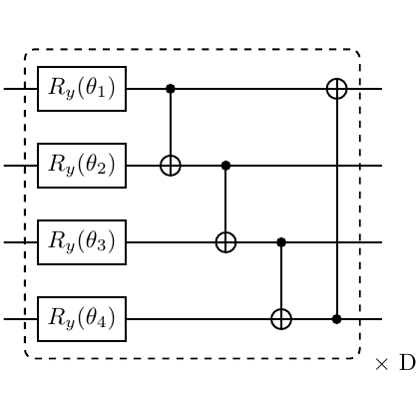

# test_10.png



# LaTeX/TikZ 量子电路图重构指导

## 1. 概览

这是一个量子电路图，展示了四个旋转门 $R_y(\theta_1)$ 到 $R_y(\theta_4)$ 与 CNOT 门的组合结构。整个电路包含在一个虚线框内，右下角标有 $\times$ D 符号，表示该结构重复 D 次。图形采用标准的量子电路表示法，包含水平线（量子比特线）和门操作。

## 2. 文档骨架与依赖

```latex
\documentclass[border=5pt]{standalone}
\usepackage{tikz}
\usetikzlibrary{quantikz}  % 量子电路专用库
\usetikzlibrary{positioning, fit, decorations.pathreplacing}
```

如果 quantikz 库不可用，可以使用基础 TikZ 库替代：

```latex
\documentclass[border=5pt]{standalone}
\usepackage{tikz}
\usetikzlibrary{positioning, fit, decorations.pathreplacing}
\usepackage{mathtools}
```

## 3. 版面与画布设置

- 图形宽度：约 7cm
- 图形高度：约 5cm
- 量子比特线间距：约 0.8cm
- 门之间水平间距：约 1.5cm

## 4. 字体与配色

- 使用默认的数学字体（Computer Modern）
- 所有文本和线条均为黑色
- 门标签使用数学模式，如 $R_y(\theta_1)$
- 虚线框右下角标注 $\times$ D

## 5. 结构与组件样式

- **量子比特线**：水平黑线，实线
- **旋转门**：矩形框，内含 $R_y(\theta_i)$ 标签
- **CNOT 门**：控制点（实心圆点）和目标点（⊕ 符号）
- **虚线框**：虚线矩形，包围整个电路
- **重复标记**：框右下角的 $\times$ D 标记

## 6. 数学细节

- 旋转门标签使用数学模式：$R_y(\theta_i)$，其中 $i$ 从 1 到 4
- CNOT 门的目标使用 $\oplus$ 符号
- 右下角标记使用 $\times$ D，表示重复 D 次

## 7. 自定义宏与命令

```latex
% 定义量子门样式
\tikzset{
    gate/.style={draw, minimum width=1.5cm, minimum height=0.6cm},
    control/.style={circle, fill, minimum size=0.15cm, inner sep=0pt},
    target/.style={circle, draw, minimum size=0.4cm, inner sep=0pt, path picture={
        \draw (path picture bounding box.north) -- (path picture bounding box.south);
        \draw (path picture bounding box.east) -- (path picture bounding box.west);
    }},
}
```

## 8. 最小可运行示例 (MWE)

```latex
\documentclass[border=5pt]{standalone}
\usepackage{tikz}
\usetikzlibrary{positioning, fit, decorations.pathreplacing}
\usepackage{mathtools}

\begin{document}
\begin{tikzpicture}[
    gate/.style={draw, minimum width=1.5cm, minimum height=0.6cm},
    control/.style={circle, fill, minimum size=0.15cm, inner sep=0pt},
    target/.style={circle, draw, minimum size=0.4cm, inner sep=0pt, path picture={
        \draw (path picture bounding box.north) -- (path picture bounding box.south);
        \draw (path picture bounding box.east) -- (path picture bounding box.west);
    }},
]

% 量子比特线
\foreach \y in {0, 1, 2, 3} {
    \draw (-0.5, -\y) -- (6, -\y);
}

% 旋转门
\node[gate] (g1) at (1, 0) {$R_y(\theta_1)$};
\node[gate] (g2) at (1, -1) {$R_y(\theta_2)$};
\node[gate] (g3) at (1, -2) {$R_y(\theta_3)$};
\node[gate] (g4) at (1, -3) {$R_y(\theta_4)$};

% CNOT门
\node[control] (c1) at (3, 0) {};
\node[target] (t1) at (5, -1) {};
\draw (c1) -- (c1 |- t1) -- (t1);

\node[target] (t2) at (3, -1) {};
\node[control] (c2) at (3, -2) {};
\draw (c2) -- (c2 |- t2) -- (t2);

\node[target] (t3) at (3, -2) {};
\node[control] (c3) at (3, -3) {};
\draw (c3) -- (c3 |- t3) -- (t3);

\node[target] (t4) at (5, -3) {};
\node[control] (c4) at (5, -2) {};
\draw (c4) -- (c4 |- t4) -- (t4);

\node[target] (t5) at (5, 0) {};
\node[control] (c5) at (5, -1) {};
\draw (c5) -- (c5 |- t5) -- (t5);

% 虚线框
\draw[dashed] (-0.2, 0.5) rectangle (5.5, -3.5);

% 重复标记
\node at (5.8, -3.7) {$\times$ D};

\end{tikzpicture}
\end{document}
```

## 9. 复刻检查清单

- ✓ 图形尺寸与比例
- ✓ 四个 $R_y(\theta_i)$ 门
- ✓ 所有 CNOT 门的控制点和目标点
- ✓ 虚线框包围整个电路
- ✓ 右下角 $\times$ D 标记
- ✓ 线条粗细与样式（实线、虚线）
- ✓ 数学符号格式

## 10. 风险与替代方案

- **精确布局**：原图中门之间的精确间距可能略有差异，可根据需要微调。
- **quantikz 库**：如果有 quantikz 库，可以使用更专业的量子电路绘制语法，代码会更简洁。
- **符号渲染**：⊕ 符号在不同 TeX 引擎中可能有细微差异，本示例使用十字线在圆圈中的方式绘制。
- **替代方案**：如果需要更专业的量子电路图，可以考虑使用 Qcircuit 或 Quantikz 宏包。

```latex
% 使用 quantikz 库的替代方案
\documentclass[border=5pt]{standalone}
\usepackage{tikz}
\usetikzlibrary{quant
