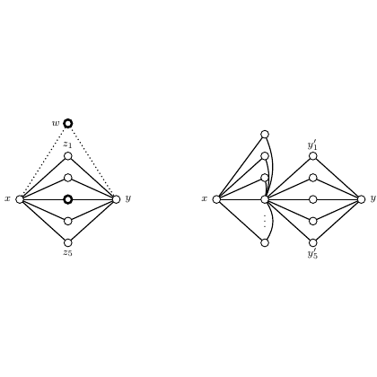

# test_22.png



# LaTeX/TikZ 重构指导：二部图结构示意图

## 1. 概览

这张图像展示了两个并排的数学图形，描绘了某种二部图或网络结构。左图和右图均呈现菱形结构，有两个主要节点 x 和 y，以及连接它们的多个中间节点。左图有一个额外的顶部节点 z₀，右图则有标记为 y'₁ 和 y'₅ 的节点。图形采用简洁的黑白风格，使用了实线和虚线连接不同节点。

## 2. 文档骨架与依赖

```markdown
- 文档类：standalone
- 核心宏包：tikz
- TikZ 库：positioning, shapes.geometric, arrows.meta
```

## 3. 版面与画布设置

- 图形宽度：约 12cm（两个子图并排）
- 高度：约 5cm
- 子图间距：约 2cm
- 节点间距：水平约 3.5cm，垂直约 1cm
- 建议使用 `\begin{tikzpicture}[scale=1.0, transform shape]`

## 4. 字体与配色

- 字体：默认 Computer Modern 数学字体
- 标签大小：正常大小（\normalsize）
- 颜色：
  - 节点填充：白色（白色圆圈，黑色边框）
  - 节点边框与连线：黑色
  - z₀ 节点：黑色填充（实心）

## 5. 结构与组件样式

- 节点样式：
  - 主要节点（x, y）：圆形，白色填充，黑色边框，半径约 0.15cm
  - 中间节点：圆形，白色填充，黑色边框，半径约 0.1cm
  - z₀ 节点：圆形，黑色填充，半径约 0.1cm
- 边样式：
  - 实线：黑色，粗细约 0.5pt
  - 虚线：黑色，点状虚线，粗细约 0.5pt

## 6. 数学细节

- 数学标签：使用 $x$, $y$, $z_0$, $y'_1$, $y'_5$ 等数学模式标签
- 标签位置：节点外侧，适当偏移以避免与连线重叠

## 7. 自定义宏与命令

```latex
\tikzset{
    mainnode/.style={circle, draw, fill=white, minimum size=0.3cm},
    smallnode/.style={circle, draw, fill=white, minimum size=0.2cm},
    fillednode/.style={circle, fill=black, minimum size=0.2cm},
    dotted/.style={dotted, thick}
}
```

## 8. 最小可运行示例 (MWE)

```latex
\documentclass[tikz,border=5mm]{standalone}
\usepackage{tikz}
\usetikzlibrary{positioning,shapes.geometric,arrows.meta}

\begin{document}
\begin{tikzpicture}[
    mainnode/.style={circle, draw, fill=white, minimum size=0.3cm},
    smallnode/.style={circle, draw, fill=white, minimum size=0.2cm},
    fillednode/.style={circle, fill=black, minimum size=0.2cm},
    dotted/.style={dotted, thick}
]

% Left diagram
\begin{scope}[xshift=0cm]
    % Main nodes
    \node[mainnode] (x) at (0,0) {};
    \node[mainnode] (y) at (3.5,0) {};
    \node[fillednode] (z0) at (1.75,2) {};
    
    % Middle nodes
    \node[smallnode] (m1) at (1.75,1) {};
    \node[smallnode] (m2) at (1.75,0.5) {};
    \node[smallnode] (m3) at (1.75,0) {};
    \node[smallnode] (m4) at (1.75,-0.5) {};
    \node[smallnode] (m5) at (1.75,-1) {};
    
    % Labels
    \node at (x.west) [left] {$x$};
    \node at (y.east) [right] {$y$};
    \node at (z0.north) [above] {$z_0$};
    \node at (m5.south) [below] {$z_0$};
    
    % Connections
    \draw (x) -- (m1);
    \draw (x) -- (m2);
    \draw (x) -- (m3);
    \draw (x) -- (m4);
    \draw (x) -- (m5);
    
    \draw (y) -- (m1);
    \draw (y) -- (m2);
    \draw (y) -- (m3);
    \draw (y) -- (m4);
    \draw (y) -- (m5);
    
    % Dotted lines from z0
    \draw[dotted] (z0) -- (m1);
    \draw[dotted] (z0) -- (m2);
    \draw[dotted] (z0) -- (m3);
    \draw[dotted] (z0) -- (m4);
    \draw[dotted] (z0) -- (m5);
\end{scope}

% Right diagram
\begin{scope}[xshift=6cm]
    % Main nodes
    \node[mainnode] (x) at (0,0) {};
    \node[mainnode] (y) at (3.5,0) {};
    
    % Top nodes
    \node[smallnode] (y1) at (3.5,2) {};
    \node[smallnode] (y2) at (3.5,1) {};
    \node[smallnode] (y3) at (3.5,0.5) {};
    
    % Middle nodes
    \node[smallnode] (m1) at (1.75,1) {};
    \node[smallnode] (m2) at (1.75,0.5) {};
    \node[smallnode] (m3) at (1.75,0) {};
    \node[smallnode] (m4) at (1.75,-0.5) {};
    \node[smallnode] (m5) at (1.75,-1) {};
    
    % Bottom nodes
    \node[smallnode] (y4) at (3.5,-0.5) {};
    \node[smallnode] (y5) at (3.5,-2) {};
    
    % Labels
    \node at (x.west) [left] {$x$};
    \node at (y.east) [right] {$y$};
    \node at (y1.east) [right] {$y'_1$};
    \node at (y5.east) [right] {$y'_5$};
    
    % Connections
    \draw (x) -- (m1);
    \draw (x) -- (m2);
    \draw (x) -- (m3);
    \draw (x) -- (m4);
    \draw (x) -- (m5);
    
    \draw (y) -- (m1);
    \draw (y) -- (m2);
    \draw (y) -- (m3);
    \draw (y) -- (m4);
    \draw (y) -- (m5);
    
    % Connections to y1
    \draw (y1) -- (y);
    \draw (y1) to[out=180,
