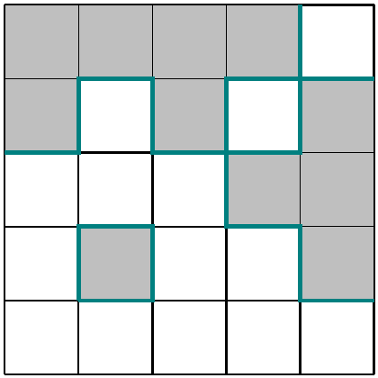

# test_25.png



# LaTeX/TikZ 重构指导：棋盘格式网格图

## 1. 概览

图像展示了一个 5×5 的棋盘式网格，由白色和灰色方格组成，部分网格边界使用青绿色线条加粗强调。整体呈现出规则的棋盘布局，但灰白格子分布不是标准棋盘的交替排列，而是特定模式。外围有黑色细边框包围整个网格。

## 2. 文档骨架与依赖

```latex
\documentclass[border=5pt]{standalone}
\usepackage{tikz}
\usepackage{xcolor}
```

主要依赖 TikZ 宏包绘制网格和方块，xcolor 宏包处理颜色。standalone 文档类适合单独编译图形。

## 3. 版面与画布设置

- 图形为正方形，建议设置为 8cm × 8cm
- 使用 TikZ 的网格坐标系，范围为 (0,0) 到 (5,5)
- 每个网格单元大小相同
- 网格线间距均匀

## 4. 字体与配色

- 图中不包含文字
- 主要颜色：
  - 灰色方格：`gray!30`（浅灰色）
  - 白色方格：`white`
  - 强调边框：`teal!80!black`（青绿色）
  - 普通网格线：`black`（黑色）
  - 外边框：`black`（黑色）

## 5. 结构与组件样式

- 网格：5×5 正方形网格
- 网格线：普通黑色细线，宽度约 0.5pt
- 强调边框：青绿色粗线，宽度约 1.5pt
- 外边框：黑色线，宽度约 1pt
- 灰色方格填充：浅灰色

## 6. 数学/表格/图形细节

- 不涉及数学公式
- 灰色方格分布模式：
  - 第1行：(1,1), (2,1), (3,1), (4,1)
  - 第2行：(1,2), (3,2)
  - 第3行：(4,3), (5,3)
  - 第4行：(2,4)
  - 第5行：(5,5)

## 7. 自定义宏与命令

```latex
\tikzset{
  cell/.style={
    rectangle,
    minimum size=1cm,
    draw=none,
    fill=#1
  },
  emphasis/.style={
    line width=1.5pt,
    teal!80!black
  }
}
```

## 8. 最小可运行示例 (MWE)

```latex
\documentclass[border=5pt]{standalone}
\usepackage{tikz}

\begin{document}
\begin{tikzpicture}

% 定义样式
\tikzset{
  cell/.style={
    rectangle,
    minimum size=1cm,
    draw=none,
    fill=#1
  },
  emphasis/.style={
    line width=1.5pt,
    teal!80!black
  }
}

% 绘制所有白色背景单元格
\foreach \i in {1,...,5} {
  \foreach \j in {1,...,5} {
    \node[cell=white] at (\i-0.5,6-\j-0.5) {};
  }
}

% 绘制灰色单元格
\node[cell=gray!30] at (0.5,4.5) {};
\node[cell=gray!30] at (1.5,4.5) {};
\node[cell=gray!30] at (2.5,4.5) {};
\node[cell=gray!30] at (3.5,4.5) {};
\node[cell=gray!30] at (0.5,3.5) {};
\node[cell=gray!30] at (2.5,3.5) {};
\node[cell=gray!30] at (3.5,2.5) {};
\node[cell=gray!30] at (4.5,2.5) {};
\node[cell=gray!30] at (1.5,1.5) {};
\node[cell=gray!30] at (4.5,0.5) {};

% 绘制常规网格线
\draw[step=1cm, black, thin] (0,0) grid (5,5);

% 绘制外边框
\draw[black, line width=1pt] (0,0) rectangle (5,5);

% 绘制强调边框
% 水平强调线
\draw[emphasis] (0,1) -- (1,1);
\draw[emphasis] (2,1) -- (5,1);
\draw[emphasis] (0,2) -- (2,2);
\draw[emphasis] (3,2) -- (5,2);
\draw[emphasis] (0,3) -- (3,3);
\draw[emphasis] (4,3) -- (5,3);
\draw[emphasis] (1,4) -- (2,4);
\draw[emphasis] (3,4) -- (4,4);
\draw[emphasis] (0,5) -- (4,5);

% 垂直强调线
\draw[emphasis] (1,0) -- (1,1);
\draw[emphasis] (1,2) -- (1,5);
\draw[emphasis] (2,0) -- (2,1);
\draw[emphasis] (2,4) -- (2,5);
\draw[emphasis] (3,1) -- (3,3);
\draw[emphasis] (3,4) -- (3,5);
\draw[emphasis] (4,0) -- (4,2);
\draw[emphasis] (4,3) -- (4,5);

\end{tikzpicture}
\end{document}
```

## 9. 复刻检查清单

- ✅ 图形尺寸：5×5 网格
- ✅ 节点样式：灰色和白色方格
- ✅ 字体与字号：不适用（图中无文字）
- ✅ 配色：灰色、白色、青绿色、黑色
- ✅ 线型：细黑线网格，粗青绿线强调，黑色外边框
- ✅ 特殊效果：无
- ⚠️ 与原图的差异点：强调线的确切位置可能有细微差别，需仔细核对

## 10. 风险与替代方案

- 灰色填充的准确色值可能与原图有差异，可以调整 `gray!30` 的百分比
- 青绿色边框的具体色值可根据需要调整 `teal!80!black` 的混合比例
- 线条宽度设置为相对值，可能需要根据最终输出尺寸微调
- 替代绘制方法：可以使用 `\fill` 命令替代节点方式绘制方格，可能更简洁

如需更精确地匹配原图，建议先打印测试并与原图对比，然后微调颜色和线宽参数。
