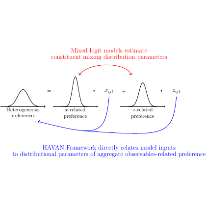

# test_4.png



# LaTeX/TikZ 重构指导：混合 Logit 模型与 HAVAN 框架图

## 1. 概览

这张图表示的是混合 logit 模型与 HAVAN 框架之间的关系图。图中包含三个分布曲线（正态分布/高斯分布曲线），用等式关系和箭头表示它们之间的关系。图中包含红色和蓝色的说明文字，分别解释了混合 logit 模型和 HAVAN 框架的作用。

## 2. 文档骨架与依赖

```latex
\documentclass[tikz, border=5pt]{standalone}
\usepackage{tikz}
\usepackage{amsmath}
\usepackage{xcolor}

% 需要的 TikZ 库
\usetikzlibrary{arrows.meta}
\usetikzlibrary{bending}
\usetikzlibrary{decorations.pathreplacing}
\usetikzlibrary{calc}
```

## 3. 版面与画布设置

- 图形尺寸：约 14cm × 8cm
- 坐标系：相对坐标系，以三个分布图为主要定位点
- 建议的 `\tikzpicture` 参数：
  ```latex
  \begin{tikzpicture}[
    font=\sffamily,
    >={Stealth[bend]},
    node distance=2.5cm
  ]
  ```

## 4. 字体与配色

- 字体：无衬线字体 (sans-serif)
- 标题与说明文字大小：\small 或 \footnotesize
- 配色方案：
  - 红色文字与箭头：`\definecolor{explanation-red}{RGB}{255,0,0}`
  - 蓝色文字与箭头：`\definecolor{explanation-blue}{RGB}{0,0,255}`
  - 黑色：分布曲线、等式符号

## 5. 结构与组件样式

- 分布曲线：用 TikZ 的绘图功能绘制高斯分布曲线
- 箭头：弯曲箭头，使用 Stealth 风格
- 等式符号：居中对齐
- 文本标签：分布下方的标签采用居中对齐

## 6. 数学/表格/图形细节

- 分布曲线可以用参数化的高斯函数绘制：`plot[domain=-2:2, samples=100] (\x, {exp(-\x*\x/0.5)/sqrt(2*pi*0.5)})`
- 数学符号：$x_{qt}$ 和 $z_{qt}$ 需要使用数学模式

## 7. 自定义宏与命令

```latex
% 定义分布曲线绘制命令
\newcommand{\gaussiancurve}[3]{
  % #1: x-offset, #2: scale factor, #3: label
  \begin{scope}[shift={(#1,0)}]
    \draw[thick] (-1.5,0) -- (1.5,0);
    \draw[thick] plot[domain=-1.5:1.5, samples=100] (\x, {#2*exp(-\x*\x/0.5)});
    \node[below, align=center, font=\small] at (0,-0.3) {#3};
  \end{scope}
}

% 定义颜色
\definecolor{explanation-red}{RGB}{255,0,0}
\definecolor{explanation-blue}{RGB}{0,0,255}
```

## 8. 最小可运行示例 (MWE)

```latex
\documentclass[tikz, border=5pt]{standalone}
\usepackage{tikz}
\usepackage{amsmath}
\usepackage{xcolor}

% 需要的 TikZ 库
\usetikzlibrary{arrows.meta}
\usetikzlibrary{bending}
\usetikzlibrary{decorations.pathreplacing}
\usetikzlibrary{calc}

% 定义颜色
\definecolor{explanation-red}{RGB}{255,0,0}
\definecolor{explanation-blue}{RGB}{0,0,255}

% 定义分布曲线绘制命令
\newcommand{\gaussiancurve}[3]{
  % #1: x-offset, #2: scale factor, #3: label
  \begin{scope}[shift={(#1,0)}]
    \draw[thick] (-1.5,0) -- (1.5,0);
    \draw[thick] plot[domain=-1.5:1.5, samples=100] (\x, {#2*exp(-\x*\x/0.5)});
    \node[below, align=center, font=\small] at (0,-0.3) {#3};
  \end{scope}
}

\begin{document}
\begin{tikzpicture}[
  font=\sffamily,
  >={Stealth[bend]},
  node distance=2.5cm
]

% 三个分布曲线
\gaussiancurve{0}{1.2}{Heterogeneous\\preferences}
\gaussiancurve{3.5}{1.5}{$x$-related\\preference}
\gaussiancurve{7}{1.3}{$z$-related\\preference}

% 等式符号和点乘
\node at (1.75,0) {$=$};
\node at (5.25,0) {$+$};

% 变量标签
\node[explanation-blue] at (4,1) {$\bullet\; x_{qt}$};
\node[explanation-blue] at (7.5,1) {$\bullet\; z_{qt}$};

% 红色上方箭头和说明
\draw[->, explanation-red, thick, out=30, in=150] (3.5,2.5) to (7,2.5);
\node[explanation-red, align=center, font=\small] at (5.25,3.2) {Mixed logit models estimate\\constituent mixing distribution parameters};

% 蓝色下方箭头和说明
\draw[->, explanation-blue, thick, out=210, in=330] (7,-2) to (0,-2);
\node[explanation-blue, align=center, font=\small, text width=10cm] at (3.5,-3) {HAVAN Framework directly relates model inputs\\to distributional parameters of aggregate observables-related preference};

\end{tikzpicture}
\end{document}
```

## 9. 复刻检查清单

- ✅ 图形尺寸与布局：三个分布曲线等间距排列
- ✅ 分布曲线的形状：左侧较矮，中间最高，右侧中等高度
- ✅ 字体与字号：使用无衬线字体
- ✅ 配色方案：红色上方说明，蓝色下方说明与变量标签
- ✅ 箭头样式：弯曲箭头指示关系
- ✅ 数学符号：$x_{qt}$ 和 $z_{qt}$ 正确排版
- ✅ 文本对齐：分布标签居中对齐

## 10. 风险与替代方案

- 不确定因素：
  - 原图中精确的高斯分布参数可能与复刻版略有差异
  - 原图中箭头
