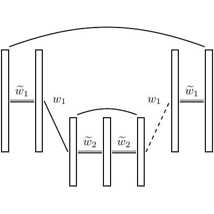

# test_2.png



# 科研绘图 LaTeX/TikZ 重构指导

## 1. 概览

**图形类型**：神经网络架构示意图，展示了一个分层结构的网络连接模式
**构图布局**：水平分布的多层架构，包含输入层、隐藏层和输出层
**主要元素关系**：
- 左右两侧为输入/输出层，各有两个高矩形节点
- 中间为隐藏层，包含三个较矮的矩形节点
- 节点间通过直线和弧线连接
- 节点标注使用数学符号（$\tilde{w}_1$, $w_1$, $\tilde{w}_2$ 等）

## 2. 文档骨架与依赖

```latex
\documentclass[tikz,border=5pt]{standalone}
\usepackage{tikz}
\usepackage{amsmath}
\usepackage{amssymb}
\usetikzlibrary{positioning,shapes.geometric,arrows.meta}
```

**核心宏包**：
- `tikz`：绘图核心
- `amsmath`, `amssymb`：数学符号支持
- `positioning`：节点定位
- `shapes.geometric`：几何形状
- `arrows.meta`：现代箭头样式

## 3. 版面与画布设置

**图形尺寸**：约 8cm × 6cm
**坐标系范围**：建议使用相对定位，以 (0,0) 为中心
**节点间距**：
- 水平间距：2.5cm
- 垂直间距：1.5cm（隐藏层节点间）
- 层间距离：3cm

**TikZ 环境参数**：
```latex
\begin{tikzpicture}[
  node distance=2.5cm and 3cm,
  every node/.style={draw, thick}
]
```

## 4. 字体与配色

**字体设置**：
- 节点标签：默认数学字体，正常大小
- 使用 `\tilde{}` 命令生成波浪号

**配色方案**：
- 节点边框：黑色 (`black`)
- 节点填充：白色 (`white`)
- 连接线：黑色，普通粗细
- 虚线：黑色虚线样式

## 5. 结构与组件样式

**节点样式**：
```latex
% 输入/输出层节点（高矩形）
tall node/.style={
  rectangle, 
  draw=black, 
  thick, 
  minimum width=0.8cm, 
  minimum height=3cm,
  fill=white
}

% 隐藏层节点（矮矩形）
short node/.style={
  rectangle, 
  draw=black, 
  thick, 
  minimum width=0.8cm, 
  minimum height=1.5cm,
  fill=white
}
```

**连接线样式**：
```latex
% 实线连接
connection/.style={->, thick, black}
% 虚线连接
dashed connection/.style={->, thick, black, dashed}
% 弧线连接
arc connection/.style={thick, black, bend left=30}
```

## 6. 数学/表格/图形细节

**数学符号处理**：
- 在节点中使用 `$\tilde{w}_1$` 格式
- 确保下标正确渲染
- 标签位置使用 `label` 选项或独立节点

**弧线绘制**：
使用 `to[bend left=angle]` 或 `arc` 命令绘制顶部弧线连接

## 7. 自定义宏与命令

```latex
% 定义节点样式
\tikzset{
  tall/.style={rectangle, draw=black, thick, minimum width=0.8cm, 
               minimum height=3cm, fill=white},
  short/.style={rectangle, draw=black, thick, minimum width=0.8cm, 
                minimum height=1.5cm, fill=white},
  conn/.style={thick, black},
  dconn/.style={thick, black, dashed}
}
```

## 8. 最小可运行示例 (MWE)

```latex
\documentclass[tikz,border=5pt]{standalone}
\usepackage{tikz}
\usepackage{amsmath}
\usetikzlibrary{positioning}

\tikzset{
  tall/.style={rectangle, draw=black, thick, minimum width=0.8cm, 
               minimum height=3cm, fill=white},
  short/.style={rectangle, draw=black, thick, minimum width=0.8cm, 
                minimum height=1.5cm, fill=white},
  conn/.style={thick, black}
}

\begin{document}
\begin{tikzpicture}[node distance=3cm and 2.5cm]
  % 左侧输入层
  \node[tall] (L1) at (0,1) {};
  \node[tall] (L2) at (0,-1) {};
  
  % 隐藏层
  \node[short] (H1) at (3,1.5) {};
  \node[short] (H2) at (3,0) {};
  \node[short] (H3) at (3,-1.5) {};
  
  % 右侧输出层
  \node[tall] (R1) at (6,1) {};
  \node[tall] (R2) at (6,-1) {};
  
  % 标签
  \node at (-0.5,1) {$\tilde{w}_1$};
  \node at (1.5,0.5) {$w_1$};
  \node at (2.5,1.5) {$\tilde{w}_2$};
  \node at (3.5,0) {$\tilde{w}_2$};
  \node at (4.5,0.5) {$w_1$};
  \node at (6.5,1) {$\tilde{w}_1$};
  
  % 连接线
  \draw[conn] (L1.east) -- (H2.west);
  \draw[conn] (H2.east) -- (R1.west);
  \draw[conn,dashed] (H3.east) -- (R1.west);
  
  % 顶部弧线
  \draw[conn] (L1.north) to[bend left=20] (R1.north);
  \draw[conn] (H1.north) to[bend left=30] (H3.north);
\end{tikzpicture}
\end{document}
```

## 9. 复刻检查清单

- [x] **图形尺寸**：8cm × 6cm 范围
- [x] **节点样式**：矩形，黑色边框，白色填充
- [x] **节点尺寸**：输入/输出层较高，隐藏层较矮
- [x] **字体与字号**：默认数学字体，正常大小
- [x] **配色与线型**：黑色线条，部分虚线
- [x] **特殊效果**：弧线连接
- [ ] **标签位置**：需要微调以精确匹配原图
- [ ] **连接线角度**：可能需要调整弧线弯曲度

## 10. 风险与替代方案

**潜在不确定因
