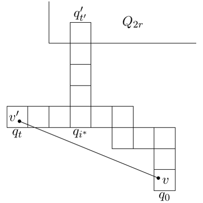

# test_17.png



```latex
% 1. 概览
% 该图为一种网络结构，包含多个正方形节点，以梯形形式排列，部分节点有标记。
% 主要元素包括节点、标签及注释箭头。

% 2. 文档骨架与依赖
\documentclass[tikz,border=10pt]{standalone}
\usepackage{tikz}
\usetikzlibrary{arrows.meta, positioning}

% 3. 版面与画布设置
% 图形宽高自适应，使用的是 Cartesian 坐标。
% 节点间距与对齐使用相对定位。

% 4. 字体与配色
% 标签字体为默认系列，大小适中。
% 主要采用黑白对比，无需特殊颜色。

% 5. 结构与组件样式
% 节点为无填充的正方形，边框为实线。
% 箭头采用直线并使用箭头符号。

% 6. 数学/表格/图形细节
% 标签内含数学符号，使用 $...$ 包裹。

% 7. 自定义宏与命令
% 可自定义节点样式与箭头样式提高复用。

% 8. 最小可运行示例 (MWE)
\begin{document}
\begin{tikzpicture}[square/.style={draw, minimum size=1cm, inner sep=0pt},
                    node distance=1cm and 1cm]
    % 定义节点
    \node[square] (q0) {};
    \node[square, above=of q0] (q1) {};
    \node[square, right=of q1] (q2) {};
    \node[square, right=of q2] (q3) {};
    \node[square, right=of q3] (q4) {};
    \node[square, right=of q4] (q5) {};
    \node[square, above=of q4] (q6) {};
    \node[square, above=of q6] (q7) {};
    \node[square, above=of q7] (q8) {};
    
    % 添加标签
    \node[below left=0.1cm of q4.south west] (qt) {$q_{t}$};
    \node[below left=0.1cm of q0.south west] (q0l) {$q_0$};
    \node[below right=0.1cm of q4.south east] (vi) {$q_{i*}$};
    \node[above right=0.1cm of q8.north east] (q2r) {$Q_{2r}$};
    \node[above right=0.1cm of q8.north west] (qtpr) {$q'_{t'}$};
    
    % 關联箭头和标签
    \draw[-{Latex}] (q4) -- (q0);
    \node[below right=0.1cm of qt] (vt) {$v'$};
    \node[below=0.1cm of q0l] (v) {$v$};
\end{tikzpicture}
\end{document}

% 9. 复刻检查清单
% - 图形尺寸、坐标范围
% - 节点/边样式
% - 字体与字号
% - 配色与线型
% - 特殊效果（无渐变、阴影）
% - 检查与原图的差异。

% 10. 风险与替代方案
% - 如精确色值难以确认，使用近似值。
% - 字体如选择困难，使用默认 Computer Modern 提高兼容性。
```

以上是基于提供的图的复刻说明。注意在编译过程中，需要确保已安装所需的 LaTeX 包和编译器支持 TikZ。
