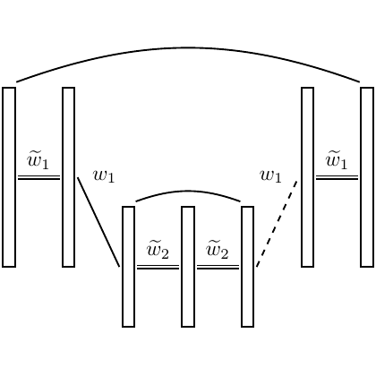

# test_2.png



以下是针对该科研绘图的完整 LaTeX/TikZ 重构指导：

### 1. 概览

- **图形类型**：流程图。
- **构图布局**：由六个矩形节点组成，呈现线性和分支布局。
- **主要元素关系**：节点通过直线与曲线相连，部分连接线为虚线。

### 2. 文档骨架与依赖

- **推荐文档类**：`standalone`
- **核心宏包**：
  - `tikz`：绘制图形
  - `amsmath`：提供数学符号
- **TikZ 库**：
  - `arrows.meta`：自定义箭头样式
  - `positioning`：节点定位

### 3. 版面与画布设置

- **图形尺寸**：建议宽度为 `10cm`。
- **坐标系范围**：`(-1,-1)` 到 `(7,4)`
- **对齐方式**：中心对齐所有节点。
- **环境参数**：`scale=1.0`，使整体图形按比例放缩。

### 4. 字体与配色

- **字体**：
  - 标签：`$\tilde{w}_1$, $\tilde{w}_2$` 使用 `\small`。
- **配色**：
  - 主色：黑色
- **特殊效果**：无渐变/透明度/阴影。

### 5. 结构与组件样式

- **节点**：矩形，白色填充，黑色边框。
- **边与箭头**：
  - 实线和虚线，普通箭头。
- **线粗细**：`line width=0.5pt`

### 6. 数学/表格/图形细节

- **公式**：直接在节点中用数学模式。
- **表格**：不涉及。
- **其他图形**：不涉及。

### 7. 自定义宏与命令

- 定义常用样式：
  ```latex
  \tikzset{
    rect node/.style={draw, minimum width=0.7cm, minimum height=3cm},
    arrow style/.style={-{Stealth[scale=1]}, line width=0.5pt},
  }
  ```

### 8. 最小可运行示例 (MWE)

```latex
\documentclass{standalone}
\usepackage{tikz}
\usetikzlibrary{arrows.meta, positioning}

\begin{document}
\begin{tikzpicture}[scale=1.0]
  \tikzset{
    rect node/.style={draw, minimum width=0.7cm, minimum height=3cm},
    arrow style/.style={-{Stealth[scale=1]}, line width=0.5pt},
  }

  % Nodes
  \node[rect node] (A1) at (0,0) {};
  \node[rect node] (A2) at (6,0) {};
  \node[rect node] (B1) at (2,1) {};
  \node[rect node] (B2) at (4,1) {};
  \node[rect node] (C1) at (1,-1) {};
  \node[rect node] (C2) at (5,-1) {};

  % Edges
  \draw[arrow style] (A1.south) -- node[midway, left] {$w_1$} (C1.north);
  \draw[arrow style] (C1.north) -- node[midway, below] {$\tilde{w}_2$} (C2.north);
  \draw[arrow style] (C2.north) -- node[midway, right] {$w_1$} (A2.south);
  \draw[arrow style, dotted] (A2.south) -- (B2.north);
  \draw[arrow style] (A1.north) to[bend left=45] node[midway, above] {} (A2.north);
  \draw[arrow style] (B1.north) to[bend left=45] node[midway, above] {} (B2.north);

  % Labels
  \node at (0,-0.1) {$\tilde{w}_1$};
  \node at (6,-0.1) {$\tilde{w}_1$};
  \node at (2,0.9) {$\tilde{w}_2$};
  \node at (4,0.9) {$\tilde{w}_2$};

\end{tikzpicture}
\end{document}
```

### 9. 复刻检查清单

- [ ] 图形尺寸、坐标范围
- [ ] 节点/边样式
- [ ] 字体与字号
- [ ] 配色与线型
- [ ] 特殊效果（无）
- [ ] 与原图的差异点

### 10. 风险与替代方案

- **不确定因素**：精确颜色和字体可能与原图不完全匹配。
- **替代方案**：默认字体可使用 Computer Modern；颜色可使用近似的黑色。

这份指南可以帮助你在 LaTeX 中重现该图形。确保在使用之前，根据具体需求进行必要的调整。
