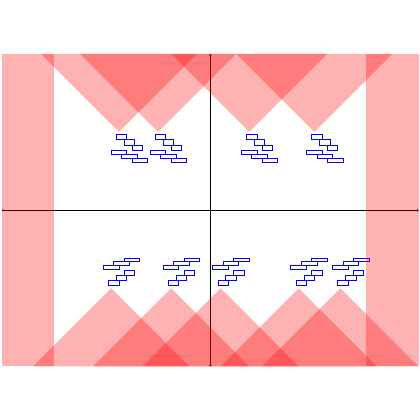

# test_20.png



以下是对给定图像的 LaTeX/TikZ 重构指导：

### 1. 概览
- **图像类型**：模式化背景的图形设计，可能用于视觉效果或强调某种结构。
- **构图布局**：以矩形为基础的网格结构，中心分为四个区域，包含重复图案元素。
- **主要元素关系**：背景为变化的红色色块（渐变效果），前景有类似直角折线的蓝色图案。

### 2. 文档骨架与依赖
- **文档类**：`standalone`，便于单独编译和调整图像大小。
- **核心宏包**：`tikz`（主要图形绘制）和 `xcolor`（自定义颜色）。
- **特定功能**：需要 `shapes.geometric`（绘制多边形）、`patterns`（填充图案）。

### 3. 版面与画布设置
- **图形尺寸**：建议宽和高均为 10cm。
- **坐标系范围**：`[-5, 5]` 以适应元素布局。
- **对齐方式**：中心对齐。

### 4. 字体与配色
- **字体**：默认 `Computer Modern`，12pt 字号。
- **主色**：红色（`RGB: {255, 102, 102}`），辅助色：蓝色（`RGB: {0, 0, 255}`）。
- **渐变效果**：使用 `fill opacity` 和 `shade` 选项。

### 5. 结构与组件样式
- **节点**：使用透明度控制效果的多边形。
- **边与箭头**：边界线为黑色细线。
- **坐标轴**：可选绘制，简单的十字交叉。

### 6. 数学/表格/图形细节
- **表格**：无。
- **复杂图形**：折线和背景多边形通过 `\draw` 和 `\filldraw` 绘制。

### 7. 自定义宏与命令
```latex
\newcommand{\redfill}[3]{
  \fill[red, opacity=#1] (#2, #3) rectangle ++(5, 5);
}

\newcommand{\bluepattern}[2]{
  \draw[blue, thick] (#1, #2) -- ++(1, 0) -- ++(0, 1);
}
```

### 8. 最小可运行示例 (MWE)
```latex
\documentclass{standalone}
\usepackage{tikz}
\usepackage{xcolor}

\begin{document}
\begin{tikzpicture}
  % Draw background gradient rectangles
  \redfill{0.2}{-5}{-5}
  \redfill{0.4}{-2.5}{-5}
  \redfill{0.6}{0}{-5}
  \redfill{0.8}{2.5}{-5}
  \redfill{1}{-5}{-2.5}

  % Draw blue pattern
  \foreach \x in {-3.5, -1.5, 1.5, 3.5}{
    \bluepattern{\x}{3.5}
    \bluepattern{\x}{0}
  }
  
  % Add a simple cross
  \draw[black, thick] (-5, 0) -- (5, 0);
  \draw[black, thick] (0, -5) -- (0, 5);
\end{tikzpicture}
\end{document}
```

### 9. 复刻检查清单
- **图形尺寸、坐标范围**：宽 10cm，高 10cm，范围 `[-5, 5]`。
- **节点/边样式**：透明红色背景，蓝色折线。
- **字体与字号**：`Computer Modern`，12pt。
- **配色与线型**：准确的 RGB 配色，线型如示。
- **特殊效果**：透明度用于渐变，检查视觉效果响应变化。

### 10. 风险与替代方案
- **不确定因素**：颜色和字体在不同设备上可能略有差异。
- **替代方案**：使用近似颜色替换。字体可选择 `Times New Roman` 以增加兼容性。
