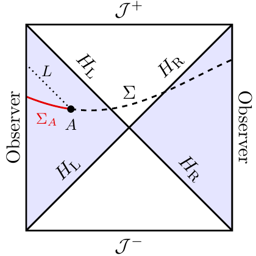

# test_27.png



Sure! Here is a detailed LaTeX/TikZ guideline to recreate the diagram:

### 1. 概览
- **图形类型**: 理论物理中的时空图。
- **构图布局**: 四个三角形的对称布局，包含标记的路径和区域。
- **主要元素关系**: 各个三角形用以不同颜色区分，线条指示时空路径。

### 2. 文档骨架与依赖
- **推荐文档类**: `standalone`
- **核心宏包**:
  ```latex
  \documentclass{standalone}
  \usepackage{tikz}
  \usetikzlibrary{arrows, decorations.pathmorphing, backgrounds}
  ```

### 3. 版面与画布设置
- **尺寸**: 8cm x 8cm
- **坐标系范围**: `[-1,1] x [-1,1]`
- **环境参数**:
  ```latex
  \begin{tikzpicture}[scale=4]
  ```

### 4. 字体与配色
- **字体**: 默认 `Computer Modern`，使用 `\scriptsize` 标注。
- **配色**:
  - **主色**: 黑色 `black`
  - **辅助色**: 浅蓝 `fill=blue!10`, 红色 `red`
  
### 5. 结构与组件样式
- **节点**: 圆点表示事件，用黑色填充。
- **边与箭头**:
  - 红色线用 `thick` 表示 。
  - 虚线路径用 `dotted`。
- **区域**: 用颜色与边框填充的三角形。

### 6. 数学/表格/图形细节
- **公式**: 使用 `node` 指定。
- **结构说明**: 使用 `\path` 与 `\draw` 分别指定线与路径。

### 7. 自定义宏与命令
- **节点样式**:
  ```latex
  \tikzset{event/.style={circle, fill=black, inner sep=1pt}}
  ```

### 8. 最小可运行示例 (MWE)
```latex
\documentclass{standalone}
\usepackage{tikz}
\usetikzlibrary{arrows, decorations.pathmorphing, backgrounds}
\begin{document}
\begin{tikzpicture}[scale=4]
  % Define regions
  \fill[blue!10] (0,0) -- (1,1) -- (1,-1) -- cycle;
  \fill[blue!10] (0,0) -- (-1,1) -- (-1,-1) -- cycle;
  
  % Diagonal borders
  \draw (0,0) -- (1,1) node[midway, above, sloped] {$H_R$};
  \draw (0,0) -- (-1,1) node[midway, above, sloped] {$H_L$};
  \draw (0,0) -- (1,-1) node[midway, below, sloped] {$H_R$};
  \draw (0,0) -- (-1,-1) node[midway, below, sloped] {$H_L$};
  
  % Time lines
  \draw[thick, red] (0.2,0) .. controls (0.25,0.4) .. (0,0.6) node[above left] {$L$};
  \draw[thick, dashed] (-0.6,0.2) .. controls (-0.3,0.3) .. (0.6,0);
  
  % Points
  \node[event, label=below left:$A$] at (0.2,-0.1) {};
  \node at (-0.5,-0.3) {$\Sigma_A$}; % Red label
  
  % Observers
  \node[rotate=90, anchor=south] at (1.1,0) {Observer};
  \node[rotate=90, anchor=north] at (-1.1,0) {Observer};
  
  % Infinity
  \node[anchor=south] at (0,1.05) {$\mathcal{J}^+$};
  \node[anchor=north] at (0,-1.05) {$\mathcal{J}^-$};
\end{tikzpicture}
\end{document}
```

### 9. 复刻检查清单
- **图形尺寸**: 8cm x 8cm
- **节点/边样式**: 检查线条粗细与颜色
- **字体与字号**: 确保标签正确放置
- **配色与线型**: 验证填充色与边颜色
- **特殊效果**: 虚线与实线检查

### 10. 风险与替代方案
- **不确定因素**: 精确色值可能因设备差异
- **替代方案**: 可使用 `xcolor` 定义相似色，字体如无可选 `Times`。

这样可以帮助你在 LaTeX 中准确重现此图像。调整参数可以获得更精细的效果！
