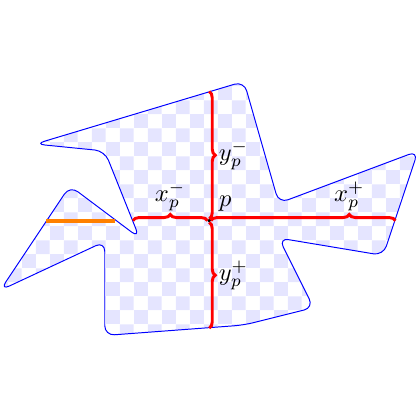

# test_31.png



以下是针对该科研绘图的完整 LaTeX/TikZ 重构指导：

### 1. 概览

- **描述图像的整体视觉要点**：这是一张展示在不规则多边形上的坐标与箭头的图。中心有一个点，延伸出四条箭头，分别指向上下左右。
- **构图布局**：中心点为原点，箭头分布于四个方向。背景为棋盘格纹，具有半透明效果。
- **主要元素关系**：中心点与箭头的终点与标签紧密关联。

### 2. 文档骨架与依赖

- **推荐的文档类**：`standalone`
- **核心宏包**：`TikZ`, `xcolor`
- **特定功能**：箭头、渐变、背景图案—需要 `arrows.meta` 和 `patterns` 库。

### 3. 版面与画布设置

- **图形的尺寸**：建议设置为 `10cm` x `10cm`
- **坐标系范围**：基于中心对称设置，如：`(-5,-5) - (5,5)`
- **纵横比**：1:1
- **节点与元素的间距**：适中，均匀分布
- **对齐方式**：中心对齐

### 4. 字体与配色

- **字体**：默认字体，建议使用 `\small`
- **主色**：蓝色边缘（HTML: `#0000FF`）、红色箭头（HTML: `#FF0000`）
- **辅助色**：背景棋盘格
- **渐变/透明度**：背景色半透明设置 `opacity=0.2`

### 5. 结构与组件样式

- **节点**：无边框、默认对齐
- **边与箭头**：红色线条，使用 `very thick`，箭头样式为 `-Latex`
- **坐标轴**：无明显坐标轴，但需保持箭头方向性

### 6. 数学/表格/图形细节

- **公式**：节点标题放于箭头末端，使用数学模式如 `$x_p^-$`
- **表格**：无
- **图形**：使用 `draw` 绘制多边形和箭头

### 7. 自定义宏与命令

- 定义箭头样式：`\tikzset{arrowstyle/.style={very thick, -Latex}}`

### 8. 最小可运行示例 (MWE)

```latex
\documentclass[tikz,border=5pt]{standalone}
\usepackage{xcolor}
\usetikzlibrary{patterns, arrows.meta}

\begin{document}
\begin{tikzpicture}
    % Background pattern
    \fill[pattern=checkerboard, pattern color=blue!20] (-5,-5) rectangle (5,5);
    
    % Irregular polygon
    \draw[blue, thick] (0,0) -- (-4,1) -- (-3,-2) -- (-5,-3) -- (-2,-4) -- (-1,-5)
                        -- (2,-3) -- (3,-5) -- (5,-2) -- (2,1) -- cycle;
    
    % Arrows
    \draw[red, arrowstyle] (0,0) -- (0,3) node[midway, right] {$y_p^+$};
    \draw[red, arrowstyle] (0,0) -- (0,-3) node[midway, right] {$y_p^-$};
    \draw[red, arrowstyle] (0,0) -- (-3,0) node[midway, below] {$x_p^-$};
    \draw[red, arrowstyle] (0,0) -- (3,0) node[midway, below] {$x_p^+$};
    
    % Center point
    \node at (0.2,0.2) {\small $p$};
\end{tikzpicture}
\end{document}
```

### 9. 复刻检查清单

- **图形尺寸、坐标范围**：10cm x 10cm，中心对称
- **节点/边样式**：箭头末端点、方向一致
- **字体与字号**：符合原图，使用 `\small`
- **配色与线型**：蓝色边框，红色箭头
- **特殊效果（渐变、阴影）**：背景棋盘格的透明度
- **与原图的差异点**：不规则多边形的精确顶点位置可能有所不同

### 10. 风险与替代方案

- **不确定因素**：颜色显示可能因设备不同造成差异；字体渲染组件差异。
- **替代方案**：颜色可使用最接近的 `xcolor` 预定义色；字体可以使用默认 Computer Modern 替代设计上可能的特定字体。
