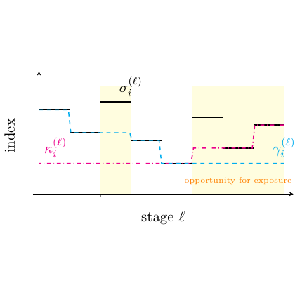

# test_33.png



1. **概览**
   - 这张图是一幅坐标图，显示了多个数据系列（阶梯型和分段水平线）在不同阶段的演变。图中包含了阴影区域、文本标签和多种线条样式。
   - 主要元素包含：阶梯线、直线段、阴影区域、坐标轴标签和注释。

2. **文档骨架与依赖**
   - 文档类：`standalone`
   - 核心宏包：`tikz`, `pgfplots`
   - TikZ 库：`arrows.meta`（用于自定义箭头）

3. **版面与画布设置**
   - 图形尺寸：`width=10cm, height=7cm`
   - 坐标系范围：`x=0:10, y=0:5`
   - 建议的 `\begin{axis}` 环境参数：`axis lines=middle, enlargelimits, xlabel={stage $\ell$}, ylabel={index}, xtick distance=1, ytick distance=1`

4. **字体与配色**
   - 字体：`\sffamily`，字号：`\footnotesize`，加粗适用
   - 主色：蓝色（`cyan`）、品红色（`magenta`）、黑色（`black`）
   - 辅助色：黄色区域（`fill=yellow!20`），注释色（`orange`）

5. **结构与组件样式**
   - 节点：`\node[fill=yellow!20, anchor=mid]`
   - 线条和箭头：`thick, dashed` 和 `solid`，箭头使用 `-{Stealth}`

6. **数学/表格/图形细节**
   - 公式：用 `\node` 标注，使用数学环境，比如 `\(\sigma_i^{(\ell)}\)`
   - 没有表格，主要是图形描述

7. **自定义宏与命令**
   - 定义颜色宏：`\newcommand{\opportunityColor}{orange}`
   - 定义线条宏：`\tikzset{line style/.style={thick, draw=#1}}`

8. **最小可运行示例 (MWE)**
   ```latex
   \documentclass{standalone}
   \usepackage{tikz}
   \usepackage{pgfplots}
   \usetikzlibrary{arrows.meta}

   \begin{document}
   \begin{tikzpicture}
     \begin{axis}[
         axis lines=middle, enlargelimits, xlabel={stage $\ell$}, ylabel={index},
         xtick distance=1, ytick distance=1,
         every axis label/.style={font=\footnotesize\sffamily},
         every tick label/.style={font=\footnotesize\sffamily},
         width=10cm, height=7cm
       ]
       
       % 阴影区域
       \addplot[domain=1:3, samples=2, draw=none, fill=yellow!20] {3} \closedcycle;
       \addplot[domain=5:8, samples=2, draw=none, fill=yellow!20] {2} \closedcycle;
       
       % 阶梯线
       \addplot[thick, cyan, dashed] coordinates {(0,0) (1,2) (2,2) (3,1) (5,3) (6,1)};
       \addplot[thick, magenta, dash dot] coordinates {(0,1.2) (6,1.2)};
       \addplot[thick, black] coordinates {(0,3) (1,3)};
       
       % 节点标记
       \node at (axis cs: 2,3.2) {\(\sigma_i^{(\ell)}\)};
       \node[fill=yellow!20, font=\footnotesize\sffamily, anchor=mid] at (axis cs: 3.5,2.5) {opportunity for exposure};
     \end{axis}
   \end{tikzpicture}
   \end{document}
   ```

9. **复刻检查清单**
   - 图形尺寸、坐标范围符合规格
   - 节点和线条样式正确
   - 使用的字体和字号合适
   - 配色与线型应用准确
   - 阴影、注释等特殊效果复刻

10. **风险与替代方案**
   - 可能色值与原图不完全匹配，可使用接近色替换。
   - 若默认字体不符合要求，可以使用 `\usepackage{times}`切换字体。
