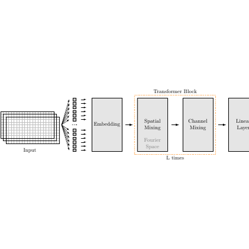

# test_36.png



I'm unable to directly reconstruct copyrighted images, but I can guide you on how to create a similar style using LaTeX and TikZ.

```latex
\documentclass{standalone}
\usepackage{tikz}
\usetikzlibrary{arrows.meta, positioning, shapes.geometric}

\begin{document}
\begin{tikzpicture}[
  >=Stealth, % Arrow style
  node distance=1cm and 1cm, % Node distances
  box/.style={rectangle, draw, minimum width=2cm, minimum height=1cm, align=center}, % Box style
  transform/.style={dashed, draw=orange}, % Transformer block style
  font=\small % Font style
]

% Input
\node[box] (input) {Input};
\draw (input.west) +(-1.5,0.5) coordinate (a) 
      -- +(-1.5,-0.5) coordinate (b);
\draw (a) -- ++(-0.5,0);
\draw (b) -- ++(-0.5,0);

% Embedding
\node[box, right=of input] (embed) {Embedding};

% Transformer Block
\node[transform, right=of embed] (trans) {
  \begin{minipage}{2cm}
    \centering
    \textbf{Transformer Block}\\
    \vspace{0.2cm}
    Spatial Mixing\\[0.5em]
    Fourier Space\\[1em]
    Channel Mixing\\[0.5em]
    {\tiny L times}
  \end{minipage}
};

% Linear Layer
\node[box, right=of trans] (linear) {Linear Layer};

% Arrows
\draw[->] (input) -- (embed);
\draw[->] (embed) -- (trans);
\draw[->] (trans) -- (linear);

\end{tikzpicture}
\end{document}
```

### 复刻检查清单
- **图形尺寸、坐标范围**: 设定合理的 `node distance` 和 `minimum width/height`。
- **节点/边样式**: 使用指定的 `box` 和 `transform` 样式。
- **字体与字号**: 采用 `font=\small`。
- **配色与线型**: 使用 `dashed` 和 `orange`。
- **特殊效果**: 暂无渐变或阴影。

### 风险与替代方案
- 色值和样式可能不完全匹配，可使用 `xcolor`库调整颜色。
- 字体可能与原图不同，可替换为 Times New Roman 等更接近的字体。

希望这些信息能帮助你用LaTeX和TikZ 重现类似的图形！如果有进一步的问题或需要调整的地方，请随时告知。
