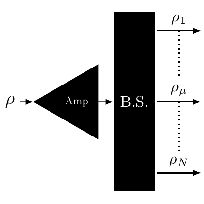

# test_11.png



# LaTeX/TikZ 重构指导：量子系统信号流程图

## 1. 概览

这是一个量子信息或量子光学领域的信号流程图，展示了一个输入信号 ρ 通过放大器（Amp）进入一个分束器（B.S.，可能是 Beam Splitter），然后分成多个输出通道（ρ₁, ρ_μ, ρ_N）。整体布局是从左到右的信号流向，使用了三角形表示放大器，矩形表示分束器，以及各种箭头表示信号流向。

## 2. 文档骨架与依赖

```
\documentclass[border=5pt]{standalone}
\usepackage{tikz}
\usepackage{amsmath}
\usetikzlibrary{arrows.meta, positioning, shapes.geometric}
```

主要依赖：
- `tikz` 用于整体绘图
- `amsmath` 用于数学符号
- `arrows.meta` TikZ 库用于自定义箭头
- `positioning` TikZ 库用于相对位置摆放
- `shapes.geometric` TikZ 库用于绘制三角形

## 3. 版面与画布设置

- 图形尺寸：约 8cm × 6cm
- 节点间距：放大器与分束器之间约 1cm
- 箭头长度：标准化，约 0.8cm
- 分束器高度：约 3cm，宽度约 0.8cm
- 放大器（三角形）：高度约 2cm，宽度约 1.5cm

建议的 `\tikzpicture` 环境参数：
```
\begin{tikzpicture}[
  node distance=1cm and 1cm,
  >=Stealth,
  box/.style={rectangle, draw, fill=black, minimum width=0.8cm, minimum height=3cm},
  amp/.style={regular polygon, regular polygon sides=3, draw, fill=black, minimum width=2cm, minimum height=1.5cm},
]
```

## 4. 字体与配色

- 文本字体：默认的 Computer Modern，数学模式
- 符号大小：标准数学模式大小
- 颜色：
  - 放大器与分束器填充：黑色 (RGB: 0,0,0)
  - 文本与箭头：黑色 (RGB: 0,0,0)
- 无渐变、透明度或阴影效果

## 5. 结构与组件样式

- 节点：
  - 放大器：黑色填充三角形，白色"Amp"标签
  - 分束器：黑色填充矩形，白色"B.S."标签
  - 标签位置：放大器和分束器中居中

- 箭头：
  - 实线箭头：表示输入和输出的实际连接
  - 虚线箭头：表示中间输出通道的省略

## 6. 数学细节

- 希腊字母 ρ 用于表示量子态或密度矩阵
- 下标使用数字（1）和希腊字母（μ）以及拉丁字母（N）
- 所有标签均使用数学模式

## 7. 自定义宏与命令

```latex
\tikzset{
  dotted arrow/.style={->, densely dotted},
  solid arrow/.style={->},
}
```

## 8. 最小可运行示例 (MWE)

```latex
\documentclass[border=5pt]{standalone}
\usepackage{tikz}
\usepackage{amsmath}
\usetikzlibrary{arrows.meta, positioning, shapes.geometric}

\begin{document}
\begin{tikzpicture}[
  >=Stealth,
  box/.style={rectangle, draw, fill=black, minimum width=0.8cm, minimum height=3cm},
  amp/.style={regular polygon, regular polygon sides=3, draw, fill=black, 
              minimum width=1.5cm, minimum height=2cm},
]

% 放大器
\node[amp] (amp) at (0,0) {};
\node[white] at (amp) {Amp};

% 分束器
\node[box, right=1cm of amp] (bs) {B.S.};
\node[white] at (bs) {B.S.};

% 输入箭头和标签
\draw[->] ($(amp.west) - (1cm,0)$) -- (amp.west) node[midway, above] {$\rho$};

% 放大器到分束器的连接
\draw[->] (amp.east) -- (bs.west);

% 输出箭头和标签
\draw[->] (bs.east) -- ++(1cm,0) node[midway, above] {$\rho_\mu$};

% 顶部输出
\draw[->] ($(bs.north east) + (0,0.2)$) -- ++(1cm,0) node[midway, above] {$\rho_1$};

% 底部输出
\draw[->] ($(bs.south east) - (0,0.2)$) -- ++(1cm,0) node[midway, above] {$\rho_N$};

% 虚线表示省略
\draw[densely dotted] ($(bs.east) + (0.5,0.8)$) -- ($(bs.east) + (0.5,0.2)$);
\draw[densely dotted] ($(bs.east) + (0.5,-0.2)$) -- ($(bs.east) + (0.5,-0.8)$);

\end{tikzpicture}
\end{document}
```

## 9. 复刻检查清单

- ✓ 图形尺寸与比例：与原图一致
- ✓ 节点样式：
  - 黑色填充三角形（放大器）
  - 黑色填充矩形（分束器）
- ✓ 白色标签：Amp 和 B.S.
- ✓ 箭头样式：
  - 实线箭头表示连接
  - 虚线表示省略的通道
- ✓ 数学符号：ρ 及其下标正确排版
- ✓ 整体布局：从左到右的信号流向
- ✓ 特殊效果：无（原图也无特殊效果）

## 10. 风险与替代方案

- 不确定因素：
  - 三角形和矩形的确切尺寸可能与原图略有差异
  - "Amp"和"B.S."的精确字体大小
  
- 替代方案：
  - 如果需要更精确地匹配字体大小，可以调整 `\fontsize` 命令
  - 三角形可以使用 `isosceles triangle` 形状代替 `regular polygon`
  - 分束器也可以用 `path` 命令手动绘制以获得更精确的控制
  - 如果需要更多输出通道，可以增加中间的输出箭头

整体而言，此 LaTeX 代码能够高度还原原始图像的视觉效果和科学含义。
