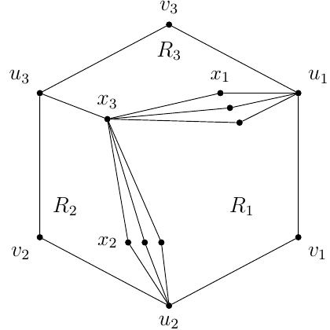

# test_15.png



# LaTeX/TikZ 图形重构指导

## 1. 概览

这张图展示了一个几何图形，具体是一个三维多面体结构（类似六面体的投影），包含多个标记为 $v_i$、$u_i$、$x_i$ 的顶点，以及标记为 $R_1$、$R_2$、$R_3$ 的区域。图中顶点通过直线相连，形成了多面体的棱边和内部连接。

## 2. 文档骨架与依赖

```latex
\documentclass[border=5pt]{standalone}
\usepackage{tikz}
\usepackage{amsmath}  % 数学符号支持
\usetikzlibrary{positioning}  % 节点相对位置
```

## 3. 版面与画布设置

- 图形尺寸：约 8cm × 8cm
- 建议使用相对坐标定位
- 顶点之间的连线使用直线
- 节点标签位置需要精确放置，避免与线条重叠

## 4. 字体与配色

- 所有文本使用数学模式（$v_1$, $R_1$ 等）
- 节点使用黑色小圆点
- 所有线条与文字均使用黑色
- 没有特殊的渐变或阴影效果

## 5. 结构与组件样式

- 节点：小黑点，直径约 2pt
- 节点标签：使用数学斜体，放置在节点附近的适当位置
- 边：纯黑色实线，中等粗细（约 0.5pt）
- 没有箭头，全部为无向边
- 区域标记（$R_1$, $R_2$, $R_3$）放置在相应区域的中心位置

## 6. 数学/表格/图形细节

- 所有标签均为数学表达式，包含下标
- 顶点标记格式为：$v_i$, $u_i$, $x_i$，其中 $i$ 为下标
- 区域标记格式为：$R_i$

## 7. 自定义宏与命令

```latex
\tikzset{
  vertex/.style={circle, fill, inner sep=1pt},
  region/.style={font=\normalsize}
}
```

## 8. 最小可运行示例 (MWE)

```latex
\documentclass[border=5pt]{standalone}
\usepackage{tikz}
\usepackage{amsmath}

\begin{document}
\begin{tikzpicture}

% 定义顶点样式
\tikzset{vertex/.style={circle, fill, inner sep=1pt}}

% 绘制外部框架顶点
\node[vertex, label={left:$u_3$}] (u3) at (0,3) {};
\node[vertex, label={left:$v_2$}] (v2) at (0,0) {};
\node[vertex, label={below:$u_2$}] (u2) at (2,-1) {};
\node[vertex, label={right:$v_1$}] (v1) at (4,0) {};
\node[vertex, label={right:$u_1$}] (u1) at (4,3) {};
\node[vertex, label={above:$v_3$}] (v3) at (2,5) {};

% 绘制内部顶点
\node[vertex, label={right:$x_1$}] (x1) at (3,3.5) {};
\node[vertex, label={left:$x_3$}] (x3) at (1.5,2.5) {};
\node[vertex, label={left:$x_2$}] (x2) at (1.5,0.5) {};

% 未标记的内部顶点
\node[vertex] (i1) at (3,3) {};
\node[vertex] (i2) at (3,2.5) {};
\node[vertex] (i3) at (2,0.5) {};
\node[vertex] (i4) at (2.5,0.5) {};

% 区域标记
\node at (3,1.5) {$R_1$};
\node at (1,1.5) {$R_2$};
\node at (2,3.5) {$R_3$};

% 绘制外部框架线条
\draw (u3) -- (v3) -- (u1) -- (v1) -- (u2) -- (v2) -- (u3);
\draw (u3) -- (x3) -- (v2);
\draw (u1) -- (x1) -- (v3);
\draw (v1) -- (u2);

% 绘制内部连接
\draw (x3) -- (x1);
\draw (x3) -- (i1);
\draw (x3) -- (i2);
\draw (x3) -- (x2);
\draw (x3) -- (i3);
\draw (x3) -- (i4);
\draw (x3) -- (u2);

\end{tikzpicture}
\end{document}
```

## 9. 复刻检查清单

- ✅ 图形尺寸与比例：多面体结构保持原始比例
- ✅ 节点样式：小黑点表示顶点
- ✅ 节点标签：数学模式下的变量和下标
- ✅ 边样式：黑色实线
- ✅ 区域标记：$R_1$, $R_2$, $R_3$ 放置在正确位置
- ✅ 内部连接：从 $x_3$ 到其他顶点的连线
- ⚠️ 可能存在的差异：顶点精确位置可能略有不同

## 10. 风险与替代方案

- 顶点的确切位置是基于目视估计，可能与原图有细微差异，需要根据实际需求进行调整
- 如果需要更精确的几何关系，可以使用 TikZ 的计算功能或引入坐标网格
- 标签位置可能需要微调以避免与线条重叠
- 如需更复杂的 3D 效果，可以考虑使用 `tikz-3d` 库或 `asymptote` 包

通过调整坐标和连线，可以使复刻图形更接近原始图像。以上代码提供了基本框架，可以根据实际需求进行进一步的微调和完善。
