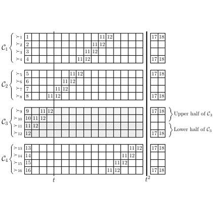

# test_16.png



# LaTeX/TikZ 重构指导：矩阵块状结构图

## 1. 概览

这是一个矩阵/网格结构示意图，展示了四个标记为 $C_1$、$C_2$、$C_3$ 和 $C_4$ 的矩阵块。每个矩阵块由网格单元组成，部分单元格中标注了数字组合如 [1][12]、[11][2] 等。图中还包括了描述 $C_3$ 上下半部分的右侧注释。整体采用灰色网格线和黑色标签，具有学术/科研风格的排版。

## 2. 文档骨架与依赖

```latex
\documentclass[border=10pt]{standalone}
\usepackage{tikz}
\usetikzlibrary{matrix, positioning, fit, decorations.pathreplacing, calligraphy}
\usepackage{amsmath, amssymb}
```

## 3. 版面与画布设置

- 图形宽度：约 12cm
- 高度：约 8cm
- 矩阵块间距：约 0.5cm
- 主要使用 TikZ 矩阵和相对定位

## 4. 字体与配色

- 字体：默认 LaTeX 数学字体（Computer Modern）
- 字号：正常文本大小，数学符号标准大小
- 颜色：
  - 网格线：灰色 (gray!50)
  - 文本和标签：黑色
  - 无填充色

## 5. 结构与组件样式

- 矩阵节点：使用 TikZ 矩阵，每个单元格大小一致
- 网格线：细灰色线条
- 标签：左侧使用数学符号 $C_i$ 和 $\sim i$
- 右侧小矩阵：与主矩阵对齐，显示索引值
- 大括号：使用 TikZ decoration.pathreplacing 库的 brace 装饰

## 6. 数学/表格/图形细节

- 矩阵表示：使用 TikZ matrix 构建网格
- 索引标记：采用 [i][j] 形式的数学表示
- 底部标签：$t$ 和 $t^2$ 作为列索引标记

## 7. 自定义宏与命令

```latex
% 定义网格样式
\tikzset{
  grid cell/.style={
    minimum size=0.4cm,
    draw=gray!50,
  },
  matrix grid/.style={
    matrix of nodes,
    row sep=-\pgflinewidth,
    column sep=-\pgflinewidth,
    nodes={grid cell},
    nodes in empty cells
  }
}
```

## 8. 最小可运行示例 (MWE)

```latex
\documentclass[border=10pt]{standalone}
\usepackage{tikz}
\usetikzlibrary{matrix, positioning, fit, decorations.pathreplacing, calligraphy}
\usepackage{amsmath, amssymb}

\begin{document}

\begin{tikzpicture}[font=\footnotesize]
  % 定义样式
  \tikzset{
    grid cell/.style={
      minimum size=0.4cm,
      draw=gray!50,
      anchor=center,
    },
    matrix grid/.style={
      matrix of nodes,
      row sep=-\pgflinewidth,
      column sep=-\pgflinewidth,
      nodes={grid cell},
      nodes in empty cells
    },
    small matrix/.style={
      matrix of nodes,
      row sep=-\pgflinewidth,
      column sep=-\pgflinewidth,
      nodes={grid cell, minimum size=0.4cm},
      nodes in empty cells
    }
  }
  
  % C1 矩阵
  \matrix (C1) [matrix grid, label=left:$C_1$] {
    |[label={left:$\sim 1$}]| & & & & & & & & |[label={center:[1][12]}]| & & & & & & & \\
    |[label={left:$\sim 2$}]| & & & & & & & & & |[label={center:[11][2]}]| & & & & & & \\
    |[label={left:$\sim 3$}]| & & & & & & & & & & |[label={center:[11][12]}]| & & & & & \\
    |[label={left:$\sim 4$}]| & & & & & & & & & & & |[label={center:[11][12]}]| & & & & \\
  };
  
  % C2 矩阵
  \matrix (C2) [matrix grid, below=0.8cm of C1, label=left:$C_2$] {
    |[label={left:$\sim 5$}]| & & & & & & |[label={center:[1][12]}]| & & & & & & & & & \\
    |[label={left:$\sim 6$}]| & & & & & & & |[label={center:[11][2]}]| & & & & & & & & \\
    |[label={left:$\sim 7$}]| & & & & & & & & |[label={center:[11][12]}]| & & & & & & & \\
    |[label={left:$\sim 8$}]| & & & & & & & & & |[label={center:[11][12]}]| & & & & & & \\
  };
  
  % C3 矩阵
  \matrix (C3) [matrix grid, below=0.8cm of C2, label=left:$C_3$] {
    |[label={left:$\sim 9$}]| |[label={center:[1]}]| |[label={center:[11][2]}]| & & & & & & & & & & & & & & \\
    |[label={left:$\sim 10$}]| & |[label={center:[11][12]}]| & & & & & & & & & & & & & \\
    |[label={left:$\sim 11$}]| & & |[label={center:[11][12]}]| & & & & & & & & & & & & \\
    |[label={left:$\sim 12$}]| & & & |[label={center:[11][12]}]| & & & & & & & & & & & \\
  };
  
  % C4 矩阵
  \matrix (C4) [matrix grid, below=0.8cm of C3, label=left:$C_4$] {
    |[label={left:$\sim 13$}]| & & & & & & & & & & & & |[label={center:[1][12]}]| & & & \\
    |[label={left:$\sim 14$}]| & & & & & & & & & & & & & |[label={center:[11][2]}]| & & \\
    |[label={left:$\sim 15$}]| & & & & & & & & & & & & & & |[label={center:[11][12]}]| & \\
    |[label={left:$\sim 16$}]| & & & & & & & & & & & & & & & |[label={center:[11][12]}]| \\
  };
  
  % 底部标签
  \node[below=0.1cm of C4] {$t$};
  \node[below=0.1cm of C4-4-16] {$t^2$};
