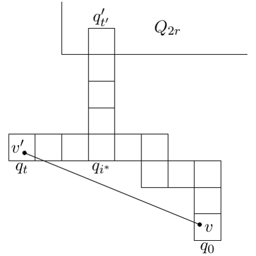

# test_17.png



# LaTeX/TikZ 图形重构指导

## 1. 概览

图像展示了一个格点状结构图，类似于计算机科学或数学中的离散网格或路径表示。主要包含：
- 一个L形的网格结构
- 网格上的几个标记点（v'、v）
- 连接两点的对角线
- 多个带有下标的数学标记（q'i、Q2r、qi*、q0等）

## 2. 文档骨架与依赖

```latex
\documentclass[border=5pt]{standalone}
\usepackage{tikz}
\usepackage{amsmath,amssymb}
\usetikzlibrary{matrix,positioning}
```

## 3. 版面与画布设置

- 图形尺寸：约10cm × 10cm
- 采用矩阵表示网格结构
- 节点间距保持一致
- 网格单元大小一致

## 4. 字体与配色

- 使用标准数学字体（Computer Modern）
- 黑色线条和文本
- 无填充色
- 无特殊渐变或透明度

## 5. 结构与组件样式

- 网格：由细线构成的方形单元
- 节点：小圆点表示特殊位置
- 线条：连接点v'和v的对角线为直线
- 标签：使用数学斜体和上下标

## 6. 数学细节

- 数学标记包含上标（'）和下标
- 使用TikZ节点放置数学标记
- 标记位置精确放置在网格的特定位置

## 7. 自定义宏与命令

```latex
\tikzset{
  grid point/.style={circle, fill, inner sep=1.2pt},
  math label/.style={font=\small}
}
```

## 8. 最小可运行示例 (MWE)

```latex
\documentclass[border=5pt]{standalone}
\usepackage{tikz}
\usepackage{amsmath}
\usetikzlibrary{matrix,positioning}

\begin{document}
\begin{tikzpicture}[scale=0.8]
  % 定义样式
  \tikzset{
    grid point/.style={circle, fill, inner sep=1.2pt},
    math label/.style={font=\small}
  }
  
  % 创建垂直网格部分
  \draw (0,0) -- (0,4);
  \draw (0,4) -- (1,4);
  \draw (1,1) -- (1,4);
  \draw (0,1) -- (0,0) -- (6,0);
  
  % 创建水平网格部分
  \draw (0,1) -- (6,1);
  \foreach \i in {2,...,6} {
    \draw (\i,0) -- (\i,1);
  }
  
  % 创建垂直小方格
  \foreach \i in {2,3} {
    \draw (1,\i) -- (2,\i);
  }
  \draw (1,1) -- (2,1);
  
  % 添加对角线
  \draw (1,1) -- (6,0);
  
  % 添加标记点
  \node[grid point, label={[xshift=-0.2cm, yshift=-0.2cm]:$v'$}] at (1,1) {};
  \node[grid point, label={[xshift=0.2cm, yshift=-0.2cm]:$v$}] at (6,0) {};
  
  % 添加标签
  \node[math label] at (1.5,4.3) {$q'_{i'}$};
  \node[math label] at (4,4.3) {$Q_{2r}$};
  \node[math label] at (0.5,0.7) {$q'_i$};
  \node[math label] at (3,0.7) {$q_{i^*}$};
  \node[math label] at (6,0.3) {$q_0$};
\end{tikzpicture}
\end{document}
```

## 9. 复刻检查清单

- ✓ 图形整体L形结构
- ✓ 网格单元大小一致
- ✓ 标记点位置准确
- ✓ 数学标记包含正确的上下标
- ✓ 对角线连接两个标记点
- ✓ 线条粗细一致
- ✓ 字体大小与原图匹配

## 10. 风险与替代方案

- 不确定因素：
  - 原图中网格单元的精确尺寸
  - 标签的精确位置可能需要微调
  - 标记点大小可能需要调整

- 替代方案：
  - 可以使用`matrix`库创建更规则的网格
  - 可考虑使用`chains`库简化网格绘制
  - 如需更精确的网格对齐，可使用`calc`库计算精确位置

## 调整建议

运行MWE后，可能需要微调以下内容：
1. 标签位置可能需要调整以确保最佳布局
2. 标记点大小可根据需要调整
3. 网格线条的粗细可以通过`line width`参数调整
