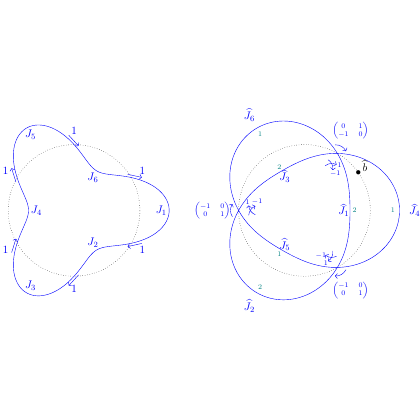

# test_18.png



# LaTeX/TikZ 重构指导：数学图形复刻

## 1. 概览

这张图是一个数学示意图，由两个并列的拓扑结构图组成，展示了一些曲线、点和标记。每个结构包含若干蓝色实线曲线和灰色虚线曲线，以及带编号的点和标记（如 $J_n$）。图形风格简洁，采用蓝色和灰色线条，黑色点标记，数学符号标注。

## 2. 文档骨架与依赖

```latex
\documentclass[border=5pt]{standalone}
\usepackage{tikz}
\usetikzlibrary{decorations.markings}
\usepackage{amsmath, amssymb}
```

需要的 TikZ 库：
- `decorations.markings`：用于在曲线上添加箭头标记
- `amsmath, amssymb`：用于数学符号和公式排版

## 3. 版面与画布设置

- 图形总宽度：约 12cm
- 图形高度：约 6cm
- 两个子图之间的间距：约 1cm
- 坐标系：自定义相对坐标

建议的 `\tikzpicture` 环境参数：
```latex
\begin{tikzpicture}[scale=1.2]
```

## 4. 字体与配色

- 字体：默认的数学字体（Computer Modern Math）
- 字号：普通正文大小
- 配色：
  - 蓝色曲线：RGB(0, 0, 255) 或 `blue`
  - 灰色虚线：RGB(180, 180, 180) 或 `gray!60`
  - 点标记：黑色 `black`
  - 文本标签：蓝色 `blue`

## 5. 结构与组件样式

- 点标记：
  - 主要点：实心圆点，直径约 2pt
  - 次要点：空心圆点，直径约 2pt，边框粗细 0.5pt
  
- 线条：
  - 蓝色实线：粗细约 0.8pt，箭头样式为默认箭头
  - 灰色虚线：粗细约 0.6pt，虚线模式 `dashed`
  
- 标签：
  - 点标签（数字）：位于点旁边，与点有少量间距
  - 曲线标签（$J_n$）：位于曲线中间位置附近，蓝色

## 6. 数学/表格/图形细节

- 数学标记：使用 `$...$` 包围，如 `$J_1$`
- 坐标标记：使用形如 `$(\frac{a}{b}, \frac{c}{d})$` 的分数表示
- 曲线：使用 TikZ 的 `\draw[options] (start) .. controls (control1) and (control2) .. (end);` 贝塞尔曲线语法

## 7. 自定义宏与命令

```latex
% 定义样式
\tikzset{
  point/.style={circle, fill, minimum size=2pt, inner sep=0pt},
  hollow point/.style={circle, draw, minimum size=2pt, inner sep=0pt},
  blue curve/.style={blue, thick, ->, >=stealth},
  gray curve/.style={gray!60, dashed}
}
```

## 8. 最小可运行示例 (MWE)

```latex
\documentclass[border=5pt]{standalone}
\usepackage{tikz}
\usetikzlibrary{decorations.markings}
\usepackage{amsmath, amssymb}

\begin{document}

\begin{tikzpicture}[scale=1.2]
% 定义样式
\tikzset{
  point/.style={circle, fill, minimum size=2pt, inner sep=0pt},
  hollow point/.style={circle, draw, minimum size=2pt, inner sep=0pt},
  blue curve/.style={blue, thick, ->, >=stealth},
  gray curve/.style={gray!60, dashed}
}

% 左侧图形
\begin{scope}[shift={(-3,0)}]
  % 点
  \node[point, label={below:$1$}] (p1) at (-1.5,-1) {};
  \node[point, label={above:$2$}] (p2) at (-0.5,1) {};
  \node[point, label={right:$3$}] (p3) at (1,0.5) {};
  \node[point, label={right:$4$}] (p4) at (0.5,-1.5) {};
  
  % 蓝色曲线
  \draw[blue curve] (p1) .. controls (-2,0) and (-1.5,1.5) .. (p2) node[midway, above left] {$J_1$};
  \draw[blue curve] (p2) .. controls (0,1.2) and (0.5,1) .. (p3) node[midway, above] {$J_2$};
  \draw[blue curve] (p3) .. controls (1.2,0) and (1,-1) .. (p4) node[midway, right] {$J_3$};
  \draw[blue curve] (p4) .. controls (0,-1.8) and (-1,-1.5) .. (p1) node[midway, below] {$J_4$};
  
  % 灰色虚线
  \draw[gray curve] (p1) .. controls (-0.5,-0.5) and (0,0) .. (p3);
  \draw[gray curve] (p2) .. controls (-0.2,0.2) and (0,0) .. (p4);
\end{scope}

% 右侧图形
\begin{scope}[shift={(3,0)}]
  % 点
  \node[point, label={below:$1$}] (p1) at (-1.5,-1) {};
  \node[point, label={above:$2$}] (p2) at (-0.5,1) {};
  \node[point, label={right:$3$}] (p3) at (1,0.5) {};
  \node[point, label={right:$4$}] (p4) at (0.5,-1.5) {};
  \node[point] (p5) at (0.2,0) {};
  \node[hollow point] (p6) at (1.5,0) {};
  
  % 蓝色曲线
  \draw[blue curve] (p1) .. controls (-2,0) and (-1.5,1.5) .. (p2) node[midway, above left] {$\tilde{J}_1$};
  \draw[blue curve] (p2) .. controls (0,1.2) and (0.5,1) .. (p3) node[midway, above] {$\tilde{J}_2$};
  \draw[blue curve] (p3) .. controls (1.2,0) and (1,-1) .. (p4) node[midway, right] {$\tilde{J}_3$};
  \draw[blue curve] (p4) .. controls (0,-1.8) and (-1,-1.5) .. (p1) node[midway, below] {$\tilde{J}_4$};
  
  % 中心点标记
  \node[blue] at (p5) [above
