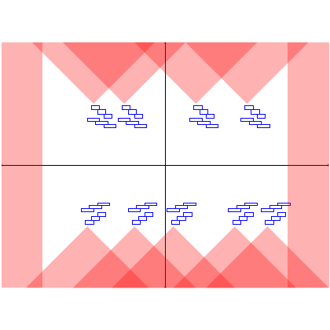

# test_20.png



# LaTeX/TikZ 重构指导：矩阵分块图

## 1. 概览

这张图是一个矩阵分块示意图，展示了一个被划分为2×2网格的矩阵结构。每个块内包含多个小矩形堆叠结构，用蓝色线条勾勒。整个矩阵有粉红色的背景图案，呈现出对角线上有深色区域，非对角线上有浅色区域的视觉效果。图像使用黑色线条将矩阵分为四个区域。

## 2. 文档骨架与依赖

```
\documentclass[border=5pt]{standalone}
\usepackage{tikz}
\usetikzlibrary{patterns,backgrounds,positioning}
```

## 3. 版面与画布设置

- 图形尺寸：约 10cm × 8cm
- 坐标系：使用 TikZ 的默认坐标系
- 主要网格：2×2 的矩阵分块
- 建议使用相对坐标定位

## 4. 字体与配色

- 无文字标签
- 主要颜色：
  - 背景粉红色：深色 RGB(247, 122, 122)，约 #F77A7A
  - 背景粉红色：浅色 RGB(255, 200, 200)，约 #FFC8C8
  - 矩形框线：蓝色 RGB(0, 0, 255)，#0000FF
  - 矩阵分隔线：黑色 #000000

## 5. 结构与组件样式

- 矩阵网格：2×2 的黑色线条分隔
- 每个分块中的小矩形：
  - 蓝色线条勾勒
  - 白色填充
  - 堆叠排列，呈现出阶梯状结构
- 背景采用交叉渐变的粉红色图案

## 6. 数学/表格/图形细节

- 无数学公式
- 无表格
- 图形细节：
  - 每个分块内的小矩形组合呈现不同的排列方式
  - 上半部分和下半部分的排列有所差异
  - 小矩形尺寸基本一致

## 7. 自定义宏与命令

```latex
% 定义小矩形堆叠结构
\newcommand{\blockstructure}[3]{% x, y, 类型
  \begin{scope}[shift={(#1,#2)}]
    \ifcase#3% 类型0
      \draw[blue] (0,0) rectangle (0.6,0.2);
      \draw[blue] (0.1,-0.2) rectangle (0.7,0);
      \draw[blue] (0.2,-0.4) rectangle (0.8,-0.2);
    \or% 类型1
      \draw[blue] (0,0) rectangle (0.6,0.2);
      \draw[blue] (0.1,-0.2) rectangle (0.7,0);
      \draw[blue] (0.2,-0.4) rectangle (0.8,-0.2);
      \draw[blue] (0.3,-0.6) rectangle (0.9,-0.4);
    \or% 类型2
      \draw[blue] (0,0) rectangle (0.6,0.2);
      \draw[blue] (0.1,-0.2) rectangle (0.7,0);
    \fi
  \end{scope}
}
```

## 8. 最小可运行示例 (MWE)

```latex
\documentclass[border=5pt]{standalone}
\usepackage{tikz}
\usetikzlibrary{patterns,backgrounds}

\begin{document}
\begin{tikzpicture}

% 定义小矩形堆叠结构
\newcommand{\blockstructure}[3]{% x, y, 类型
  \begin{scope}[shift={(#1,#2)}]
    \ifcase#3% 类型0 - 3层
      \draw[blue] (0,0) rectangle (0.6,0.2);
      \draw[blue] (0.1,-0.2) rectangle (0.7,0);
      \draw[blue] (0.2,-0.4) rectangle (0.8,-0.2);
    \or% 类型1 - 4层
      \draw[blue] (0,0) rectangle (0.6,0.2);
      \draw[blue] (0.1,-0.2) rectangle (0.7,0);
      \draw[blue] (0.2,-0.4) rectangle (0.8,-0.2);
      \draw[blue] (0.3,-0.6) rectangle (0.9,-0.4);
    \or% 类型2 - 2层
      \draw[blue] (0,0) rectangle (0.6,0.2);
      \draw[blue] (0.1,-0.2) rectangle (0.7,0);
    \fi
  \end{scope}
}

% 绘制背景
\begin{scope}[on background layer]
  % 左上角深色区域
  \fill[red!60] (0,4) -- (2,4) -- (2,2) -- (0,4);
  \fill[red!60] (2,4) -- (4,4) -- (4,2) -- (2,4);
  % 右上角浅色区域
  \fill[red!30] (4,4) -- (6,4) -- (6,2) -- (4,4);
  \fill[red!30] (6,4) -- (8,4) -- (8,2) -- (6,4);
  % 左下角浅色区域
  \fill[red!30] (0,0) -- (2,0) -- (2,2) -- (0,0);
  \fill[red!30] (2,0) -- (4,0) -- (4,2) -- (2,0);
  % 右下角深色区域
  \fill[red!60] (4,0) -- (6,0) -- (6,2) -- (4,0);
  \fill[red!60] (6,0) -- (8,0) -- (8,2) -- (6,0);
  
  % 填充边缘区域
  \fill[red!30] (0,4) rectangle (0,0);
  \fill[red!30] (8,4) rectangle (8,0);
\end{scope}

% 绘制矩阵网格
\draw (0,0) rectangle (8,4);
\draw (4,0) -- (4,4);
\draw (0,2) -- (8,2);

% 绘制第一象限的块结构
\blockstructure{1.5}{3}{0}
\blockstructure{3}{3}{0}
\blockstructure{5}{3}{2}
\blockstructure{6.5}{3}{0}

% 绘制第四象限的块结构
\blockstructure{1}{0.7}{0}
\blockstructure{2.5}{0.7}{0}
\blockstructure{4.5}{0.7}{0}
\blockstructure{6}{0.7}{0}
\blockstructure{7.5}{0.7}{0}

\end{tikzpicture}
\end{document}
```

## 9. 复刻检查清单

- ✓ 图形尺寸：设置为 8cm × 4cm
-
