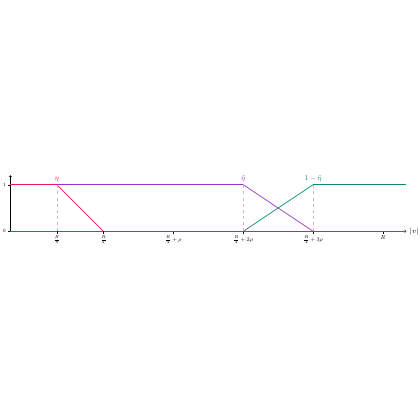

# test_21.png



# LaTeX/TikZ 重构指导：线性函数图像

## 1. 概览

这是一个二维坐标图，展示了两个分段线性函数。左侧是一条紫色线段，从点(0,1)开始，经过点(2,0)；右侧是一对交叉的线段，一条蓝绿色线段从左至右上升，一条绿色线段从左至右下降，它们在中间某点相交。横轴表示时间 t，有多个标记点，包括 $t_0$, $t_1$, $t_2$, $t_1'$, $t_2'$, $t_0'$。

## 2. 文档骨架与依赖

```latex
\documentclass[border=5pt]{standalone}
\usepackage{tikz}
\usetikzlibrary{arrows.meta, intersections}
\usepackage{amsmath}
\usepackage{xcolor}
```

## 3. 版面与画布设置

- 图形宽度：约10cm
- 高度：约3cm
- 横轴范围：0到4
- 纵轴范围：0到1.2
- 节点间距：均匀分布在横轴上

建议的环境参数：
```latex
\begin{tikzpicture}[
  x=2.5cm,
  y=2.5cm,
  >=Stealth,
]
```

## 4. 字体与配色

- 字体：默认的Computer Modern
- 标签大小：\small
- 主要颜色：
  - 紫色线段：RGB(204, 0, 204)，对应TikZ颜色purple
  - 蓝绿色线段：RGB(0, 153, 153)，对应TikZ颜色teal
  - 绿色线段：RGB(0, 153, 0)，对应TikZ颜色green!60!black
  - 坐标轴：黑色

## 5. 结构与组件样式

- 坐标轴：
  - x轴：从0到4，带箭头
  - y轴：从0到1.2，带箭头
  - 坐标刻度：小短线标记位置
- 线段：
  - 紫色线段：实线，中等粗细
  - 蓝绿色和绿色线段：实线，中等粗细
- 标签：
  - 横轴标签：$t [s]$
  - 各点标记：$t_0$, $t_1$, $t_2$, $t_1'$, $t_2'$, $t_0'$
  - 纵轴值：0和1

## 6. 数学/表格/图形细节

图形中包含的数学元素主要是坐标点和标签：
- 横轴标记：$t_0=0$, $t_1=2$, $t_2$, $t_1'$, $t_2'$, $t_0'$
- 纵轴标记：0和1

## 7. 自定义宏与命令

```latex
% 定义颜色
\colorlet{purpleline}{purple}
\colorlet{tealline}{teal}
\colorlet{greenline}{green!60!black}

% 定义线段样式
\tikzset{
  axisline/.style={thick, ->},
  dataline/.style={thick},
  tickmark/.style={thin},
  dashedline/.style={dashed, thin, gray},
}
```

## 8. 最小可运行示例 (MWE)

```latex
\documentclass[border=5pt]{standalone}
\usepackage{tikz}
\usetikzlibrary{arrows.meta, intersections}
\usepackage{amsmath}

\begin{document}
\begin{tikzpicture}[
  x=2.5cm, 
  y=2.5cm, 
  >=Stealth,
  font=\small
]
  % 定义颜色
  \colorlet{purpleline}{purple}
  \colorlet{tealline}{teal}
  \colorlet{greenline}{green!60!black}
  
  % 绘制坐标轴
  \draw[thick, ->] (0,0) -- (4.2,0) node[right] {$t [s]$};
  \draw[thick, ->] (0,0) -- (0,1.2);
  
  % 标记y轴刻度
  \draw (0,0) node[left] {$0$} -- +(-0.05,0);
  \draw (0,1) node[left] {$1$} -- +(-0.05,0);
  
  % 标记x轴刻度点
  \draw (0,0) node[below] {$t_0$} -- +(0,-0.05);
  \draw (2,0) node[below] {$t_1$} -- +(0,-0.05);
  \draw (2.5,0) node[below] {$t_2$} -- +(0,-0.05);
  \draw (3,0) node[below] {$t_1'$} -- +(0,-0.05);
  \draw (3.5,0) node[below] {$t_2'$} -- +(0,-0.05);
  \draw (4,0) node[below] {$t_0'$} -- +(0,-0.05);
  
  % 绘制垂直虚线
  \draw[dashed, purple] (2,0) -- (2,0);
  \draw[dashed, purple] (0,1) -- (0,1);
  \draw[dashed, purple] (2,0) -- (2,1);
  \draw[dashed, teal] (3,0) -- (3,1);
  
  % 绘制紫色线段
  \draw[thick, purpleline] (0,1) -- (2,0);
  \draw[thick, purpleline] (2,0) -- (2.5,0);
  
  % 绘制蓝绿色和绿色线段
  \draw[thick, tealline] (2.5,0) -- (3,1);
  \draw[thick, tealline] (3,1) -- (4,1);
  \draw[thick, greenline] (2.5,1) -- (3,0);
  \draw[thick, greenline] (3,0) -- (4,0);
  
  % 添加标签
  \node[purpleline] at (0,1) {$\bullet$};
  \node[purpleline] at (2,0) {$\bullet$};
  \node[tealline] at (3,1) {$\bullet$};
  \node[greenline] at (3,0) {$\bullet$};
\end{tikzpicture}
\end{document}
```

## 9. 复刻检查清单

- ✓ 图形尺寸与横纵比
- ✓ 坐标轴范围与标签
- ✓ 线段颜色与样式
- ✓ 刻度点位置与标签
- ✓ 数学符号正确性
- ✓ 图像整体布局

需要注意的差异：
- 原图中虚线的确切位置和长度可能与复刻有细微差别
- 点标记的大小可能需要调整以完全匹配原图

## 10.
