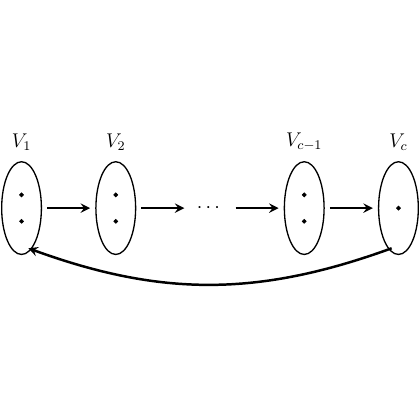

# test_23.png



# LaTeX/TikZ 重构指导：有向图结构

## 1. 概览

这张图是一个有向图结构，展示了一系列按顺序连接的节点（$V_1$, $V_2$, ..., $V_{c-1}$, $V_c$），每个节点由椭圆表示，内部有三个小点。节点之间由箭头连接，形成一条主路径，同时还有一条从 $V_c$ 回到 $V_1$ 的长弧形箭头，构成一个循环结构。整体布局是水平的，节点间距均匀。

## 2. 文档骨架与依赖

```latex
\documentclass{standalone}
\usepackage{tikz}
\usetikzlibrary{arrows.meta} % 用于箭头样式
\usepackage{amsmath} % 用于数学符号
```

## 3. 版面与画布设置

- 画布尺寸：约 12cm × 4cm
- 节点间距：约 2cm
- 节点对齐：水平中心对齐
- TikZ 环境设置：

```latex
\begin{tikzpicture}[
    node distance=2cm,
    every node/.style={font=\normalsize}
]
```

## 4. 字体与配色

- 节点标签：数学模式，使用默认的 Computer Modern 字体
- 颜色：纯黑色 (`black`)
- 无特殊渐变、透明度或阴影效果

## 5. 结构与组件样式

- 节点样式：
  - 椭圆形状 (`ellipse`)
  - 黑色边框，无填充色
  - 宽度约 0.8cm，高度约 2cm
  
- 点样式：
  - 小圆点，直径约 1.5pt
  - 黑色填充

- 箭头样式：
  - 直线箭头：黑色，线宽约 0.8pt，带箭头尖端
  - 回环箭头：黑色，线宽约 1.2pt，弧形，带箭头尖端

## 6. 数学细节

- 节点标签：$V_1$, $V_2$, $V_{c-1}$, $V_c$ 使用数学模式，带下标
- 省略号 $\cdots$ 用于表示中间省略的节点

## 7. 自定义宏与命令

```latex
\tikzset{
    vertex/.style={
        draw,
        ellipse,
        minimum width=0.8cm,
        minimum height=2cm,
    },
    dot/.style={
        circle,
        fill,
        inner sep=0.75pt
    }
}
```

## 8. 最小可运行示例 (MWE)

```latex
\documentclass{standalone}
\usepackage{tikz}
\usetikzlibrary{arrows.meta}
\usepackage{amsmath}

\begin{document}
\begin{tikzpicture}[
    vertex/.style={
        draw,
        ellipse,
        minimum width=0.8cm,
        minimum height=2cm,
    },
    dot/.style={
        circle,
        fill,
        inner sep=0.75pt
    },
    arrow/.style={-{Stealth[length=2mm]}, line width=0.8pt}
]

% 定义节点
\node[vertex] (v1) at (0,0) {};
\node[above=0.4cm] at (v1.north) {$V_1$};

\node[vertex] (v2) at (2,0) {};
\node[above=0.4cm] at (v2.north) {$V_2$};

\node at (3.5,0) {$\cdots$};

\node[vertex] (vc-1) at (5,0) {};
\node[above=0.4cm] at (vc-1.north) {$V_{c-1}$};

\node[vertex] (vc) at (7,0) {};
\node[above=0.4cm] at (vc.north) {$V_{c}$};

% 添加节点内的点
\foreach \v in {v1, v2, vc-1, vc} {
    \node[dot] at (\v.center) {};
    \node[dot] at (\v.center |- \v.north) [yshift=-0.6cm] {};
    \node[dot] at (\v.center |- \v.south) [yshift=0.6cm] {};
}

% 添加连接箭头
\draw[arrow] (v1) -- (v2);
\draw[arrow] (v2) -- (2.8,0);
\draw[arrow] (4.2,0) -- (vc-1);
\draw[arrow] (vc-1) -- (vc);

% 添加回环箭头
\draw[arrow, line width=1.2pt] (vc.south) .. controls +(0,-1.5) and +(0,-1.5) .. (v1.south);

\end{tikzpicture}
\end{document}
```

## 9. 复刻检查清单

- ✓ 图形尺寸与比例：水平排列的四个节点，间距均匀
- ✓ 节点样式：椭圆形状，黑色边框，无填充
- ✓ 节点内部：每个椭圆内有三个垂直排列的点
- ✓ 字体与标签：节点上方的数学标签 $V_1$, $V_2$, $V_{c-1}$, $V_c$
- ✓ 箭头样式：节点间的水平箭头和底部的回环箭头
- ✓ 省略号：表示中间省略的节点

## 10. 风险与替代方案

- 不确定因素：
  - 椭圆的精确尺寸可能与原图略有差异
  - 点的大小和间距可能需要微调
  - 回环箭头的弧度可能需要调整以匹配原图

- 替代方案：
  - 可以使用 `\tikzset` 定义更多样式，使代码更简洁
  - 如果需要更精确的控制，可以使用 `\coordinate` 定义辅助点
  - 可以考虑使用 `positioning` 库实现更精确的节点定位

如需进一步调整，可以修改节点间距、椭圆尺寸、点的大小和位置，以及回环箭头的控制点位置。
