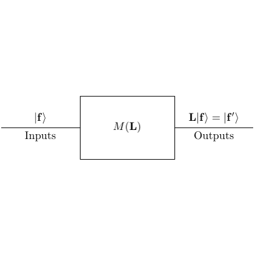

# test_8.png



# LaTeX/TikZ 重构指导：量子线性变换框图

## 1. 概览

这是一个简洁的量子物理/量子计算线性变换框图。图中包含一个中央矩形框，左侧标记为"Inputs"的输入态 $|f\rangle$，右侧标记为"Outputs"的输出态 $\mathbf{L}|f\rangle = |f'\rangle$。矩形框内标记为 $M(\mathbf{L})$，表示线性变换 $\mathbf{L}$ 的矩阵表示。整体布局是水平的线性流程图，采用了简洁的黑白风格。

## 2. 文档骨架与依赖

```latex
\documentclass{standalone}
\usepackage{tikz}
\usepackage{amsmath,amssymb}
\usetikzlibrary{positioning,fit}
```

## 3. 版面与画布设置

- 图形尺寸：约 7cm × 3cm
- 矩形框尺寸：约 2.5cm × 2cm
- 水平线长度：约 1.8cm
- 节点间距：水平排列，间距约 5mm

## 4. 字体与配色

- 字体：默认 Computer Modern 字体
- 数学公式：使用 amsmath 排版
- 颜色：纯黑色线条和文字
- 无渐变、透明度或阴影效果

## 5. 结构与组件样式

- 中央矩形框：黑色边框，无填充，线宽约 0.5pt
- 连接线：黑色直线，线宽约 0.5pt
- 标签位置：
  - 输入/输出标签位于水平线下方
  - 数学表达式位于水平线上方
  - 矩阵表示 $M(\mathbf{L})$ 位于矩形框中央

## 6. 数学细节

- 量子态表示：使用 Dirac 符号 $|f\rangle$ 和 $|f'\rangle$
- 矩阵表示：$M(\mathbf{L})$ 其中 $\mathbf{L}$ 使用粗体
- 等式：$\mathbf{L}|f\rangle = |f'\rangle$

## 7. 自定义宏与命令

```latex
\tikzset{
  block/.style={draw, rectangle, minimum width=2.5cm, minimum height=2cm},
  iotext/.style={font=\small},
  math/.style={font=\normalsize}
}
```

## 8. 最小可运行示例 (MWE)

```latex
\documentclass{standalone}
\usepackage{tikz}
\usepackage{amsmath,amssymb}
\usetikzlibrary{positioning}

\begin{document}
\begin{tikzpicture}
  % 定义样式
  \tikzset{
    block/.style={draw, rectangle, minimum width=2.5cm, minimum height=2cm},
    iotext/.style={font=\small},
    math/.style={font=\normalsize}
  }
  
  % 中央处理块
  \node[block] (process) at (0,0) {$M(\mathbf{L})$};
  
  % 输入侧
  \draw (-3.5,0) -- (process.west);
  \node[iotext, below] at (-2.5,-0.1) {Inputs};
  \node[math, above] at (-2.5,0.1) {$|f\rangle$};
  
  % 输出侧
  \draw (process.east) -- (3.5,0);
  \node[iotext, below] at (2.5,-0.1) {Outputs};
  \node[math, above] at (2.5,0.1) {$\mathbf{L}|f\rangle = |f'\rangle$};
\end{tikzpicture}
\end{document}
```

## 9. 复刻检查清单

- ✓ 图形尺寸：水平流程图，比例与原图匹配
- ✓ 矩形框：简单黑色边框，中央放置 $M(\mathbf{L})$
- ✓ 连接线：水平黑线连接输入和输出
- ✓ 标签位置：输入/输出标签在线下方，数学表达式在线上方
- ✓ 数学公式：正确使用 Dirac 符号和粗体表示线性变换
- ✓ 字体风格：使用默认 Computer Modern 字体，大小适中

## 10. 风险与替代方案

- 不确定因素：
  - 原图中矩形框的精确尺寸可能与重构有细微差异
  - 数学公式中 $\mathbf{L}$ 的粗体表示可能与原图有差异

- 替代方案：
  - 如果需要更精确匹配原图尺寸，可以调整 `minimum width` 和 `minimum height` 参数
  - 如果原图使用不同的粗体样式，可以尝试 `\boldsymbol{L}` 或 `\bm{L}` (需要 `bm` 宏包)
  - 如需更改字体，可以考虑使用 `\usepackage{newtxtext,newtxmath}` 切换到 Times New Roman 风格

此重构保持了原图的简洁性和学术风格，适合用于量子计算或量子物理相关的科研论文。
