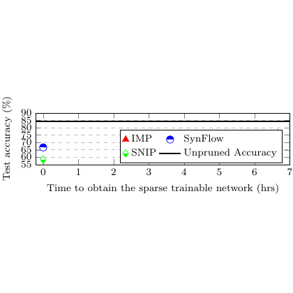

# test_5.png



# LaTeX/TikZ 重构指导：科研性能对比图

## 1. 概览

这是一个科研性能对比图，展示了三种算法（IMP、SynFlow、SNIP）在不同时间点的测试准确率变化。图形特点：

- **图形类型**：时间序列折线图，带有图例和网格线
- **构图布局**：标准的二维坐标系，横轴为时间（0-7小时），纵轴为测试准确率（55-90%）
- **主要元素**：三条不同样式的折线、图例框、坐标轴标签、网格线
- **数据特征**：显示剪枝网络训练过程中准确率随时间的变化趋势

## 2. 文档骨架与依赖

```latex
\documentclass[border=5pt]{standalone}
\usepackage{pgfplots}
\usepackage{xcolor}
\usepackage{amsmath}
\usepackage{siunitx}

\pgfplotsset{compat=1.18}
\usetikzlibrary{positioning}
```

**核心依赖说明**：
- `pgfplots`：绘制科学图表的主要工具
- `xcolor`：颜色定义和管理
- `siunitx`：单位格式化（小时、百分比）

## 3. 版面与画布设置

- **图形尺寸**：建议宽度 10cm，高度 6cm（4:3 比例）
- **坐标范围**：x轴 [0,7]，y轴 [55,90]
- **网格设置**：主网格线和次网格线
- **边距**：适当的轴标签间距

```latex
\begin{axis}[
    width=10cm,
    height=6cm,
    xmin=0, xmax=7,
    ymin=55, ymax=90,
    grid=both,
    grid style={line width=.1pt, draw=gray!10},
    major grid style={line width=.2pt,draw=gray!50},
]
```

## 4. 字体与配色

**字体设置**：
- 轴标签：默认大小，无衬线字体
- 图例：小号字体
- 刻度标签：默认大小

**配色方案**：
- IMP（红色三角）：`red` 或 `#FF0000`
- SynFlow（蓝色圆点）：`blue` 或 `#0000FF`  
- SNIP（绿色方块）：`green!70!black` 或 `#228B22`
- 未剪枝准确率（黑色实线）：`black`

## 5. 结构与组件样式

**数据点样式**：
- IMP：红色实心三角 `mark=triangle*`
- SynFlow：蓝色实心圆 `mark=*`
- SNIP：绿色实心方块 `mark=square*`
- 未剪枝基线：黑色实线，无标记

**线条样式**：
- 连接线：细实线 `line width=0.8pt`
- 基线：稍粗的实线 `line width=1pt`

## 6. 数学/表格/图形细节

**坐标轴设置**：
- X轴标签：`Time to obtain the sparse trainable network (hrs)`
- Y轴标签：`Test Accuracy (\%)`
- 刻度间隔：X轴每1小时，Y轴每5%

**图例配置**：
- 位置：图内右上角
- 样式：带边框的矩形框
- 包含：算法名称和"Unpruned Accuracy"基线

## 7. 自定义宏与命令

```latex
% 定义数据点样式
\pgfplotsset{
    imp style/.style={red, mark=triangle*, mark size=3pt, line width=0.8pt},
    synflow style/.style={blue, mark=*, mark size=3pt, line width=0.8pt},
    snip style/.style={green!70!black, mark=square*, mark size=3pt, line width=0.8pt},
    baseline style/.style={black, line width=1pt, no marks}
}
```

## 8. 最小可运行示例 (MWE)

```latex
\documentclass[border=5pt]{standalone}
\usepackage{pgfplots}
\usepackage{xcolor}
\pgfplotsset{compat=1.18}

% 自定义样式
\pgfplotsset{
    imp style/.style={red, mark=triangle*, mark size=3pt, line width=0.8pt},
    synflow style/.style={blue, mark=*, mark size=3pt, line width=0.8pt},
    snip style/.style={green!70!black, mark=square*, mark size=3pt, line width=0.8pt},
    baseline style/.style={black, line width=1pt, no marks}
}

\begin{document}
\begin{tikzpicture}
\begin{axis}[
    width=10cm,
    height=6cm,
    xmin=0, xmax=7,
    ymin=55, ymax=90,
    xlabel={Time to obtain the sparse trainable network (hrs)},
    ylabel={Test Accuracy (\%)},
    grid=both,
    grid style={line width=.1pt, draw=gray!10},
    major grid style={line width=.2pt,draw=gray!50},
    legend pos=south east,
    legend style={draw=black, fill=white, font=\small},
    tick align=outside,
    xtick={0,1,2,3,4,5,6,7},
    ytick={55,60,65,70,75,80,85,90},
]

% 未剪枝准确率基线（水平线）
\addplot[baseline style] coordinates {(0,85) (7,85)};
\addlegendentry{Unpruned Accuracy}

% IMP 数据（示例数据点）
\addplot[imp style] coordinates {
    (0.5,70) (1,72) (2,75) (3,78) (4,80) (5,82) (6,83)
};
\addlegendentry{IMP}

% SynFlow 数据（示例数据点）
\addplot[synflow style] coordinates {
    (0.2,68) (0.5,71) (1,73) (2,76) (3,79) (4,81) (5,82.5)
};
\addlegendentry{SynFlow}

% SNIP 数据（示例数据点）
\addplot[snip style] coordinates {
    (0.1,65) (0.3,67) (0.8,70) (1.5,73) (2.5,76) (3.5,78)
};
\addlegendentry{SNIP}

\end{axis}
\end{tikzpicture}
\end{document}
```

## 9. 复刻检查清单

- [ ] **图形尺寸**：宽高比例 4:3，整体大小适中
- [ ] **坐标范围**：X轴 0-7 小时，Y轴 55-90%
- [ ] **数据点样式**：三角形（IMP）、圆形（SynFlow）、方形（SNIP）
- [ ] **颜色匹配**：红、蓝、绿色调准确
