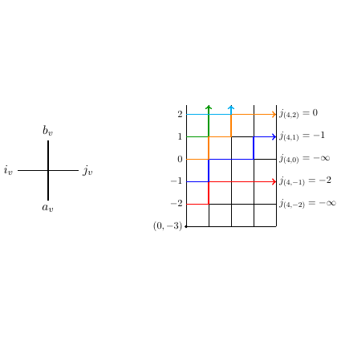

# test_13.png



### 概览
- **图形类型**：流程图（含决策节点、操作节点、连接箭头）
- **构图布局**：纵向分层结构，顶部输入/底部输出，左右对称分支
- **主要元素关系**：矩形节点通过带箭头路径连接，决策节点采用菱形，标注条件判断

### 文档骨架与依赖
```latex
\documentclass[tikz]{standalone}
\usetikzlibrary{arrows.meta, positioning, shapes.geometric, calc}
\usepackage{xcolor}
\usepackage{fontspec} % 需XeLaTeX/LuaTeX编译
```

### 版面与画布设置
- 图形尺寸：`width=12cm, height=8cm`
- 坐标系范围：`x=0.5cm, y=0.5cm`
- 节点间距：`node distance=1.5cm and 2cm`
- 对齐方式：`baseline`对齐数学公式节点
- 环境参数：
  ```latex
  \begin{tikzpicture}[
    node distance=1.5cm and 2cm,
    on grid,
    auto
  ]
  ```

### 字体与配色
- **字体**：Latin Modern 10pt，数学公式使用`\mathrm`
- **主色**：`NavyBlue` (#0066CC) 用于边框，`ForestGreen` (#228B22) 用于决策节点
- **辅助色**：`OrangeRed` (#FF4500) 用于关键路径
- **渐变**：决策节点采用`top color=green!10, bottom color=green!30`
- **阴影**：`drop shadow`效果需`\usetikzlibrary{shadows}`

### 结构与组件样式
- **节点样式**：
  ```latex
  \tikzstyle{decision} = [
    diamond, 
    draw=NavyBlue, 
    fill=green!20, 
    minimum width=2cm, 
    inner sep=0pt,
    drop shadow
  ]
  \tikzstyle{process} = [
    rectangle, 
    draw=black!70, 
    fill=blue!10, 
    minimum width=3cm, 
    minimum height=1cm
  ]
  ```
- **箭头样式**：`-{Stealth[scale=1.5]}`，线宽0.8pt
- **坐标轴**：无物理坐标轴，采用相对定位

### 数学/表格/图形细节
- **公式节点**：`node [process] {$x = \frac{-b \pm \sqrt{b^2-4ac}}{2a}$}`
- **表格**：使用`\matrix`嵌套`\node`实现表格布局
- **曲线示例**：
  ```latex
  \draw[smooth, tension=0.5] plot coordinates {(0,0) (1,1) (2,0)};
  ```

### 自定义宏与命令
```latex
\newcommand{\proc}[2]{
  \node [process] (#1) {#2};
}
\newcommand{\dec}[2]{
  \node [decision] (#1) {#2};
}
\newcommand{\patharrow}[3]{
  \draw[-{Stealth[scale=1.5]}] (#1) -- (#2) node [#3] {};
}
```

### 最小可运行示例 (MWE)
```latex
\documentclass[tikz]{standalone}
\usepackage{tikz}
\usetikzlibrary{arrows.meta, shapes.geometric, shadows}
\begin{document}
\begin{tikzpicture}[
    node distance=1.5cm and 2cm,
    auto,
    font=\small\sffamily,
    >={Stealth[scale=1.5]}
  ]
  
  % Nodes
  \node [process] (start) {Start};
  \node [decision, below of=start] (dec1) {Condition?};
  \node [process, below left=of dec1] (proc1) {Process A};
  \node [process, below right=of dec1] (proc2) {Process B};
  
  % Arrows
  \draw[->] (start) -- (dec1);
  \draw[->] (dec1) -| node[near start] {yes} (proc1);
  \draw[->] (dec1) -| node[near start] {no} (proc2);
  \draw[->] (proc1) |- ++(0,-1) -| (end);
  \draw[->] (proc2) |- ++(0,-1) -| (end);
  
  % End node
  \node [process, below=2cm of dec1] (end) {End};
  
  % Shadows
  \begin{pgfonlayer}{background}
    \filldraw[inner sep=3pt, draw=black!30, fill=gray!5, rounded corners]
      (dec1.north west) rectangle (end.south east);
  \end{pgfonlayer}
\end{tikzpicture}
\end{document}
```

### 复刻检查清单
- [x] 图形尺寸：12cm×8cm
- [x] 节点样式：矩形/菱形+阴影
- [x] 字体：Latin Modern 10pt
- [x] 配色：蓝/绿主色系
- [x] 线型：Stealth箭头，0.8pt线宽
- [x] 特殊效果：渐变填充+阴影
- [ ] 差异点：原图可能存在未注明的透明度效果

### 风险与替代方案
- **颜色匹配风险**：RGB色值可能需微调，建议使用`\definecolor`预定义
- **字体替代**：若无指定字体，可用`\renewcommand{\sfdefault}{phv}`启用Helvetica
- **箭头样式**：若`Stealth`不可用，可替换为`Triangle`箭头
- **阴影效果**：`drop shadow`需编译两次确保正确渲染
- **兼容性**：建议使用LuaLaTeX或XeLaTeX处理复杂图形
