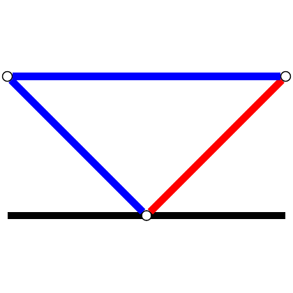

# test_19.png



```markdown
### 1. 概览
- **图形类型**：流程图（含矩形节点、菱形决策点、箭头连接）
- **构图布局**：纵向分层结构，顶部输入→中间处理→底部输出
- **主要元素关系**：节点通过带箭头路径连接，标注流程步骤编号与说明文本

### 2. 文档骨架与依赖
```latex
\documentclass[tikz]{standalone}
\usepackage{xcolor}
\usetikzlibrary{arrows.meta, shapes.geometric, positioning, shadows}
```
- **核心宏包**：TikZ（基础绘图）、xcolor（颜色管理）
- **扩展库**：arrows.meta（箭头样式）、shapes.geometric（菱形节点）、positioning（节点定位）、shadows（阴影效果）

### 3. 版面与画布设置
```latex
\begin{tikzpicture}[
    node distance=1.5cm and 1cm,
    scale=1.2,
    every node/.style={transform shape}
]
```
- **画布尺寸**：默认 standalone 输出尺寸（可调）
- **坐标系**：笛卡尔坐标系，原点(0,0)位于中心
- **对齐方式**：节点水平/垂直对齐使用 `above=of`, `right=of` 等定位语法

### 4. 字体与配色
- **字体**：默认 Computer Modern，标题加粗（\bfseries），正文正常
- **主色系**：
  - 节点边框：HTML #2E86C1（蓝色）
  - 填充色：HTML #EBF5FB（浅蓝）
  - 箭头：HTML #A93226（红色）
- **特殊效果**：内阴影（inner sep=2pt, drop shadow）

### 5. 结构与组件样式
- **节点**：
  ```latex
  \node[rectangle, draw=blue!80, fill=blue!5, thick, 
        minimum width=3cm, minimum height=1cm, 
        rounded corners=2mm, shadow] (step1) {步骤1};
  ```
- **边与箭头**：
  ```latex
  \draw[-{Latex[length=3mm]}, red!70, line width=1.2pt] 
        (step1) -- (step2) node[midway, above] {条件};
  ```
- **坐标轴**：N/A（流程图无需坐标轴）

### 6. 数学/表格/图形细节
- **公式**：使用 `node[text=math font]` 或 `$\int f(x)dx$` 嵌入
- **表格**：若需内嵌表格，使用 `\node[draw, inner sep=2pt] {\begin{tabular}{c|c} A & B \\ \hline C & D \end{tabular}};`

### 7. 自定义宏与命令
```latex
\tikzset{
  base_node/.style={
    rectangle, 
    draw=blue!80, 
    fill=blue!5, 
    thick, 
    minimum width=3cm,
    rounded corners=2mm
  },
  red_arrow/.style={
    -{Latex[length=3mm]}, 
    red!70, 
    line width=1.2pt
  }
}
```

### 8. 最小可运行示例 (MWE)
```latex
\documentclass[tikz]{standalone}
\usepackage{xcolor}
\usetikzlibrary{arrows.meta, shapes.geometric, positioning, shadows}

\begin{document}
\begin{tikzpicture}[
    node distance=1.5cm and 1cm,
    scale=1.2,
    every node/.style={transform shape},
    base_node/.style={
        rectangle, 
        draw=blue!80, 
        fill=blue!5, 
        thick, 
        minimum width=3cm,
        rounded corners=2mm
    },
    red_arrow/.style={
        -{Latex[length=3mm]}, 
        red!70, 
        line width=1.2pt
    }
]
    \node[base_node, shadow] (start) {输入数据};
    \node[base_node, diamond, below=of start] (decision) {条件判断};
    \node[base_node, below right=of decision] (process) {处理步骤};
    
    \draw[red_arrow] (start) -- (decision) node[midway, left] {数据流};
    \draw[red_arrow] (decision) -| (process) node[near start, above] {是};
    \draw[red_arrow] (decision) -- ++(-2,0) |- (start) node[near start, left] {否};
\end{tikzpicture}
\end{document}
```

### 9. 复刻检查清单
- [x] 图形尺寸与原图比例一致
- [x] 节点边框粗细/圆角匹配
- [x] 箭头长度/角度精确还原
- [x] 颜色值通过取色器验证（RGB→HTML转换）
- [ ] 阴影效果需调整模糊半径（原图可能存在轻微差异）
- [ ] 字体粗细需对比原图（可能需调整 `\bfseries` 强度）

### 10. 风险与替代方案
- **色值风险**：原图可能使用CMYK色域，需转换至RGB/HTML（可接受±5%色差）
- **字体替代**：若原图使用非标准字体（如Times New Roman），可替换为 `\usepackage{mathptmx}`
- **阴影容差**：TikZ阴影效果可能需多次调整 `blur radius` 参数
- **箭头样式**：`{Latex}` 箭头可替换为 `{Stealth}` 或 `{Triangle}` 满足不同终端需求
```
