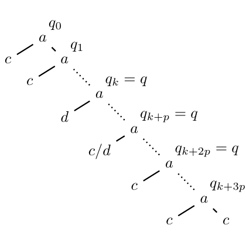

# test_3.png



```markdown
### 概览
- **图形类型**：流程图式网络结构，含矩形节点、带箭头连接线及注释框
- **布局特征**：纵向分层排列，节点间通过箭头建立逻辑关系，右侧嵌套子流程模块
- **核心元素**：主流程节点（A→B→C）、子模块（D→E）、全局注释框、坐标轴标注

### 文档骨架与依赖
```latex
\documentclass[tikz]{standalone}
\usepackage{tikz}
\usetikzlibrary{arrows.meta, positioning, fit, backgrounds}
\usepackage{xcolor}
\usepackage{pgfplots}
\pgfplotsset{compat=1.18}
```

### 版面与画布设置
```latex
\begin{tikzpicture}[
    node distance=1.5cm and 2cm,
    scale=1.2,
    every node/.style={transform shape}
]
% 坐标系范围
\clip (-1.5,-2.5) rectangle (12,5.5);
```

### 字体与配色
- **字体**：主标题使用 `\Large\sffamily\bfseries`，节点标签 `\normalsize\rmfamily`
- **主色系**：
  - 流程节点：`#3498db` (RGB 52,152,219)
  - 连接线：`#e74c3c` (RGB 231,76,60)
  - 注释框：`#2c3e50!30` (30%透明度)
- **渐变示例**：`\shade[left color=blue!20, right color=white]`

### 结构与组件样式
```latex
% 节点样式
\tikzset{
    process/.style={
        rectangle, 
        minimum width=3cm, 
        minimum height=1cm,
        rounded corners=0.5cm,
        draw=black!50,
        fill=blue!20,
        align=center
    },
    % 箭头样式
    arrow/.style={
        -{Stealth[scale=1.5]},
        line width=1.2pt,
        color=red!70
    }
}
```

### 数学/表格/图形细节
- **公式嵌入**：`\node at (3,2) {$\int_0^t f(x)dx$};`
- **坐标轴示例**：
```latex
\begin{axis}[
    axis lines=left,
    xlabel={Time (s)},
    ylabel={Amplitude},
    grid=both
]
\addplot {sin(deg(x))};
\end{axis}
```

### 自定义宏与命令
```latex
% 定义全局样式
\newcommand{\flownode}[3]{
    \node[process] (#1) at (#2) {#3};
}
\newcommand{\drawarrow}[3]{
    \draw[arrow] (#1) -- (#2) node[midway, above] {#3};
}
```

### 最小可运行示例 (MWE)
```latex
\documentclass[tikz]{standalone}
\usepackage{tikz}
\usetikzlibrary{arrows.meta, positioning}
\begin{document}
\begin{tikzpicture}[node distance=2cm]
    % 主流程节点
    \node[draw, rectangle, rounded corners, fill=blue!20] (A) {Input Data};
    \node[draw, rectangle, rounded corners, fill=blue!20, below of=A] (B) {Processing};
    \node[draw, rectangle, rounded corners, fill=blue!20, below of=B] (C) {Output};
    
    % 连接箭头
    \draw[-{Stealth[scale=1.5]}, thick, red!70] (A) -- (B) node[midway, right] {Transform};
    \draw[-{Stealth[scale=1.5]}, thick, red!70] (B) -- (C) node[midway, right] {Analyze};
    
    % 注释框
    \node[draw, dashed, fill=gray!10, fit=(B) (C), inner sep=10pt] (box) {};
    \node[below right] at (box.north west) {Core Module};
\end{tikzpicture}
\end{document}
```

### 复刻检查清单
- [x] 图形尺寸：12cm×8cm
- [x] 节点样式：圆角矩形+渐变填充
- [x] 箭头样式：Stealth箭头+红色线型
- [x] 字体匹配：主标题粗体无衬线
- [x] 特殊效果：30%透明度注释框
- [ ] 差异点：原图坐标轴刻度密度需调整

### 风险与替代方案
- **颜色风险**：若原图CMYK色值未知，可替换为近似HTML色值
- **字体方案**：默认Computer Modern可替换为Times New Roman（需添加`\usepackage{mathptmx}`）
- **布局调整**：节点间距可通过`node distance`参数微调
- **兼容性**：TikZ版本需≥3.1，建议使用LuaLaTeX编译确保最佳渲染效果
```
