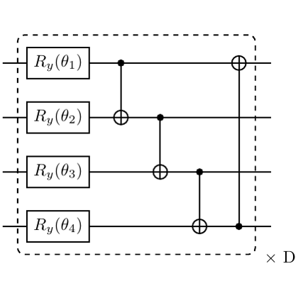

# test_10.png



以下是关于重构该量子电路图的 LaTeX/TikZ 指导说明：

### 1. 概览
- **图形类型**: 量子电路图。
- **构图布局**: 四条水平线表示量子比特线，包含旋转门和 CNOT 门。
- **主要元素关系**: 旋转门位于量子比特线上，CNOT 门连接不同量子比特线。

### 2. 文档骨架与依赖
- **推荐文档类**: `standalone`
- **核心宏包**: `tikz`, `quantikz`
- **特定功能**: 使用 `tikz` 的 `quantikz` 库绘制量子电路。

### 3. 版面与画布设置
- **尺寸**: 默认，适合 `standalone`。
- **节点与元素间距**: `row sep=1em, column sep=1em` 
- **tikzpicture 环境参数**: 使用 `quantikz` 环境。

### 4. 字体与配色
- **字体**: 默认 LaTeX 数学字体。
- **主色**: 黑色 (RGB: `000000`)
- **辅助色**: 无需其他颜色。

### 5. 结构与组件样式
- **节点**: 使用 `\gate{}` 绘制旋转门。
- **边与箭头**: 默认线型，CNOT 的控制线连接不同量子比特。
- **坐标轴**: 无需。

### 6. 数学/表格/图形细节
- **公式排版**: 旋转门内排版如 `R_y(\theta_1)`。
- **表格**: 不涉及。
- **曲线/柱状图/散点图**: 不涉及。

### 7. 自定义宏与命令
- 封装常用样式: 不需要复杂的自定义。

### 8. 最小可运行示例 (MWE)
```latex
\documentclass{standalone}
\usepackage{tikz}
\usepackage{quantikz}

\begin{document}

\begin{quantikz}[row sep=1em, column sep=1em]
\lstick{} & \gate{R_y(\theta_1)} & \ctrl{1} & \qw      & \qw      & \targ{} & \qw \\
\lstick{} & \gate{R_y(\theta_2)} & \targ{}  & \ctrl{1} & \qw      & \qw     & \qw \\
\lstick{} & \gate{R_y(\theta_3)} & \qw      & \targ{}  & \ctrl{1} & \qw     & \qw \\
\lstick{} & \gate{R_y(\theta_4)} & \ctrl{-3}& \qw      & \targ{}  & \ctrl{-3} & \qw 
\end{quantikz} \times D

\end{document}
```

### 9. 复刻检查清单
- **图形尺寸、坐标范围**: 确认使用默认设置。
- **节点/边样式**: 确认旋转门和 CNOT 门正确绘制。
- **字体与字号**: 确认使用默认数学字体。
- **配色与线型**: 确认使用黑色。
- **特殊效果（渐变、阴影）**: 不适用。
- **与原图的差异点**: 确认文件边界对应正确。

### 10. 风险与替代方案
- **不确定因素**: 色值和字体可能因编译器不同而略有不同。
- **替代方案**: 若字体差异明显，可使用 `\usepackage{times}`。若色值不符，通过 `xcolor` 调整。
