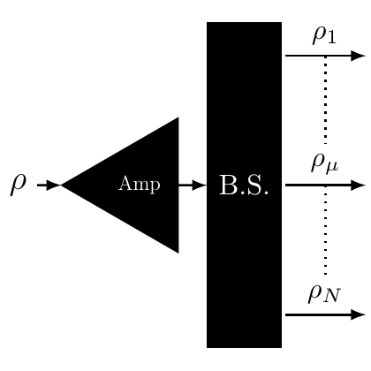

# test_11.png



以下是针对给定科研绘图的 LaTeX/TikZ 重构指导：

### 1. 概览
- **图形类型**：流程图。
- **布局**：图形从左到右依次由三部分组成：箭头、三角形（Amp）、长方形（B.S.）。
- **主要元素**：输入箭头、放大器三角形、光束分离器矩形，以及多条输出箭头。

### 2. 文档骨架与依赖
- **文档类**：`standalone`
- **宏包**：`tikz`, `xcolor`
- **TikZ 库**：`arrows.meta`（用于自定义箭头）

### 3. 版面与画布设置
- **图形尺寸**：建议宽高约为 `6cm x 6cm`
- **坐标系范围**：`(-1, -2) -- (3, 2)`
- **环境参数**：`\begin{tikzpicture}[scale=1]`

### 4. 字体与配色
- **字体**：默认字体，大小为 `\small`
- **主色、辅助色**：黑色填充（Amp 和 B.S.），白色字体
- **透明度**：无要求透明度设置

### 5. 结构与组件样式
- **节点**：
  - **Amp**：三角形，黑色填充，白色文字
  - **B.S.**：矩形，黑色填充，白色文字
- **边与箭头**：
  - **线型**：实线
  - **箭头样式**：`-{Stealth}`，虚线用于中间部分箭头

### 6. 数学/表格/图形细节
- **公式**：使用 `node` 标签添加数学符号

### 7. 自定义宏与命令
- 定义常用样式：
  ```latex
  \tikzset{
      amp/.style={draw, fill=black, triangle, minimum height=1cm, inner sep=0pt},
      bs/.style={draw, fill=black, minimum size=1.5cm, inner sep=0pt},
      arrow/.style={-{Stealth}}
  }
  ```

### 8. 最小可运行示例 (MWE)
```latex
\documentclass{standalone}
\usepackage{tikz}
\usetikzlibrary{arrows.meta}
\begin{document}
\begin{tikzpicture}[scale=1]
    % Input Arrow
    \draw [arrow] (-1,0) -- (0,0) node[midway, above] {$\rho$};

    % Amplifier
    \node[amp, shape border rotate=270] (amp) at (0.5,0) {\textcolor{white}{Amp}};

    % Arrow and BS
    \draw [arrow] (1,0) -- (1.5,0);
    \node[bs, rectangle] (bs) at (2.5,0) {\textcolor{white}{B.S.}};

    % Output Arrows
    \foreach \y in {-1.5, 0, 1.5} {
        \draw [arrow] (3.5,\y) -- (4.5,\y);
    }
    \node at (4,1.5) {$\rho_1$};
    \node at (4,0) {$\rho_\mu$};
    \node at (4,-1.5) {$\rho_N$};

    % Dotted Line
    \draw[dotted] (4,1) -- (4,-1);
\end{tikzpicture}
\end{document}
```

### 9. 复刻检查清单
- 图形尺寸、坐标范围确认为 `6cm x 6cm`
- 节点和边样式检查符合预期
- 字体为 \small 的默认字体
- 配色为黑色主体、白色字体，线型准确
- 检查是否有额外的渐变或阴影（无）

### 10. 风险与替代方案
- **不确定因素**：
  - 精确的色值可能由于显示设备导致差异。
  - 字体可能因 LaTeX 配置不同显示略有差异。
- **替代方案**：
  - 采用默认 Computer Modern 字体替代高要求字体。
  - 颜色用约似的黑色（RGB: 0, 0, 0）。

通过上述建议和示例代码，应该可以成功复刻出较为接近的图形。
