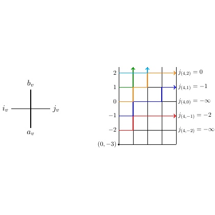

# test_13.png



下面是针对给定科研绘图的 LaTeX/TikZ 重构指南。

### 1. 概览
- **图形类型**：包含一个网格图和一个简单节点图。
- **构图布局**：左侧为节点坐标（交叉节点），右侧为带有箭头的网格。
- **主要元素关系**：节点标记重要变量，两部分图通过视觉对比呈现。

### 2. 文档骨架与依赖
- **文档类**：`\documentclass{standalone}`
- **核心宏包**：`tikz`
- **TikZ 库**：`arrows.meta`, `positioning`

### 3. 版面与画布设置
- **尺寸**：建议宽度 10cm，高度自适应。
- **坐标系范围**：网格部分为 (-0.5, -2.5) -- (5, 2.5)。
- **对齐方式**：图形居中，网格右对齐标签。

### 4. 字体与配色
- **字体**：默认字体，建议大小 `\small`。
- **配色**：箭头分别使用绿色、蓝色、橙色、红色 (如 green, blue, orange, red)。
- **无渐变或透明度**

### 5. 结构与组件样式
- **节点**：`draw`，`cross`，`minimum size=0.5cm`
- **箭头**：`-{Stealth}`, 颜色自定义，线型`thick`。
- **网格**：`ultra thin` 线。

### 6. 数学/图形细节
- **公式**：TikZ 节点中使用 `$...$` 进行数学表达。
- **网格部分**：使用 `\draw` 创建箭头并标上坐标。

### 7. 自定义宏与命令
- 可使用 `\newcommand` 封装箭头样式。

### 8. 最小可运行示例 (MWE)

```latex
\documentclass{standalone}
\usepackage{tikz}
\usetikzlibrary{arrows.meta, positioning}

\begin{document}
\begin{tikzpicture}
    % Left cross node
    \node[draw, cross, minimum size=0.5cm] (cross) {};
    \node[below left=0.1cm of cross] {$a_v$};
    \node[above left=0.1cm of cross] {$b_v$};
    \node[below right=0.1cm of cross] {$j_v$};
    \node[above right=0.1cm of cross] {$i_v$};

    % Right grid with arrows
    \begin{scope}[xshift=3cm]
        \draw[step=1, ultra thin, black] (-0.5,-2.5) grid (5,2.5);

        % Arrows
        \draw[->, thick, green]  (0,0) -- ++(0,1);
        \draw[->, thick, blue]   (1,0) -- ++(1,0);
        \draw[->, thick, orange] (2,0) -- ++(0,1);
        \draw[->, thick, red]    (3,0) -- ++(1,0);

        % Labels
        \node at (5,-3) {$(0, -3)$};
        \node[right] at (5,2) {$j(4,2) = 0$};
        \node[right] at (5,1) {$j(4,1) = -1$};
        \node[right] at (5,0) {$j(4,0) = -\infty$};
        \node[right] at (5,-1) {$j(4,-1) = -2$};
        \node[right] at (5,-2) {$j(4,-2) = -\infty$};
    \end{scope}
\end{tikzpicture}
\end{document}
```

### 9. 复刻检查清单
- **图形尺寸**：对比原图进行调整。
- **节点/边样式**：检查箭头和节点形状。
- **字体与字号**：确保与源文件一致。
- **配色与线型**：多对比色值与线型。
- **特殊效果**：确认无渐变或阴影。
- **与原图差异点**：可能在细节或位置对齐方面需微调。

### 10. 风险与替代方案
- **不确定因素**：细微色值和字体差异。
- **替代方案**：可使用标准字体（如 Computer Modern）与近似色替换。调整尺寸后复查整体布局。
