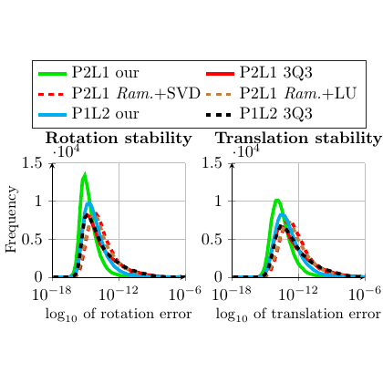

# test_14.png



Certainly! Here’s a detailed guide for reconstructing the provided plot using LaTeX and TikZ.

### 1. 概览
- **图形类型**: 坐标图
- **构图布局**: 两个并排的坐标图，每个坐标图上有多条曲线。
- **主要元素关系**: 主要元素包括曲线、图例、坐标轴标签。

### 2. 文档骨架与依赖
- **推荐文档类**: `standalone`
- **核心宏包**: `tikz`, `pgfplots`, `xcolor`, `amsmath`
- **特定功能**: 使用 `pgfplots` 库进行折线图绘制

### 3. 版面与画布设置
- **尺寸**: 宽度 `10cm`，高度根据比例自动调整
- **坐标系范围**：
  - 第一个图：x 轴 `10^{-18}` 到 `10^{-6}`，y 轴 `0` 到 `1.5 \times 10^4`
  - 第二个图：x 轴 `10^{-12}` 到 `10^{-6}`
- **节点与元素的间距**: 默认
- **环境参数**: 使用 `axis` 环境配置，包含 `xtick={...}`, `ytick={...}`

### 4. 字体与配色
- **字体**: 默认字体，可调整为 `\small` 或 `\normalsize`
- **主色**:
  - 绿色 `rgb={(0, 1, 0)}`
  - 红色 `rgb={(1, 0, 0)}`
  - 蓝色 `rgb={(0, 1, 1)}`
- **辅助色**: 其它线型为不同的虚线样式

### 5. 结构与组件样式
- **节点和边框**: 无边框节点
- **线型**: 连续和虚线，线宽适中
- **箭头样式**: 不适用
- **坐标轴**: 包含网格线、刻度

### 6. 数学/表格/图形细节
- **公式**: 使用 `\log_{10}` 来表示对数
- **表格**: 无表格

### 7. 自定义宏与命令
- 创建自定义颜色和线型宏以便重用

### 8. 最小可运行示例 (MWE)
```latex
\documentclass{standalone}
\usepackage{tikz}
\usepackage{pgfplots}
\usepackage{xcolor}
\pgfplotsset{compat=1.18}

\begin{document}
\begin{tikzpicture}
    \begin{axis}[
        legend style={at={(0.5,-0.25)},anchor=north,legend columns=-1},
        ylabel={Frequency},
        xlabel={$10^{\log_{10} \text{ of rotation error}}$},
        title={Rotation stability},
        width=10cm,
        height=6cm,
        grid=major,
        xtick={-18, -12, -6},
        ytick={0, 0.5e4, 1.0e4, 1.5e4},
        legend style={draw=none},
        cycle list name=color list
        ]
        \addplot[green, thick] coordinates {(-18, 1e4) (-12, 0.8e4) (-6, 0.1e4)};
        \addlegendentry{P2L1 our}
        
        \addplot[red, thick] coordinates {(-18, 0.8e4) (-12, 0.6e4) (-6, 0)};
        \addlegendentry{P2L1 3Q3}
        
        \addplot[red, dashed] coordinates {(-18, 0.9e4) (-12, 0.7e4) (-6, 0.2e4)};
        \addlegendentry{P2L1 Ram.+SVD}
        
        \addplot[red, dashdotted] coordinates {(-18, 0.7e4) (-12, 0.5e4) (-6, 0)};
        \addlegendentry{P2L1 Ram.+LU}
        
        \addplot[cyan, densely dotted, thick] coordinates {(-18, 1e4) (-12, 0.9e4) (-6, 0.5e4)};
        \addlegendentry{P1L2 our}
        
        \addplot[black, densely dashed, thick] coordinates {(-18, 0.5e4) (-12, 0.3e4) (-6, 0)};
        \addlegendentry{P1L2 3Q3}
    \end{axis}
    
    \begin{axis}[
        at={(8cm,0)},
        ylabel={Frequency},
        xlabel={$10^{\log_{10} \text{ of translation error}}$},
        title={Translation stability},
        width=10cm,
        height=6cm,
        grid=major,
        xtick={-12, -6},
        ytick={0, 0.5e4, 1.0e4, 1.5e4},
        legend style={draw=none},
        cycle list name=color list again
        ]
        \addplot[green, thick] coordinates {(-12, 1e4) (-6, 0.8e4)};
        \addlegendentry{P2L1 our}
        
        \addplot[red, thick] coordinates {(-12, 0.8e4) (-6, 0)};
        \addlegendentry{P2L1 3Q3}
        
        \addplot[red, dashed] coordinates {(-12, 0.9e4) (-6, 0.2e4)};
        \addlegendentry{P2L1 Ram.+SVD}
        
        \addplot[red, dashdotted] coordinates {(-12, 0.7e4) (-6, 0)};
        \addlegendentry{P2L1 Ram.+LU}
        
        \addplot[cyan, densely dotted, thick] coordinates {(-12, 1e4) (-6, 0.5e4)};
        \addlegendentry{P1L2 our}
        
        \addplot[black, densely dashed, thick] coordinates {(-12, 0.5e4) (-6, 0)};
        \addlegendentry{P1L2 3Q3}
    \end{axis}
\end{tikzpicture}
\end{document}
```

### 9. 复刻检查清单
- **图形尺寸、坐标范围**: 检查尺寸 `10cm`，坐标范围是否准确
- **节点/边样式**: 线型、颜色、粗细
- **字体与字号**: 确认是否适用
- **配色与线型**: 检查颜色及线型是否匹配
- **特殊效果**: 网格线设置
- **与原图的差异点**: 可能需细调坐标轴标签位置及文本大小

### 10. 风险与替代方案
- **不确定因素**: 精确色值可能有细微差异，使用标准 LaTeX 字体
- **替代方案**: 使用尽可能接近的 `xcolor` 定义色，字体使用 `Times` 宏包替代标准字体以匹配外观。

这样可以让重建的图像尽可能接近原图，但仍需根据具体数据进行调整。以上代码提供了一个基础框架，可以根据需要进行进一步修改。
