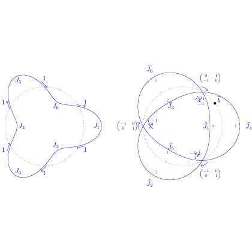

# test_18.png



为了对该科研绘图进行完整的LaTeX/TikZ重构，以下是详细的指导说明：

### 1. 概览
- **图像类型**：这是一个网络结构图，包含多个节点和连线。
- **构图布局**：左侧和右侧各有一个闭合的曲线网络，节点在圆周上均匀分布。
- **主要元素**：节点、连接的曲线边、节点标签。

### 2. 文档骨架与依赖
- 推荐文档类：`standalone`
- 核心宏包：`tikz`
- 使用库：`arrows.meta`（用于自定义箭头），`decorations.pathmorphing`（用于线条装饰）

### 3. 版面与画布设置
- **尺寸**：宽度约为10cm，高度约为5cm
- **坐标系范围**：`(-4,-4)` 到 `(4,4)`
- **节点间距**：均匀分布，整体对齐为中心对称布局
- 使用 `\begin{tikzpicture}[scale=0.7]` 进行缩放和对齐

### 4. 字体与配色
- **字体**：建议使用默认的 `Computer Modern`，大小为 `\small`
- **主色**：蓝色 `blue`
- **辅助色**：黑色 `black`
- 无渐变或阴影效果

### 5. 结构与组件样式
- **节点**：圆形节点，填充色为白色，边框为蓝色
- **边与箭头**：曲线线型，主要为蓝色，带箭头
- **箭头样式**：`[-{Stealth}]`，用于表示方向

### 6. 数学/表格/图形细节
- 数学表达式放在节点标签中，可以直接在 TikZ 节点中使用 `$ ... $` 进行公式排版

### 7. 自定义宏与命令
```latex
\tikzset{
  mynode/.style={circle, draw=blue, inner sep=1pt},
  myedge/.style={blue, thick, -{Stealth}}
}
```

### 8. 最小可运行示例 (MWE)
```latex
\documentclass{standalone}
\usepackage{tikz}
\usetikzlibrary{arrows.meta, decorations.pathmorphing}

\begin{document}
\begin{tikzpicture}[scale=0.7]
  % Nodes
  \foreach \i/\pos in {1/(-3,1), 2/(-2,-2), 3/(0,-3), 4/(2,-2), 5/(3,1), 6/(0,3)} {
    \node[mynode] (J\i) at \pos {\small $J_{\i}$};
  }
  
  \foreach \i/\text in {1/1,2/1,3/1,4/1,5/1,6/1} {
    \path (J\i) edge[myedge, out=120-\i*60, in=180-\i*60] node[midway, above] {\text} (J\6);
  }
  
  % Connections and labels
  \node at (0,0) {\small $K^{-1}$};
  \path[myedge] (J1) edge[myedge, out=30, in=150] (J4)
  (J2) edge[myedge, out=60, in=-30] (J5)
  (J3) edge[myedge, out=-60, in=210] (J6)
  (J1) edge[myedge, dashed] (J4)
  (J2) edge[myedge, dashed] (J5)
  (J3) edge[myedge, dashed] (J6);
  
  % Labels
  \node[black] at (1,1) {\small $(\begin{smallmatrix} 0 & 1 \\ -1 & 0 \end{smallmatrix})$};
  \node[black] at (-2,1) {\small $(\begin{smallmatrix} -1 & 0 \\ 0 & 1 \end{smallmatrix})$};
\end{tikzpicture}
\end{document}
```

### 9. 复刻检查清单
- **图形尺寸、坐标范围**：检查是否与原图一致
- **节点/边样式**：确保节点形状、边框颜色及箭头样式准确
- **字体与字号**：核对字体与大小
- **配色与线型**：图中所有颜色需准确核对
- **特殊效果**：无

### 10. 风险与替代方案
- **不确定因素**：可能在视觉效果上，具体色值上存在差异
- **替代方案**：默认使用 `Computer Modern` 字体；如果有需要，调整 `xcolor` 的色值以更接近图像的原色。
