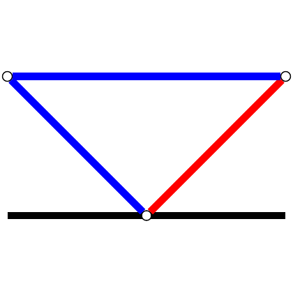

# test_19.png



以下是根据提供的图像生成的 LaTeX/TikZ 重构指导：

### 1. 概览
- **图形类型**：网络结构图。
- **构图布局**：五个节点，其中三个在顶端对齐，两个在底端，三个边连接了四个节点。中央两个节点通过两条不同颜色的边连接到底部中心节点。
- **主要元素关系**：顶部中间与底部节点连接，底部中间节点是两条有颜色线的汇聚点。

### 2. 文档骨架与依赖
- **文档类**：`standalone`
- **核心宏包**：`TikZ`, `xcolor`
- **特定功能**：需要在 TikZ 中使用 `arrows.meta` 库来定义箭头，可能还需 `positioning` 库来精确定位。

### 3. 版面与画布设置
- **图形尺寸**：建议宽度 `10cm`。
- **画布范围**：`(-1.5, 0)` 到 `(1.5, 1.5)`。
- **对齐方式**：顶端与底端节点水平对齐。

### 4. 字体与配色
- **字体**：默认字体，可使用 `\small` 调整大小。
- **配色**：
  - 主色：蓝色 `RGB(0, 0, 255)`
  - 辅助色：红色 `RGB(255, 0, 0)`，黑色 `RGB(0, 0, 0)`

### 5. 结构与组件样式
- **节点**：
  - 形状：圆形
  - 填充：无
  - 边框：黑色，`thick`
- **边与箭头**：
  - 线型：`thick`，无箭头
  - 颜色：蓝色与红色

### 6. 数学/表格/图形细节
- 无复杂数学公式、表格、或高级图形细节。

### 7. 自定义宏与命令
- 定义蓝色与红色线条样式，便于复用：
  ```latex
  \tikzset{
    blue line/.style={draw=blue, thick},
    red line/.style={draw=red, thick},
  }
  ```

### 8. 最小可运行示例 (MWE)
```latex
\documentclass{standalone}
\usepackage{tikz}
\usetikzlibrary{arrows.meta, positioning}

\begin{document}
\begin{tikzpicture}
  % Nodes
  \node[draw, circle, thick] (A) at (-1, 1.5) {};
  \node[draw, circle, thick] (B) at (0, 1.5) {};
  \node[draw, circle, thick] (C) at (1, 1.5) {};
  \node[draw, circle, thick] (D) at (0, 0) {};
  % Lines
  \draw[blue line] (A) -- (D);
  \draw[blue line] (B) -- (C);
  \draw[red line] (C) -- (D);
\end{tikzpicture}
\end{document}
```

### 9. 复刻检查清单
- 图形尺寸、坐标范围：`10cm`，`(-1.5, 0)` 到 `(1.5, 1.5)`
- 节点/边样式：圆形节点，红蓝黑线条
- 字体与字号：`\small` 字体
- 配色与线型：蓝色和红色主线，`thick`
- 特殊效果：无

### 10. 风险与替代方案
- **不确定因素**：可能存在的色差与字体差异。
- **替代方案**：如没有要求的颜色，使用近似色。字体使用默认 Computer Modern 以确保兼容性。
