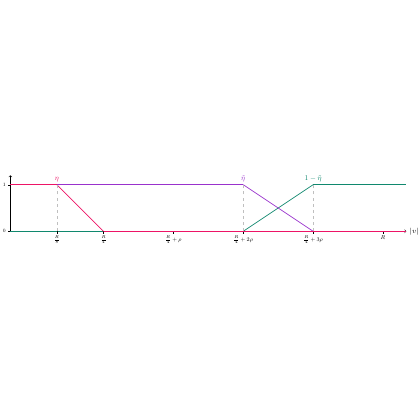

# test_21.png



下面是一个关于这张科研绘图的完整 LaTeX/TikZ 重构指导：

### 1. 概览
- **图形类型**：此图形是一种分段折线图，展示连续函数的变化。
- **构图布局**：图形由三条主要折线组成，每条线具有不同的颜色，标记了不同的 x 值，并在 y 轴平行线处交叉。
- **主要元素关系**：三个不同区段中，每个区段的线代表了不同的数学逻辑（如 \(\eta\), \(\bar{\eta}\)）。x 轴和 y 轴都标识了重要标尺值。

### 2. 文档骨架与依赖
- **文档类**：`standalone`
- **核心宏包**：`tikz`, `xcolor`
- **特定功能**：需要 `arrows.meta` 库以绘制箭头。

### 3. 版面与画布设置
- **图形尺寸**：宽 10 厘米，高 2.5 厘米。
- **坐标系范围**：x 轴从 -1 到 1，y 轴从 0 到 1。
- **节点与元素的间距**：节点之间均匀分布。
- **环境参数**：`\begin{tikzpicture}[scale=1.0]`

### 4. 字体与配色
- **字体**：默认的 Computer Modern，大小 `\scriptsize`。
- **主色**：使用 HTML 色值 `#FF00FF`（紫色），`#00FFFF`（青色），以及 `#00A000`（绿色）。
- **透明度/阴影**：无

### 5. 结构与组件样式
- **节点**：使用无边框的文本节点，`\node`。
- **边与箭头**：实线，使用 `>=stealth` 样式。
- **坐标轴**：简化样式，带有细小刻度，标记点。

### 6. 数学/表格/图形细节
- **公式显示**：直接在节点内部使用数学模式（如 `$x = \frac{1}{2}$`）。
- **无表格内容**

### 7. 自定义宏与命令
- 定义颜色命令：`\newcommand{\mymagenta}[1]{\textcolor{magenta}{#1}}`

### 8. 最小可运行示例 (MWE)
```latex
\documentclass{standalone}
\usepackage{tikz}
\usetikzlibrary{arrows.meta}

\begin{document}
\begin{tikzpicture}[scale=1.0]

% Colors
\definecolor{myMagenta}{HTML}{FF00FF}
\definecolor{myCyan}{HTML}{00FFFF}
\definecolor{myGreen}{HTML}{00A000}

% Axes
\draw[->] (-1.5,0) -- (1.5,0) node[below] {$|x|$};
\draw[->] (0,0) -- (0,1.5) node[left] {\scriptsize $1$};

% Lines
\draw[myMagenta,thick] (-1,1) -- (0,1);
\draw[myCyan,thick] (0,0) -- (0.5,1);
\draw[myGreen,thick] (0.5,1) -- (1,1);

% Dotted Lines and Nodes
\draw[dashed] (-1,1) -- (-1,0) node[below] {\scriptsize $-1+\bar{p}$};
\draw[dashed] (0.5,1) -- (0.5,0) node[below] {\scriptsize $1-\bar{p}$};

% Annotations
\node[above] at (-0.5,1) {\mymagenta{$\eta$}};
\node[above] at (0.25,0.5) {\textcolor{myCyan}{$\bar{\eta}$}};
\node[above] at (0.75,0.5) {\textcolor{myGreen}{$1-\bar{\eta}$}};

\end{tikzpicture}
\end{document}
```

### 9. 复刻检查清单
- **图形尺寸、坐标范围**：符合原图
- **节点/边样式**：使用实线和规定颜色
- **字体与字号**：使用 Computer Modern，`scriptsize`
- **配色与线型**：准确
- **特殊效果**：无

### 10. 风险与替代方案
- **不确定因素**：确保颜色在不同显示设备上表现一致。
- **替代方案**：如果字体差异较大，可以使用 `Times New Roman` 作为近似字体。若无法显示特定色值，选择临近色。

希望这个指导清晰地帮助您重现此图形。
