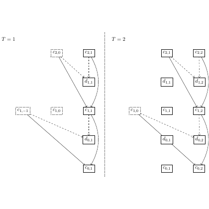

# test_24.png



# LaTeX/TikZ 重构指导

## 1. 概览
- **图形类型**: 图像是一个网络结构图，由多个节点和有向边组成。
- **构图布局**: 有两个主要部分（T=1 和 T=2），之间用虚线分隔。每部分包含多个节点，节点之间使用线段和箭头连接。
- **主要元素关系**: 各节点之间通过箭头连接，表示顺序和因果关系。部分节点用虚线框显示。

## 2. 文档骨架与依赖
- **推荐文档类**: `standalone`
- **核心宏包**: `TikZ`
- **特定功能**: 使用 `arrows.meta` 库自定义箭头样式、`matrix` 库布局节点。

## 3. 版面与画布设置
- **尺寸**: 图形大约宽度为12cm，高度为10cm。
- **节点与元素间距**: 节点水平和垂直间距应保持适中对齐。
- **环境参数**: \begin{tikzpicture}[node distance=2cm and 1.5cm]

## 4. 字体与配色
- **字体**: 默认字体，节点标签大小为 \small。
- **配色**: 
    - 主色（节点边框及连接线）: 黑色
    - 虚线颜色: 灰色

## 5. 结构与组件样式
- **节点**: 使用 `rectangle`，部分节点用 `dashed` 表示。
- **边与箭头**: 直线、虚线、多重箭头样式。
- **对齐**: 节点标签居中。

## 6. 数学/表格/图形细节
- 使用数学环境（如 `$c_{1,0}$`）输出节点标签。

## 7. 自定义宏与命令
- 定义颜色样式和节点样式提高复用性。

```latex
\tikzset{
    every node/.style={draw, rectangle, minimum size=8mm},
    dotted node/.style={dotted},
    edge/.style={-Stealth},
    dotted edge/.style={dashed}
}
```

## 8. 最小可运行示例 (MWE)
```latex
\documentclass{standalone}
\usepackage{tikz}
\usetikzlibrary{arrows.meta, matrix}

\begin{document}
\begin{tikzpicture}[node distance = 2cm and 1.5cm]
    % Nodes for T=1
    \node[dotted node] (c10) { $c_{1,0}$ };
    \node (c11) [below of=c10] { $c_{1,1}$ };
    \node (d01) [below of=c11] { $d_{0,1}$ };
    \node[dotted node] (c20) [above right of=c11] { $c_{2,0}$ };
    \node (c01) [below right of=c11] { $c_{0,1}$ };

    % Edges for T=1
    \draw[edge] (c11) -- (c10);
    \draw[dotted edge] (c20) -- (c11);
    \draw[edge] (c11) -- (c01);
    \draw[dotted edge] (c20) -- (d01);

    % Divider
    \draw[dashed] (3,-2) -- ++(0,6);

    % Nodes for T=2
    \node[dotted node] (c10_T2) at (6,0) { $c_{1,0}$ };
    \node (c11_T2) [below of=c10_T2] { $c_{1,1}$ };
    \node (d02) [below of=c11_T2] { $d_{0,2}$ };
    \node[dotted node] (c21) [above right of=c11_T2] { $c_{2,1}$ };
    \node (c02) [below right of=c11_T2] { $c_{0,2}$ };
    \node (d11) [below right of=c21] { $d_{1,1}$ };
    \node[dotted node] (c22) [right of=c21] { $c_{2,2}$ };

    % Edges for T=2
    \draw[dotted edge] (c21) -- (c11_T2);
    \draw[edge] (c11_T2) -- (c10_T2);
    \draw[dotted edge] (c22) -- (c21);
    \draw[edge] (c21) -- (d11);
    \draw[dotted edge] (c22) -- (c02);
    \draw[edge] (c11_T2) -- (c02);
    \draw[dotted edge] (c21) -- (d02);
\end{tikzpicture}
\end{document}
```

## 9. 复刻检查清单
- 图形尺寸、坐标范围
- 节点/边样式
- 字体与字号
- 配色与线型
- 与原图的差异点

## 10. 风险与替代方案
- **不确定因素**: 精确的色值和字体差异。
- **替代方案**: 使用默认字体（Computer Modern）和接近的灰色强度。
