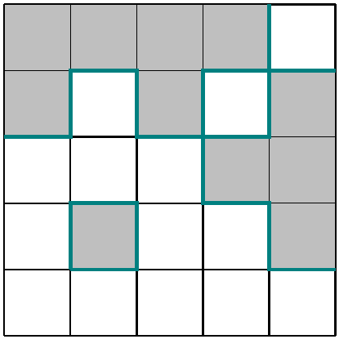

# test_25.png



1. **概览**
   - 该图像为一个矩阵展示，由 5x5 格子组成，部分格子用灰色填充，另一些用青色边框标识。
   - 布局为规则的方格网格，具有高度对称性。
   - 主要元素为不同颜色填充的方形区域。

2. **文档骨架与依赖**
   - 推荐的文档类：`standalone`，方便独立编译。
   - 核心宏包：`TikZ`，支持绘制矩形和设置样式。
   - 需要的 TikZ 库：`shapes.geometric` 用于绘制矩形。

3. **版面与画布设置**
   - 图形尺寸：约 9cm x 9cm。
   - 坐标系范围：0 到 5（横纵各包含5个单位）。
   - 建议的 `\tikzpicture` 环境参数：`x=1.8cm, y=1.8cm`，使每个方形大小统一。

4. **字体与配色**
   - 无需特殊字体，因为没有文本标签。
   - 主色（灰色）：`gray!50`，辅助色（青色）：`cyan`.
   - 无渐变、透明度或阴影效果。

5. **结构与组件样式**
   - 节点：正方形，黑色细边框，填充无或灰色。
   - 边与箭头：青色方框为 2pt 的线宽。
   - 无坐标轴或者 legend。

6. **数学/表格/图形细节**
   - 无公式和表格。
   - 使用 TikZ node 绘制方形。

7. **自定义宏与命令**
   - 定义方形样式宏，有利于统一管理样式设置。

8. **最小可运行示例 (MWE)**
   ```latex
   \documentclass{standalone}
   \usepackage{tikz}
   \begin{document}
   \begin{tikzpicture}[x=1.8cm, y=1.8cm]
       % Define colors
       \definecolor{grayfilled}{rgb}{0.5, 0.5, 0.5}
       \definecolor{cyanborder}{rgb}{0, 1, 1}
       % Fill gray squares
       \foreach \i/\j in {0/4, 1/4, 2/2, 2/0, 3/1, 4/0, 4/2, 4/4} {
           \fill[grayfilled] (\i,\j) rectangle ++(1,1);
       }
       % Cyan border squares
       \foreach \i/\j in {1/3, 2/1, 3/0, 3/2, 3/4} {
           \draw[thick, cyanborder] (\i,\j) rectangle ++(1,1);
       }
       % Draw grid
       \foreach \i in {0,1,...,5} {
           \draw (\i,0) -- (\i,5);
           \draw (0,\i) -- (5,\i);
       }
   \end{tikzpicture}
   \end{document}
   ```

9. **复刻检查清单**
   - 图形尺寸、坐标范围均为 5x5 单位。
   - 节点/边样式：符合题干要求。
   - 无需字体与字号调整。
   - 配色：灰色为 `gray!50`，青色为 `cyan`。
   - 无特殊效果。

10. **风险与替代方案**
   - 可能无法精确匹配原始色值；使用常规 RGB 替代。
   - 字体差异最小化影响，因为图中无文字。
