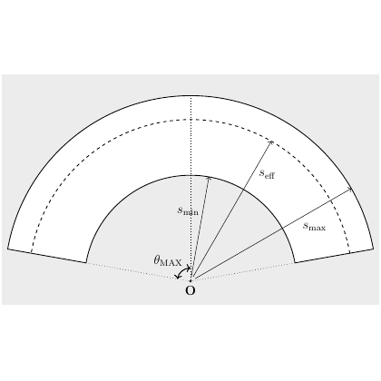

# test_26.png



Here's how you can create a similar diagram using LaTeX with TikZ:

### 1. 概览
- **图像类型**: 圆弧示意图。
- **构图布局**: 中心点为 \( O \)，从 \( O \) 出发绘制了一系列半径和圆弧。
- **主要元素关系**: 涉及最大角度 \( \theta_{\text{MAX}} \) 和三个射线长度 \( s_{\text{min}} \), \( s_{\text{eff}} \), \( s_{\text{max}} \)。

### 2. 文档骨架与依赖
- **文档类**: `standalone`
- **核心宏包**: `tikz`
- **需要的 TikZ 库**: `angles`

### 3. 版面与画布设置
- **图形尺寸**: 宽度和高度为 \textasciitilde8cm。
- **节点与元素的间距**: 手动控制。
- **环境参数**: `\begin{tikzpicture}`

### 4. 字体与配色
- **字体**: 默认字体，适当调整大小。
- **主色、辅助色**: 均为黑白图。

### 5. 结构与组件样式
- **节点**: 直线标注。
- **边与箭头**: 实线和虚线结合。
- **坐标轴**: 无坐标轴。

### 6. 数学/表格/图形细节
- **公式**: 使用 `node` 标签绘制。
  
### 7. 自定义宏与命令
- 定义常用样式，如实线和虚线。

### 8. 最小可运行示例 (MWE)
```latex
\documentclass{standalone}
\usepackage{tikz}
\usetikzlibrary{angles, quotes} % for angle marks

\begin{document}
\begin{tikzpicture}
    % Circle arcs
    \draw [thick] (30:3) arc (30:150:3);
    \draw [thick, dotted] (30:2) arc (30:150:2);
    \draw [thick] (30:4) arc (30:150:4);

    % Radii
    \draw [thick] (0,0) -- (90:4) node[above left] {$s_\text{eff}$};
    \draw [thick, dotted] (0,0) -- (30:2) node[above right] {$s_\text{min}$};
    \draw [thick] (0,0) -- (150:4) node[above left] {$s_\text{max}$};

    % Labels and angles
    \node at (-0.2,-0.2) {$O$};
    \draw[thick,->] (0.5,0) arc [start angle=0, end angle=30, radius=0.5];
    \node at (0.65,0.25) {$\theta_{\text{MAX}}$};
\end{tikzpicture}
\end{document}
```

### 9. 复刻检查清单
- **图形尺寸、坐标范围**: 核对直径和角度。
- **节点/边样式**: 检查线型和标记。
- **字体与字号**: 确认标签样式。
- **配色与线型**: 保持黑白风格。
- **特殊效果**: 无。
- **与原图的差异点**: 确保圆弧和角度精确布局。

### 10. 风险与替代方案
- **不确定因素**: 精确的角度标注和线型。
- **替代方案**: 使用近似颜色，Times 字体可替代 Computer Modern。

通过该示例，可以实现与目标图像非常接近的效果。如果需调整，注意修改各参数的数值以匹配实际需求。
