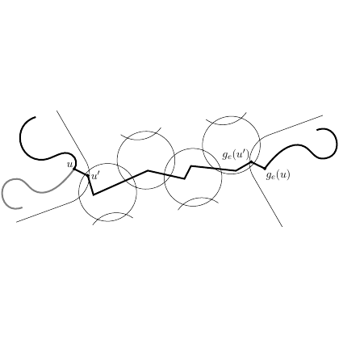

# test_28.png



以下是针对该科研绘图的 LaTeX/TikZ 重构指导：

### 1. 概览
- **图形类型**：网络结构图。
- **构图布局**：由多条曲线和折线构成，中间包含多个重叠的圆圈，标记了点和函数关系。
- **主要元素关系**：箭头指向标记节点间的函数映射关系。

### 2. 文档骨架与依赖
- **文档类**：`standalone`
- **核心宏包**：`tikz`, `amsmath`
- **需要的 TikZ 库**：`arrows.meta`（箭头样式），`decorations.pathreplacing`（曲线）

### 3. 版面与画布设置
- **图形尺寸**：建议宽高比为约 4:1
- **坐标系范围**：`x` 轴从 -3 到 3，`y` 轴从 -1.5 到 1.5
- **建议的 \tikzpicture 环境参数**：
  ```latex
  \begin{tikzpicture}[scale=1]
  ```

### 4. 字体与配色
- **字体**：`$\mathsf{`...`}$` 用于数学符号，默认大小。
- **主色**：黑色线条，灰色辅助元素。
- **辅助色**：浅灰色，用于标记圆圈和线段。
- **渐变/透明度/阴影**：无。

### 5. 结构与组件样式
- **节点**：标记点用小圆圈，`node` 命令用于标签。
- **边与箭头**：线型为 `thick`，箭头使用 `-{Stealth}`。
- **坐标轴**：无坐标轴元素的图形，只用网格线分割加强理解。

### 6. 数学/表格/图形细节
- **公式**：使用 `node` 命令嵌入数学环境。
- **无表格或坐标图需求**。

### 7. 自定义宏与命令
- 无需复杂封装，基本样式可直接使用 TikZ 自带功能。

### 8. 最小可运行示例 (MWE)
```latex
\documentclass{standalone}
\usepackage{tikz}
\usetikzlibrary{arrows.meta, decorations.pathreplacing}
\begin{document}

\begin{tikzpicture}
  % Nodes
  \draw[thick] (-3,-1) to[out=30,in=150] (-1,0);
  \draw[thick] (-1,0) -- (1,0);
  \draw[thick] (1,0) to[out=-30,in=-150] (3,1);
  
  % Circles
  \draw[gray, thick] (-2,0) circle (0.5);
  \draw[gray, thick] (0,0) circle (0.5);
  \draw[gray, thick] (2,0.5) circle (0.5);
  
  % Nodes and Labels
  \node at (-3,-1.2) {$u$};
  \node at (-1,-0.2) {$u'$};
  \node at (1.2,-0.2) {$g_e(u')$};
  \node at (3.2,0.8) {$g_e(u)$};
  
  % Arrows
  \draw[-{Stealth}, gray] (0.5,0) to[out=60,in=120] (1.5,0.5);
  \draw[-{Stealth}, gray] (-2.5,0) -- (-1.5,0);
  \draw[-{Stealth}, gray] (0.5,0.5) to[out=240,in=300] (-0.5,0);
  
\end{tikzpicture}

\end{document}
```

### 9. 复刻检查清单
- **图形尺寸、坐标范围**：确认是宽:高约为 4:1，范围在 (-3, 3) x (-1.5, 1.5)
- **节点/边样式**：确保使用 `thick` 和 `-{Stealth}`。
- **字体与字号**：内部数学字体为 `\mathsf`。
- **配色与线型**：黑色和灰色搭配，`gray` 为辅助色。
- **特殊效果**：无。
- **与原图的差异点**：线条粗细和箭头可能存在小比例偏差。

### 10. 风险与替代方案
- **不确定因素**：精确配色可能因显示设备变化。
- **替代方案**：采用 `Computer Modern` 字体与近似灰色 (\texttt{gray!60}) 作为替代。

请根据以上指导进行 LaTeX 复刻，确保与原图尽量接近。
