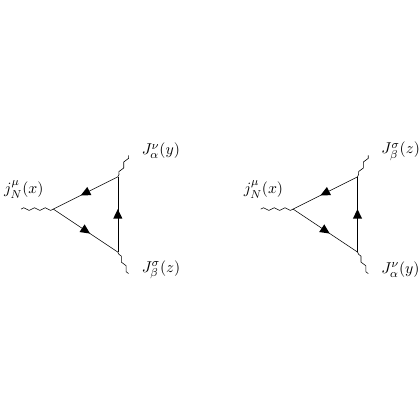

# test_29.png



以下是针对给定科研图的 LaTeX/TikZ 重构指导：

### 1. 概览
- **图像类型**：两个费曼图，各包含三个节点和边。
- **构图布局**：左图和右图对称排列；每个图含三角结构，顶点连接有波状和箭头直线。
- **主要元素关系**：每个节点代表一个数学符号（如 \( j^\mu_N(x) \)），边为箭头或波状线。

### 2. 文档骨架与依赖
- **推荐文档类**：`standalone`
- **核心宏包**：`tikz`, `amsmath`
- **TikZ 库**：`decorations.pathmorphing`（用于波状线），`arrows.meta`（用于箭头）

### 3. 版面与画布设置
- **尺寸**：每个子图约占画布宽度一半
- **节点间距**：适中，保证标签清晰
- **环境参数**：使用 `\begin{tikzpicture}[thick]` 设置线条粗细

### 4. 字体与配色
- **字体**：默认数学字体，`normalsize`
- **主色**：黑色 `black`
- **无渐变/阴影**

### 5. 结构与组件样式
- **节点形状**：无边框，文本对齐点
- **边与箭头**：`->`箭头，用 `decorate` 进行波状修饰
- **波状线**：`decorate` with `decoration={coil,aspect=0}`

### 6. 数学/表格/图形细节
- **公式**：直接在 TikZ 节点中使用数学环境
- **无表格**

### 7. 自定义宏与命令
- 定义常见样式：

  ```latex
  \tikzset{
      wave/.style={decorate, decoration={coil,segment length=4pt}, very thick},
      particle/.style={draw, thick, ->}
  }
  ```

### 8. 最小可运行示例 (MWE)
```latex
\documentclass{standalone}
\usepackage{tikz}
\usetikzlibrary{decorations.pathmorphing, arrows.meta}

\begin{document}
\begin{tikzpicture}[thick]
  % Left diagram
  \draw[wave] (0,0) -- ++(60:1.5) node[above right] {$J'^\nu_\alpha(y)$};
  \draw[particle] (0,0) -- ++(300:1.5) node[below right] {$J^\beta_\gamma(z)$};
  \draw[particle] (0,0) -- ++(180:1.5) node[left] {$j^\mu_N(x)$};

  % Right diagram
  \begin{scope}[shift={(4,0)}]
    \draw[wave] (0,0) -- ++(60:1.5) node[above right] {$J^\beta_\gamma(z)$};
    \draw[particle] (0,0) -- ++(300:1.5) node[below right] {$J'^\nu_\alpha(y)$};
    \draw[particle] (0,0) -- ++(180:1.5) node[left] {$j^\mu_N(x)$};
  \end{scope}
\end{tikzpicture}
\end{document}
```

### 9. 复刻检查清单
- **图形尺寸**：两个子图对称放置
- **节点/边样式**：箭头、波状线正确应用
- **字体与字号**：默认数学字体
- **线型与配色**：黑色，无渐变
- **无特殊效果**

### 10. 风险与替代方案
- **色值不确定性**：使用 `xcolor` 自定义颜色，近似处理
- **字体差异**：默认 Computer Modern；可用 Times if needed

通过该指导，可在 LaTeX 中精确重现图像的各个要素。
