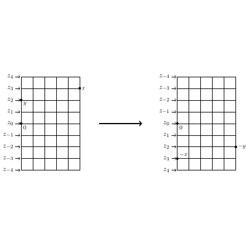

# test_30.png



以下是针对图中的 LaTeX/TikZ 重构指导：

### 1. 概览
- **类型与布局**: 
  - 图形类型为箭头与网格图。
  - 分为两个主要网格矩阵，中间用箭头连接。
- **主要元素关系**:
  - 左右两侧有对称的网格，中间用一条箭头表示转换关系。

### 2. 文档骨架与依赖
- **推荐文档类**: `standalone`
- **核心宏包**: `tikz`, `amsmath`
- **特别库**: `arrows.meta`（箭头支持）

### 3. 版面与画布设置
- **尺寸与范围**:
  - 每个网格为 5x5。
  - 总宽度建议约为 12cm，高度约为 6cm。
- **环境参数**: 
  - 使用 `\begin{tikzpicture}`。

### 4. 字体与配色
- **字体**:
  - 默认使用 `Computer Modern` 或 `Times`，尺寸为 `\scriptsize`。
- **配色**:
  - 主要颜色为黑色，无特殊色值。

### 5. 结构与组件样式
- **节点**:
  - 矩形节点无填充，边框为黑色线条。
- **边与箭头**:
  - 箭头线型为 `->`，中等粗细。

### 6. 数学/表格/图形细节
- **公式排版**:
  - 使用 `$` 包围标识符。
- **网格线**:
  - 明确每个格子的大小，平行线构成网格。

### 7. 自定义宏与命令
- 定义通用节点样式和箭头样式，便于复用和调整。

### 8. 最小可运行示例 (MWE)
```latex
\documentclass{standalone}
\usepackage{tikz}
\usetikzlibrary{arrows.meta}

\begin{document}

\begin{tikzpicture}
  % Left grid
  \draw (-3,2) grid (-1,-2);
  \foreach \i in {0,1,2,3,4}
    \node at (-3.5,2-\i) {$z_{\i}$};
  \node at (-2,2.5) {$x$};
  \node at (-3.5,0) {$0$};
  \node at (-2.5,-2.5) {$y$};

  % Right grid
  \draw (1,2) grid (3,-2);
  \foreach \i in {0,1,2,3,4}
    \node at (3.5,2-\i) {$z_{\i}$};
  \node at (2,-2.5) {$y$};
  \node at (1.5,3.5) {$z-1$};
  \node at (3.5,0) {$0$};
  \node at (3,-2.5) {$x$};

  % Arrow between grids
  \draw[-{Latex[length=3mm]}] (-0.5,0) -- (0.5,0);
\end{tikzpicture}

\end{document}
```

### 9. 复刻检查清单
- **图形尺寸**: 确保宽度与高度一致。
- **节点/边样式**: 边框线性与箭头。
- **字体与字号**: 检查是否为指定字体与大小。
- **配色与线型**: 确保为黑色。
- **特殊效果**: 确认为无渐变与阴影。

### 10. 风险与替代方案
- **不确定因素**: 字体在不同环境可能存在差异。
- **替代方案**: 若 `Computer Modern` 不支持，使用 `Times`。颜色不敏感时，选择近似黑色值。
