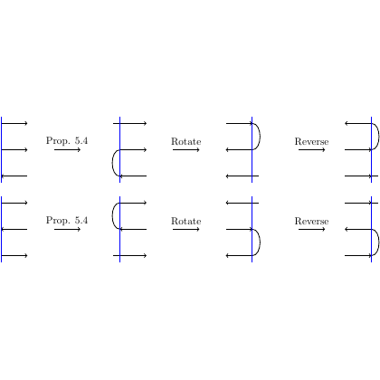

# test_32.png



1. **概览**
   - **图形类型**：流程图
   - **构图布局**：水平对称的流程，包含多个过程、旋转、反转步骤。
   - **主要元素关系**：线条和箭头连接框，框中有简短文字描述。

2. **文档骨架与依赖**
   - **文档类**：`standalone`
   - **核心宏包**：`TikZ`
   - **特定功能**：`arrows.meta`（箭头样式），`positioning`（节点定位）

3. **版面与画布设置**
   - **尺寸**：6cm x 4cm
   - **节点间距**：1.5cm
   - **对齐方式**：中心对齐
   - 建议使用 `\begin{tikzpicture}[node distance=1.5cm]`。

4. **字体与配色**
   - **字体**：默认字体，字号 `\small`
   - **主色**：黑色
   - **辅助色**：RGB（0, 0, 255）蓝色
   - **箭头**：黑色，`-Stealth`

5. **结构与组件样式**
   - **节点**：基本形状为矩形或无边框文本
   - **边与箭头**：直线，应用 `-Stealth` 箭头
   - **无坐标轴**

6. **数学/表格/图形细节**
   - **公式与标注**：使用 `node` 中直接排版
   - **表格**：无
   - **图形**：无数据绘图

7. **自定义宏与命令**
   - 自定义样式如：
     ```latex
     \tikzset{
       mynode/.style={draw=none, font=\small, inner sep=0pt},
       bluepath/.style={draw=blue, line width=1pt},
       arrow/.style={-Stealth}
     }
     ```

8. **最小可运行示例 (MWE)**
   ```latex
   \documentclass{standalone}
   \usepackage{tikz}
   \usetikzlibrary{arrows.meta, positioning}

   \begin{document}
   \begin{tikzpicture}[node distance=1.5cm, mynode/.style={font=\small}, arrow/.style={-Stealth}]
     \node[mynode] (n1) {Prop. 5.4};
     \draw[arrow] (n1) -- +(1,0) node[mynode, above] {Rotate};
     \draw[bluepath] (1.5,0.5) .. controls +(0.5,-0.5) and +(0,-0.5) .. +(0,1);
     \node[mynode, right=of n1] (n2) {};
     \draw[arrow] (n2) -- +(1,0) node[mynode, above] {Reverse};
     \draw[bluepath] (3,0.5) .. controls +(0.5,-0.5) and +(0,-0.5) .. +(0,1);
   \end{tikzpicture}
   \end{document}
   ```

9. **复刻检查清单**
   - **图形尺寸**：6cm x 4cm
   - **节点/边样式**：对齐中心，使用 `-Stealth` 箭头
   - **字体与字号**：\small
   - **配色与线型**：黑色箭头，蓝色弧线
   - **特殊效果**：无

10. **风险与替代方案**
   - **不确定因素**：精确色值可能因显示器校准差异
   - **替代方案**：默认字体使用 Computer Modern，近似色可调整至黑色或其他标准色值。
