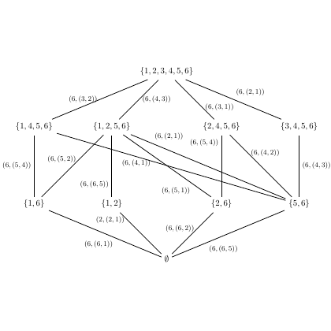

# test_34.png



以下是关于图中结构的 LaTeX/TikZ 重构指导：

### 1. 概览
- **描述**: 该图为一个网络结构图，类似 Hasse 图。元素节点由集合表示，节点之间有边表示关系。
- **构图布局**: 由多个节点和方向性无箭头的边组成，各节点彼此连接形成层次结构。
- **主要元素关系**: 节点表示集合，边表示包含关系。

### 2. 文档骨架与依赖
- **文档类**: `standalone`
- **核心宏包**: `TikZ`
- **特定功能**: 无

### 3. 版面与画布设置
- **图形尺寸**: 建议宽高比例为 1:1。
- **坐标系范围**: 自定义。
- **节点与元素的间距**: 节点的间距应足以区分文本。
- **环境参数**: 使用 `\begin{tikzpicture}` 和 `\end{tikzpicture}`。

### 4. 字体与配色
- **字体**: 默认字体，标准大小。
- **配色**: 黑色边和文本。

### 5. 结构与组件样式
- **节点**: 圆形或矩形，无边框，居中对齐。
- **边与箭头**: 直线边，默认线宽。
- **坐标轴**: 不需要。

### 6. 数学/表格/图形细节
- **公式**: 使用 `$` 包围集合表示。
- **表格**: 不适用。
- **图形细节**: 无曲线或特殊图形。

### 7. 自定义宏与命令
- 定义节点样式，例如：
  ```latex
  \tikzstyle{mynode}=[draw, rectangle, minimum size=1.5em, inner sep=2pt]
  ```

### 8. 最小可运行示例 (MWE)
```latex
\documentclass{standalone}
\usepackage{tikz}

\begin{document}

\begin{tikzpicture}[node distance=1.5cm]
  \node (a) at (0,4) {$\{1, 2, 3, 4, 5, 6\}$};
  \node (b) at (-3,2) {$\{1, 2, 5, 6\}$};
  \node (c) at (0,2) {$\{2, 4, 5, 6\}$};
  \node (d) at (3,2) {$\{3, 4, 5, 6\}$};
  \node (e) at (-4,0) {$\{1, 4, 5, 6\}$};
  \node (f) at (-2,0) {$\{1, 6\}$};
  \node (g) at (-1,0) {$\{2, 6\}$};
  \node (h) at (1,0) {$\{5, 6\}$};
  \node (i) at (3,0) {$\{6\}$};
  \node (j) at (0,-2) {$\emptyset$};

  \foreach \from/\to in {a/b, a/c, a/d, b/e, b/f, b/g, c/g, c/h, d/i,
                         e/j, f/j, g/j, h/j, i/j}
    \draw (\from) -- (\to);

\end{tikzpicture}

\end{document}
```

### 9. 复刻检查清单
- **图形尺寸、坐标范围**: 检查节点布局。
- **节点/边样式**: 确保节点大小和边粗细符合预期。
- **字体与字号**: 默认字体无误。
- **配色与线型**: 黑色无误。
- **特殊效果**: 无需渐变或阴影。
- **与原图的差异点**: 确保节点位置准确。

### 10. 风险与替代方案
- **可能不确定因素**: 精确位置可能需要手动调整。
- **替代方案**: 使用图形编辑软件微调位置，如 Inkscape 或其他矢量编辑器。
