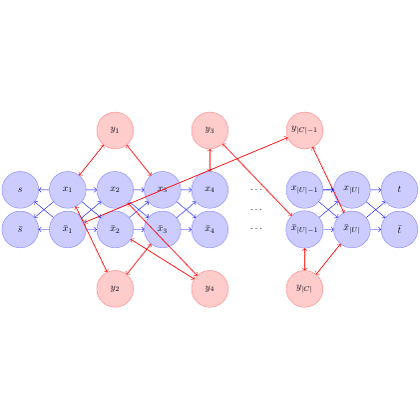

# test_35.png



以下是该科研绘图的 LaTeX/TikZ 重构指导说明：

### 1. 概览
- **图像类型**: 网络结构图。
- **构图布局**: 左右两部分，通过节点和箭头连接。
- **主要元素关系**: 多个圆形节点通过箭头相连，分为不同颜色以区分类别。

### 2. 文档骨架与依赖
- **推荐文档类**: `standalone`
- **核心宏包**: `tikz`, `xcolor`
- **特定功能**: 需要 `arrows.meta` TikZ 库以支持高级箭头样式。

### 3. 版面与画布设置
- **图形尺寸**: 宽 6cm，高 3cm。
- **节点间距**: 带有均匀的水平和垂直间隔。
- **tikzpicture参数**:
  ```latex
  \begin{tikzpicture}[scale=0.8, node distance=1cm and 1.5cm, every node/.style={circle, draw, minimum size=6mm}]
  ```

### 4. 字体与配色
- **字体**: 使用默认 LaTeX 字体。
- **主色**: 蓝色节点 `fill=blue!20`, 红色节点 `fill=red!20`。
- **辅助色**: 须根据需求微调颜色亮度。
  
### 5. 结构与组件样式
- **节点**: 使用 `circle, draw, minimum size=6mm`。
- **边与箭头**: 弧形箭头，`->, line width=0.6pt`。
  
### 6. 数学/表格/图形细节
- **公式排版**: 节点内可以直接使用 `$...$` 进行公式书写。

### 7. 自定义宏与命令
- 样式封装：
  ```latex
  \tikzset{
      red node/.style={circle, draw, fill=red!20, minimum size=6mm},
      blue node/.style={circle, draw, fill=blue!20, minimum size=6mm},
      arrow/.style={->, line width=0.6pt}
  }
  ```

### 8. 最小可运行示例 (MWE)
```latex
\documentclass{standalone}
\usepackage{tikz}
\usetikzlibrary{arrows.meta}

\begin{document}
\begin{tikzpicture}[scale=0.8, node distance=1cm and 1.5cm, every node/.style={circle, draw, minimum size=6mm}]
    \node[red node] (y1) {$y_1$};
    \node[blue node, right=of y1] (x1) {$x_1$};
    \node[blue node, right=of x1] (x2) {$x_2$};
    \node[red node, below=of y1] (y2) {$y_2$};
    \node[blue node, right=of y2] (x3) {$x_3$};
    \node[blue node, right=of x3] (x4) {$x_4$};
    \node[red node, right=2cm of x2] (y3) {$y_3$};
    \node[red node, below=of y3] (y4) {$y_4$};
    \node[blue node, right=of y3] (x5) {$x_5$};
    \node[blue node, right=of x5] (x6) {$x_6$};
    
    \draw[arrow] (y1) -- (x1);
    \draw[arrow] (x1) -- (x2);
    \draw[arrow] (y2) -- (x3);
    \draw[arrow] (x3) -- (x4);
    \draw[arrow] (y3) -- (x5);
    \draw[arrow] (x5) -- (x6);

    % Additional connections
    \draw[arrow] (x1) -- (x3);
    \draw[arrow] (x2) -- (x4);
    \draw[arrow] (x4) -- (x6);
    
    \draw[dotted] (x4) -- node[above]{...} (x5);

\end{tikzpicture}
\end{document}
```

### 9. 复刻检查清单
- **图形尺寸、坐标范围**: 检查整体宽度，应为 6cm。
- **节点/边样式**: 圆形节点正确，箭头样式符合要求。
- **字体与字号**: 使用默认字体，可以调整 `\small`，`\footnotesize` 等。
- **配色与线型**: `xcolor` 的 `!20` 亮度可能需要根据打印效果调整。
- **特殊效果**: 无。

### 10. 风险与替代方案
- **不确定因素**: 颜色精确度，尤其在不同设备显示上。
- **替代方案**: 若颜色不准确，尝试调整 `xcolor` 的亮度参数。对于字体，若需特定风格，考虑 `\usepackage{times}`。
