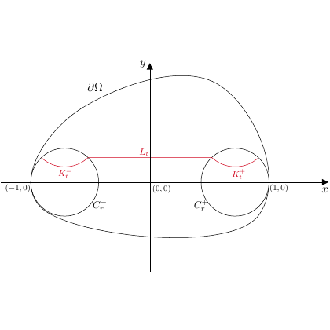

# test_37.png



```latex
% 1. 概览
% 这是一个带有坐标轴的数学示意图，展现了两个圆和与其相连的不同区域。主要元素包括坐标轴、两个圆、连结的曲线和标注。

% 2. 文档骨架与依赖
\documentclass[tikz, border=2mm]{standalone}
\usepackage{amsmath}
\usepackage{tikz}
\usetikzlibrary{shapes,arrows.meta,calc,positioning}

% 3. 版面与画布设置
% 设定图形的尺寸和坐标范围
\begin{document}
\begin{tikzpicture}[scale=2]

% 4. 字体与配色
\tikzset{
    every label/.style={font=\small},
    mycircle/.style={draw, thick, shape=circle, minimum size=0.8cm},
    redline/.style={draw=red, thick}
}

% 5. 结构与组件样式
% 定义节点、箭头和曲线样式
\node[mycircle,label=left:$K_r^-$] (Km) at (-0.5,0) {};
\node[mycircle,label=right:$K_r^+$] (Kp) at (0.5,0) {};

% 曲线和连接线
\draw[redline] (Km) -- node[above] {$L_t$} (Kp);

% 圆的外部边界与坐标轴
\draw[thick] 
    plot [smooth cycle] coordinates {(-1.2,0.3) (-0.9,1) (0.9,1) (1.2,0.3) (0.9,-0.7) (-0.9,-0.7)}
    node[above right,pos=0.2] {$\partial \Omega$};

% 坐标轴
\draw[-{Latex}] (-1.5,0) -- (1.5,0) node[right] {$x$};
\draw[-{Latex}] (0,-1.5) -- (0,1.5) node[above] {$y$};

% 小半圆
\draw (-1,0) arc[start angle=180,end angle=360,radius=0.2] node[pos=0.5,below] {$C_r^-$};
\draw (1,0) arc[start angle=0,end angle=180,radius=0.2] node[pos=0.5,below] {$C_r^+$};

% 6. 数学/表格/图形细节
% 使用 TikZ 添加数学符号

% 7. 自定义宏与命令
% 宏命令在上面的 \tikzset 部分已被定义

\end{tikzpicture}
\end{document}
```

### 9. 复刻检查清单

- **图形尺寸、坐标范围**：检查是否合理缩放。
- **节点/边样式**：确保圆的边框和线条粗细符合原图。
- **字体与字号**：使用相应大小的数学字体。
- **配色与线型**：红色线条与标签采用相应色值。
- **特殊效果**：可通过“smooth cycle”实现曲线。

### 10. 风险与替代方案

- **颜色精确性**：可能需要根据实际视觉效果调整为近似色。
- **字体差异**：如果没有特定要求，默认的 Computer Modern 是合适的选择。
- **曲线效果**：如果生成的曲线不够平滑，可以尝试调整坐标或使用更多插值点。

调整示例中参数以取得更接近的视觉效果，例如图形的 scale 或者曲线的控制点。
