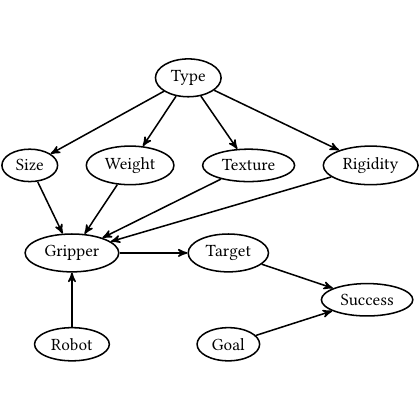

# test_38.png



# LaTeX/TikZ 重构指导

## 1. 概览
- **类型**：网络结构图
- **布局**：由多个圆形和椭圆形节点组成，节点间通过箭头连线连接，形成多中心辐射结构。
- **元素关系**：中心节点“Gripper”连接多个子节点，各节点之间使用箭头指示关系。

## 2. 文档骨架与依赖
- **文档类**：`standalone`
- **核心宏包**：`TikZ`
- **TikZ 库**：`arrows.meta`（用于箭头样式）

## 3. 版面与画布设置
- **尺寸**：按需调整，无须固定
- **节点间距**：适中，保证连接线清晰
- **对齐方式**：节点位置精确设置
- **环境参数**：`\begin{tikzpicture}`

## 4. 字体与配色
- **字体**：默认字体，可调整为 `\sffamily` 增强阅读性
- **主色**：黑色 `black`

## 5. 结构与组件样式
- **节点**：椭圆形，边框为黑色线条
- **连接线**：直线，箭头样式为 `->`，线宽 `thick`

## 6. 数学/表格/图形细节
- **公式排版**：未涉及复杂数学公式，仅节点文本
- **表格**：无

## 7. 自定义宏与命令
使用 TikZ 样式定义简化复用：
```latex
\tikzset{
  node style/.style={draw, ellipse, minimum width=1.5cm, align=center},
  arrow style/.style={->, thick}
}
```

## 8. 最小可运行示例 (MWE)
```latex
\documentclass{standalone}
\usepackage{tikz}
\usetikzlibrary{arrows.meta}

\begin{document}
\begin{tikzpicture}[node distance=2cm]
  \tikzset{
    node style/.style={draw, ellipse, minimum width=1.5cm},
    arrow style/.style={->, thick}
  }

  \node[node style] (type) {Type};
  \node[node style, below left of=type] (size) {Size};
  \node[node style, below=1.5cm of type] (weight) {Weight};
  \node[node style, below right of=type] (texture) {Texture};
  \node[node style, right=2cm of texture] (rigidity) {Rigidity};
  \node[node style, below=3cm of type] (gripper) {Gripper};
  \node[node style, below left of=gripper] (robot) {Robot};
  \node[node style, right=2cm of gripper] (target) {Target};
  \node[node style, right=2cm of target] (success) {Success};
  \node[node style, below=1.5cm of target] (goal) {Goal};

  \draw[arrow style] (type) -- (size);
  \draw[arrow style] (type) -- (weight);
  \draw[arrow style] (type) -- (texture);
  \draw[arrow style] (type) -- (rigidity);
  \draw[arrow style] (size) -- (gripper);
  \draw[arrow style] (weight) -- (gripper);
  \draw[arrow style] (texture) -- (gripper);
  \draw[arrow style] (rigidity) -- (gripper);
  \draw[arrow style] (gripper) -- (target);
  \draw[arrow style] (gripper) -- (robot);
  \draw[arrow style] (target) -- (success);
  \draw[arrow style] (goal) -- (success);
\end{tikzpicture}
\end{document}
```

## 9. 复刻检查清单
- **图形尺寸、坐标范围**：可调
- **节点/边样式**：确认椭圆形状及线型
- **字体与字号**：默认即可
- **配色与线型**：使用黑色
- **特殊效果**：无

## 10. 风险与替代方案
- **不确定因素**：字体渲染可能略有差异；色值接近真实视图
- **替代方案**：允许字体默认更改，颜色选用比对相似度即可满足需求。
