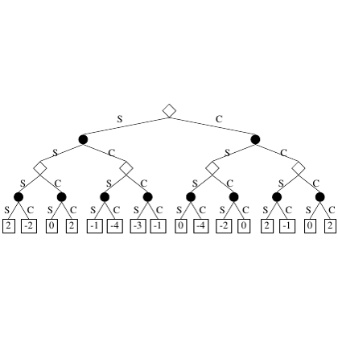

# test_39.png



下面是为该图像生成的完整 LaTeX/TikZ 重构指导：

### 1. 概览
- **图形类型**：该图片是树形结构图。
- **构图布局**：呈现层次结构，由根节点向下分支至叶节点。
- **主要元素关系**：节点之间使用线条连接，显示出父子关系。

### 2. 文档骨架与依赖
- **推荐文档类**：`standalone`。
- **核心宏包**：`tikz`。
- **特定功能**：使用`shapes`和`arrows.meta`库。

### 3. 版面与画布设置
- **图形尺寸**：宽度设为8cm。
- **节点/元素间距**：水平与垂直间距适中。
- **\tikzpicture 参数**：
  - 开启工作图层，关闭边界。

### 4. 字体与配色
- **字体**：默认字体，无需更改。
- **配色**：
  - 主色：黑色（节点和文字）。
  - 辅助色：白色（背景填充）。
- **特效**：无渐变或阴影效果。

### 5. 结构与组件样式
- **节点**：
  - 形状：圆形实心节点和方块节点。
  - 边框：无。
  - 填充：圆形节点为黑色。
  - 对齐：默认居中。
- **边与箭头**：
  - 线型：实线。
  - 粗细：默认。
  - 箭头：无。
- **其他组件**：
  - 方块节点下方为数字标签。

### 6. 数学/表格/图形细节
- **公式**：无。
- **曲线/柱状图/散点图**：无。

### 7. 自定义宏与命令
- 无需创建复杂自定义命令，使用简单样式封装。

### 8. 最小可运行示例 (MWE)

```latex
\documentclass{standalone}
\usepackage{tikz}
\usetikzlibrary{shapes, arrows.meta}

\begin{document}
\begin{tikzpicture}
  [level distance=1.5cm, sibling distance=2cm,
   every node/.style={shape=circle, draw, fill=black, inner sep=1.5pt},
   edge from parent/.style={draw, -}]
  
  \node[shape=diamond, draw, fill=white] {}
    child { node {} child { node {} child { node {} child { node[rectangle, draw=none, fill=none] {2}}}
                                                 child { node {} child { node[rectangle, draw=none, fill=none] {-2}}}}
                             child { node {} child { node {} child { node[rectangle, draw=none, fill=none] {0}}}
                                                 child { node {} child { node[rectangle, draw=none, fill=none] {2}}}}}
    child { node {} child { node {} child { node {} child { node[rectangle, draw=none, fill=none] {0}}}
                                                 child { node {} child { node[rectangle, draw=none, fill=none] {-1}}}}
                             child { node {} child { node {} child { node[rectangle, draw=none, fill=none] {-4}}}
                                                 child { node {} child { node[rectangle, draw=none, fill=none] {-3}}}}};

\end{tikzpicture}
\end{document}
```

### 9. 复刻检查清单
- **图形尺寸、坐标范围**：检查整体宽度和节点布局。
- **节点/边样式**：确保节点形态与边的连接准确。
- **字体与字号**：确保标签大小适合。
- **配色与线型**：确认节点颜色和边线准确。
- **特殊效果**：无。
- **与原图的差异点**：确认排版和标签位置。

### 10. 风险与替代方案
- **不确定因素**：手动调整可能导致的小偏差。
- **替代方案**：调整`inner sep`以适应具体场合需求。默认字体使用 Computer Modern，若不同可切换到 Times New Roman。
