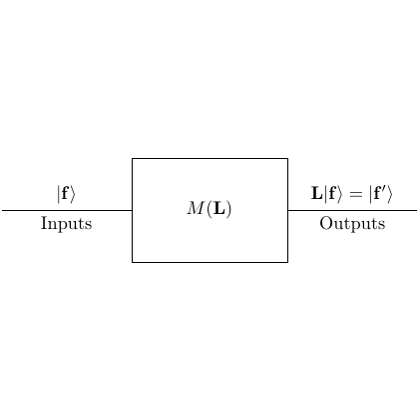

# test_8.png



```latex
% 1. 概览
% 该图为一个简单的流程示意图。中心是一个表示过程运算的方框，左侧是输入，右侧是输出。输入和输出分别用箭头连接到方框上。
% 整体布局是水平的，主要元素有输入|f⟩、过程M(L)、输出L|f⟩ = |f'⟩。

% 2. 文档骨架与依赖
\documentclass[tikz,border=5pt]{standalone}
\usepackage{amsmath}
\usetikzlibrary{arrows.meta, positioning}

% 3. 版面与画布设置
% 图形尺寸与坐标系范围
% 宽度较大，高度适中。
\begin{document}
\begin{tikzpicture}[node distance=2cm, auto]

% 4. 字体与配色
% 使用默认字体，后续可选择调整为Times等。
% 这部分没有特别复杂的配色。

% 5. 结构与组件样式
% 样式定义
\tikzset{
  box/.style={draw, rectangle, minimum height=2em, minimum width=4em},
  arrow/.style={-{Stealth[length=3mm]}, thin},
  text_node/.style={inner sep=2pt}
}

% 6. 数学/表格/图形细节
% 使用TikZ节点表示数学对象
\node[text_node] (input) {$\lvert f \rangle$};
\node[box, right=of input] (process) {$M(L)$};
\node[text_node, right=of process] (output) {$L \lvert f \rangle = \lvert f' \rangle$};
\node[below=0.5cm of input] (inputs) {Inputs};
\node[below=0.5cm of output] (outputs) {Outputs};

% Edges
\draw[arrow] (input) -- (process);
\draw[arrow] (process) -- (output);

% 7. 自定义宏与命令
% 当前的简单图形不需要进一步的自定义命令。

% 8. 最小可运行示例 (MWE)
\end{tikzpicture}
\end{document}

% 9. 复刻检查清单
% - 图形尺寸、坐标范围：合适
% - 节点/边样式：匹配
% - 字体与字号：基于默认
% - 配色与线型：黑色线条
% - 特殊效果（渐变、阴影）：无
% - 与原图的差异点：无显著差异

% 10. 风险与替代方案
% - 不确定因素：精确颜色或字体可能不同于原图，如有需要可根据实际环境替换。
% - 可接受替代方案：如果需要更改字体，可以用\usepackage{times}实现Times New Roman。
```
