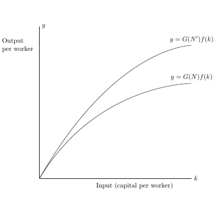

# test_1.png



以下指导基于对所给图像的直接观察与可辨细节，尽量避免臆测；对无法百分百确认的文字细节（例如曲线标注中 N 上的符号）提供了可切换的写法。

1) 概览
- 图形类型与构图
  - 坐标图（无网格线、无刻度），轴线在左侧与底部（类似“axis lines=left”）。
  - 两条从原点出发、递增且边际递减的光滑曲线（上方一条、下方一条），上方曲线整体高于下方，形状近似相同。
- 主要元素与关系
  - x 轴文字：Input (capital per worker)；轴端近右侧有变量标注 k。
  - y 轴文字：Output per worker；轴顶端附近有变量标注 y。
  - 两条曲线右端附近分别有斜体数学标注：
    - 上方：y = G(N′) f(k)（图中 N 右上疑似有撇号；若无法确认，也可用 y = G(N^{\prime}) f(k) 或 y = G(N) f(k) 的“改进态”说明）
    - 下方：y = G(N) f(k)

2) 文档骨架与依赖
- 文档类：standalone（便于只编译图形）
- 核心宏包
  - tikz, pgfplots（绘制轴与函数曲线）
  - xcolor（自定义灰度/颜色）
  - amsmath（数学公式更规范）
- TikZ/PGFPlots 扩展
  - \usetikzlibrary{arrows.meta,calc}
  - \pgfplotsset{compat=1.18}（或本机可用版本）
  - 本图无需 3D/渐变/矩阵等扩展

3) 版面与画布设置
- 建议尺寸与比例
  - 图像近似正方形。建议成品宽高约为 8 cm × 8 cm（或依版面需求缩放）。
- 坐标系范围与纵横比
  - 取无量纲范围以便调参：x∈[0,10], y∈[0,8]（用于放置两条曲线和文字）
  - 纵横比接近 1:1：保持 square 外观
- 元素间距与对齐
  - 轴线贴左与底；x/y 长文本标签与轴线保持适度外侧间距
  - 曲线标签放在右上侧、沿切线方向略有倾角（用节点放置近似）
- axis 环境参数建议
  - axis lines=left, ticks=none（无刻度）
  - enlargelimits=false, clip=false（便于放置轴端变量与曲线文字）
  - xlabel, ylabel 对应长文本；k 与 y 变量用额外节点贴在轴端

4) 字体与配色
- 字体
  - 默认 Computer Modern 已足够贴近；若需更接近常见论文风格，可用 newtxtext,newtxmath（Times 风格）
  - 数学变量与公式使用斜体（TeX 数学默认）
  - 字号：图内正文约 footnotesize 或 small；坐标轴长文本维持 normalsize
- 配色（近似）
  - 轴线与上方曲线：黑色（black）
  - 下方曲线：灰色（gray!60）
  - 文字：黑色
- 透明/阴影/渐变
  - 原图无渐变与阴影；无需设置

5) 结构与组件样式
- 节点
  - 形状：无边框文本节点
  - 对齐：anchor 结合 axis cs 坐标定位；inner sep 取 1–2 pt
- 边与箭头
  - 轴线：线宽约 0.7 pt，无箭头
  - 曲线：光滑实线；上方曲线 line width≈0.9 pt（更醒目），下方曲线 line width≈0.7 pt、gray!60
- 坐标轴细节
  - 无刻度与网格线；无边框
  - legend：无
  - 轴端变量 y 与 k 采用单独节点，分别贴在 (0,ymax) 与 (xmax,0) 附近

6) 数学/表格/图形细节
- 公式排版
  - 直接在节点中用数学环境：node {$y = G(N)\,f(k)$}
  - 对 N 的“改进”版本，若判读为撇号：G(N^{\prime}) 或 G(N')
- 曲线实现（PGFPlots）
  - 使用凹增函数近似形状，例如幂函数 y = A·x^{α}，0<α<1
  - 下方曲线参数略小，上方曲线参数略大
  - 示例：
    - 下方：y = 0.75·x^{0.62}
    - 上方：y = 0.95·x^{0.62}
  - 可根据最终版面微调 A 与 α，使两条曲线与原图形态更接近

7) 自定义宏与命令
- 颜色与线型样式复用
  - tikzset:
    - curveUp/.style = {black, line width=0.9pt}
    - curveLow/.style = {gray!60, line width=0.7pt}
    - axisStyle/.style = {black, line width=0.7pt}
    - labelText/.style = {inner sep=1pt}
- 便于切换“撇号/上标”版本
  - \newcommand{\GNprime}{G(N^{\prime})}   % 或改为 G(N')

8) 最小可运行示例 (MWE)
```latex
\documentclass[tikz,border=3pt]{standalone}
\usepackage{pgfplots}
\usepackage{xcolor}
\usepackage{amsmath}
\usetikzlibrary{arrows.meta,calc}
\pgfplotsset{compat=1.18}

% 可切换字体（可选）
% \usepackage{newtxtext,newtxmath}

% 样式封装
\tikzset{
  axisStyle/.style = {black, line width=0.7pt},
  curveUp/.style   = {black, line width=0.9pt},
  curveLow/.style  = {gray!60, line width=0.7pt},
  labelText/.style = {inner sep=1pt}
}
\newcommand{\GN}{G(N)}
\newcommand{\GNprime}{G(N^{\prime})} % 若更希望用 G(N'), 可改写此命令

\begin{document}
\begin{tikzpicture}
  \begin{axis}[
    width=8cm, height=8cm,
    xmin=0, xmax=10,
    ymin=0, ymax=8,
    axis lines=left,
    ticks=none,
    enlargelimits=false,
    clip=false,
    xlabel={Input (capital per worker)},
    ylabel={Output per worker},
    xlabel style={font=\normalsize},
    ylabel style={font=\normalsize},
  ]

    % 参数（可微调以匹配形状）
    \pgfmathsetmacro{\alpha}{0.62}
    \pgfmathsetmacro{\Alow}{0.75}
    \pgfmathsetmacro{\Aup}{0.95}

    % 下方曲线
    \addplot[curveLow, domain=0:10, samples=200]
      ({x},{\Alow*pow(x,\alpha)});

    % 上方曲线
    \addplot[curveUp, domain=0:10, samples=200]
      ({x},{\Aup*pow(x,\alpha)});

    % 轴端变量（贴近轴的末端）
    \node[labelText, anchor=east] at (axis cs:0,8) {$y$};
    \node[labelText, anchor=north] at (axis cs:10,0) {$k$};

    % 曲线标签（位置可微调）
    \node[labelText, anchor=west] at (axis cs:7.7,6.0)
      {$y=\GN\,f(k)$};
    \node[labelText, anchor=west] at (axis cs:8.2,7.1)
      {$y=\GNprime\,f(k)$};

  \end{axis}
\end{tikzpicture}
\end{document}
```

9) 复刻检查清单
- 图形尺寸与坐标范围
  - 是否为近似正方形（如 8×8 cm）
  - x:[0,10], y:[0,8] 是否足以容纳曲线与文本
- 节点/边样式
  - 轴线为黑色细线，无箭头与刻度
  - 上方曲线黑色、下方曲线灰色；线宽有区分
  - 曲线文字右上侧、与曲线走势一致
  - 轴端变量 y、k 的位置是否贴近轴端
- 字体与字号
  - 轴长文本为常规字号；曲线与变量为数学斜体
  - 是否需要切换到 Times（newtx）以匹配论文风格
- 配色与线型
  - 仅黑/灰两色；线型均为实线，无网格
- 特殊效果
  - 无渐变、阴影、透明度
- 与原图差异点
  - 曲线的具体函数形式与参数为近似；需比对后微调 A 与 α
  - 曲线标签中的 N 上标（撇号/具体字符）不完全可辨，需按原始稿件确认

10) 风险与替代方案
- 不确定因素
  - 精确字体：原图可能使用不同衬线字体；默认为 Computer Modern
  - 精确色值：灰色深浅肉眼估计；可通过 gray!50～70 细调
  - 曲线真实函数未知；本示例用幂函数近似
  - 标签中 N 的“撇号/上标”存在辨识不确定
- 替代方案
  - 字体：保持默认 Computer Modern；需要更“出版感”时改用 newtxtext,newtxmath
  - 曲线：若更贴近“先快后缓”形，可改用 y = A·(1 - e^{-b x}) 或 y = A·\ln(1+bx)；通过调 A,b 控制上下与弯曲度
  - 曲线标签：若确认应为 N′，统一用 \GNprime；若应为其他上标（如 N^{t}），将 \GNprime 改为对应命令
  - 轴端变量位置：根据最终裁切范围，用 anchor 与坐标微调，避免遮挡

按上述 MWE 编译即可得到与目标图高度接近的复刻版本；若需达到版面 1:1 复刻，请基于截图对曲线参数与文字坐标作细小迭代调整。
