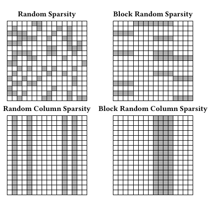

# test_12.png



以下是针对所给科研绘图（四宫格稀疏模式示意）的 LaTeX/TikZ 重构指导。目标是最大程度复刻其版式、构图与样式，并提供可复用的参数化代码，便于替换为真实数据或可重复的随机生成。

1. 概览
- 图形类型：四个等尺寸的方阵/热图式稀疏模式示意图（非坐标系，无轴刻度）。每个方阵由均匀网格构成，部分单元格以不同深浅的灰色填充，表示“非零/活跃”位置。
- 构图布局：2×2 排列，上排：Random Sparsity 与 Block Random Sparsity；下排：Random Column Sparsity 与 Block Random Column Sparsity。每个子图上方有加粗标题。
- 主要元素关系：
  - 每个子图是 N×N 的网格，边框稍粗、内部网格线细。
  - 单元格填充为若干层次的灰度（不带渐变），视觉密度随“随机/块/列带”特征不同而变化。
  - 四图采用一致的网格尺寸与线型，区别体现在填充规则。

2. 文档骨架与依赖
- 文档类：standalone（便于单图编译与精确外框裁切）。
- 宏包：tikz, xcolor。
- TikZ 库：calc, positioning（布局与标注用）。无需 PGFPlots（无坐标轴、legend）。
- 字体（可选）：newtxtext,newtxmath（Times 风格）；或使用默认 Computer Modern。

3. 版面与画布设置
- 建议尺寸与比例：
  - 网格边长 L = N × cellsize。推荐 N=20，cellsize=0.16 cm，则单图约 3.2 cm 见方。
  - 四图水平/垂直间距：约 0.6–1.0 × L 的空隙；标题与方阵上边缘间距约 0.18–0.25 × cellsize × N。
- 坐标与对齐：
  - 使用 TikZ 的单位缩放 [x=cellsize cm, y=cellsize cm]，内部以“格”为单位运算，便于 for 循环。
  - 四图通过 scope+shift 定位，保证等间距与标题对齐。
- \tikzpicture 建议参数：
  - baseline 采用默认；如需严格贴边，可在 standalone 传 border=2pt 控制白边。

4. 字体与配色
- 标题/标签字体：无公式，标题使用 \bfseries；字号建议 \small 或 \normalsize。
- 颜色：
  - 线条：黑色（grid 细线、outline 略粗）。
  - 填充：黑白灰（使用 black!p 语法，p∈[25,80]，形成 2–3 层强度的随机灰度）。
- 透明/阴影：原图无渐变与阴影；用不透明纯色填充即可。若需透明度，可在 fill 处增加 opacity=0.9–1.0。

5. 结构与组件样式
- 节点：
  - 标题节点：居中对齐，放在矩阵顶部中点上方固定间距。
- 边与网格：
  - 内部网格：\draw[line width=0.25pt] (0,0) grid (\N,\N)。
  - 外框：\draw[line width=0.5pt] (0,0) rectangle (\N,\N)。
- 填充：
  - 单元格坐标 (i,j) 用矩形 (i,j) rectangle ++(1,1)。
  - 灰度可用 black!{p}，p 随机或按规则分配，以模拟强弱不同的激活。

6. 数学/表格/图形细节
- 本图无公式与表格。核心是四种稀疏模式的“填充策略”：
  - Random Sparsity：每个格子独立以概率 p 填充，灰度随机。
  - Block Random Sparsity：在随机位置放置若干 B×B（或大小随机）的块作为高密度区，块外少量噪声点。
  - Random Column Sparsity：每列有独立的列密度 p_j，列间稀疏度不同。
  - Block Random Column Sparsity：选择一个连续列带 [s, s+w] 作为高密度区，带外低密度。

7. 自定义宏与命令
- 定义统一的样式（线宽、标题、尺寸）和四种生成器，提升复用性与可控性：
  - 全局参数：\N, \cellsize, \titlesep, \hgap, \vgap。
  - 样式：gridline, gridoutline, title。
  - 生成器：\GridRandom, \GridBlockRandom, \GridRandomColumn, \GridBlockRandomColumn，均支持 seed 以保证可重复。

8. 最小可运行示例 (MWE)
说明：
- 该示例使用可重复随机（\pgfmathsetseed），模式与版式与目标图一致；密度/块宽可自行微调。
- 不对原图的具体灰格位置做“逐格复刻”，而以程序化规则产生形似图样（避免臆造具体数据）。

```latex
\documentclass[border=2pt]{standalone}
\usepackage{tikz}
\usetikzlibrary{calc,positioning}
\usepackage{xcolor}
% 可选：Times 风格
% \usepackage{newtxtext,newtxmath}

% ===== 全局参数 =====
\newcommand{\N}{20}              % 每边格子数
\newcommand{\cellsize}{0.16}     % 单格边长（cm）
\newcommand{\titlesep}{1.1}      % 标题距阵顶(单位: 格)
\newcommand{\hgap}{4.0}          % 水平子图间距(单位: 格)
\newcommand{\vgap}{6.0}          % 垂直子图间距(单位: 格)

% ===== 样式 =====
\tikzset{
  gridline/.style   ={line width=0.25pt},
  gridoutline/.style={line width=0.5pt},
  title/.style      ={font=\bfseries\small,align=center}
}

% ===== 工具宏 =====
% 画一个空网格+标题（不填充）
\newcommand{\BaseGrid}[2]{% #1 Title, #2 y-shift of title in "格"
  \draw[gridline]   (0,0) grid (\N,\N);
  \draw[gridoutline](0,0) rectangle (\N,\N);
  \node[title] at (\N/2,\N + #2) {#1};
}

% ===== 生成器1：随机稀疏 =====
% #1 Title, #2 seed, #3 p (填充概率 0~1)
\newcommand{\GridRandom}[3]{%
  \pgfmathsetseed{#2}%
  \pgfmathtruncatemacro{\NmOne}{\N-1}%
  \foreach \i in {0,...,\NmOne}{%
    \foreach \j in {0,...,\NmOne}{%
      \pgfmathparse{rnd < #3 ? 1:0}%
      \ifnum\pgfmathresult=1
        \pgfmathsetmacro{\pct}{35 + 45*rnd} % 35~80 的灰度
        \fill[black!\pct] (\i,\j) rectangle ++(1,1);
      \fi
    }%
  }%
  \BaseGrid{#1}{\titlesep}%
}

% ===== 生成器2：块状随机稀疏 =====
% #1 Title, #2 seed, #3 块边长B(格), #4 块数, #5 背景噪声概率
\newcommand{\GridBlockRandom}[5]{%
  \pgfmathsetseed{#2}%
  \pgfmathtruncatemacro{\NmOne}{\N-1}%
  % 背景少量噪声
  \foreach \i in {0,...,\NmOne}{%
    \foreach \j in {0,...,\NmOne}{%
      \pgfmathparse{rnd < #5 ? 1:0}%
      \ifnum\pgfmathresult=1
        \pgfmathsetmacro{\pct}{30 + 30*rnd}
        \fill[black!\pct] (\i,\j) rectangle ++(1,1);
      \fi
    }%
  }%
  % 随机块（密度更高、灰度略深）
  \pgfmathtruncatemacro{\B}{#3}%
  \foreach \k in {1,...,#4}{%
    \pgfmathtruncatemacro{\bx}{floor(rnd*(\N-\B))}%
    \pgfmathtruncatemacro{\by}{floor(rnd*(\N-\B))}%
    \foreach \i in {0,...,\B-1}{%
      \foreach \j in {0,...,\B-1}{%
        \pgfmathsetmacro{\pct}{45 + 40*rnd}
        \fill[black!\pct] (\bx+\i,\by+\j) rectangle ++(1,1);
      }%
    }%
  }%
  \BaseGrid{#1}{\titlesep}%
}

% ===== 生成器3：随机列稀疏 =====
% #1 Title, #2 seed, #3 p_min, #4 p_max （每列独立在 [p_min, p_max] 取密度）
\newcommand{\GridRandomColumn}[4]{%
  \pgfmathsetseed{#2}%
  \pgfmathtruncatemacro{\NmOne}{\N-1}%
  \foreach \i in {0,...,\NmOne}{%
    \pgfmathsetmacro{\pcol}{#3 + ( #4 - #3 ) * rnd}%
    \foreach \j in {0,...,\NmOne}{%
      \pgfmathparse{rnd < \pcol ? 1:0}%
      \ifnum\pgfmathresult=1
        \pgfmathsetmacro{\pct}{35 + 45*rnd}
        \fill[black!\pct] (\i,\j) rectangle ++(1,1);
      \fi
    }%
  }%
  \BaseGrid{#1}{\titlesep}%
}

% ===== 生成器4：列带块状随机稀疏 =====
% #1 Title, #2 seed, #3 带宽w(格), #4 带内概率, #5 带外概率
\newcommand{\GridBlockRandomColumn}[5]{%
  \pgfmathsetseed{#2}%
  \pgfmathtruncatemacro{\wband}{#3}%
  \pgfmathtruncatemacro{\start}{floor(rnd*(\N-\wband))}%
  \pgfmathtruncatemacro{\NmOne}{\N-1}%
  \foreach \i in {0,...,\NmOne}{%
    \ifnum\i<\start
      \def\pnow{#5}%
    \else
      \ifnum\i<\numexpr\start+\wband\relax
        \def\pnow{#4}%
      \else
        \def\pnow{#5}%
      \fi
    \fi
    \foreach \j in {0,...,\NmOne}{%
      \pgfmathparse{rnd < \pnow ? 1:0}%
      \ifnum\pgfmathresult=1
        \pgfmathsetmacro{\pct}{40 + 40*rnd}
        \fill[black!\pct] (\i,\j) rectangle ++(1,1);
      \fi
    }%
  }%
  \BaseGrid{#1}{\titlesep}%
}

\begin{document}
\begin{tikzpicture}[x=\cellsize cm, y=\cellsize cm]

% 位置参数（以"格"为单位）
\def\xL{0}
\def\yT{0}
\def\xR{\N + \hgap}
\def\yB{-\N - \vgap}

% 1) Random Sparsity
\begin{scope}[shift={(\xL,\yT)}]
  \GridRandom{Random Sparsity}{11}{0.22}
\end{scope}

% 2) Block Random Sparsity
\begin{scope}[shift={(\xR,\yT)}]
  \GridBlockRandom{Block Random Sparsity}{12}{4}{6}{0.06}
\end{scope}

% 3) Random Column Sparsity
\begin{scope}[shift={(\xL,\yB)}]
  \GridRandomColumn{Random Column Sparsity}{21}{0.05}{0.50}
\end{scope}

% 4) Block Random Column Sparsity
\begin{scope}[shift={(\xR,\yB)}]
  \GridBlockRandomColumn{Block Random Column Sparsity}{22}{6}{0.60}{0.08}
\end{scope}

\end{tikzpicture}
\end{document}
```

9. 复刻检查清单
- 图形尺寸、坐标范围
  - N 是否与原图观感一致（常见 16 或 20）；cellsize 是否让单图边长与原图相近。
  - 四图间距（\hgap, \vgap）是否接近原图留白。
- 节点/边样式
  - gridline、gridoutline 线宽是否匹配；外框明显略粗于内部网格。
  - 标题位置与对齐是否居中，距离是否合适（\titlesep）。
- 字体与字号
  - 标题加粗；Times 风格或默认 Computer Modern 是否与原图一致。
- 配色与线型
  - 填充灰度范围（black!{35–80}）是否与原图深浅接近；是否去掉渐变/透明。
- 特殊效果
  - 原图不含阴影/渐变；确保未误用。
- 与原图的差异点
  - 具体灰格位置为程序化生成，非逐格复刻；整体密度与“块/列带”结构应相似。
  - 字体可能略有差异（如 Times vs CM）；灰度阈值和块大小可微调。

10. 风险与替代方案
- 不确定因素
  - 原图的精确 N、cellsize、线宽与灰度值不可从缩略图严格读出。
  - 字体家族可能为 Times/类似衬线体；若环境不同会有细微差异。
- 替代方案
  - 字体：默认 Computer Modern；若需更接近论文风格，选用 newtxtext/newtxmath（pdflatex）或 fontspec + Times New Roman（Xe/LuaLaTeX）。
  - 颜色：若打印或期刊需 CMYK，可用 xcolor 的 cmyk 模式定义等效灰度；或直接使用 gray 颜色模型。
  - 精确数据驱动：若有真实稀疏矩阵，可将数据（非零坐标或0/1矩阵）读入并按坐标填充，保持当前网格与样式不变，仅替换四个生成器中“随机/块/列带”的逻辑。
  - 使用 PGFPlots 热图：若需要色标或插值，可切换 PGFPlots 的 matrix plot/mesh，随后用 extra tick style 控制网格线；但本图无坐标轴，TikZ 方案更轻量。

通过上述参数化与宏封装，你可以快速复刻当前版式，并通过更改 N、概率、块宽（B/w）与种子值生成与原图风格一致的多种稀疏模式示意。
