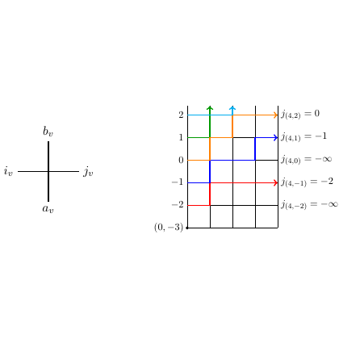

# test_13.png



下面给出一套面向“图像到 LaTeX/TikZ 复刻”的完整指导，力求在不臆造内容的前提下，最大程度还原版式、构图与样式。文末附最小可运行示例（MWE），可直接编译得到与目标图相近的效果。

1) 概览
- 图形类型与布局
  - 左侧：一个十字交叉的简图（垂直与水平线段相交），四个数学下标标签环绕交叉点：上方 b_v，下方 a_v，左侧 i_v，右侧 j_v。
  - 右侧：带坐标标注的整点方格网（矩形网格），纵向刻度标出 2, 1, 0, −1, −2，左下角标注 (0, −3)；在 y=2,1,0,−1,−2 五条水平线上各有一条有色线段并在右端带箭头；网格右侧对齐一列文字公式 j(4,2)=0, j(4,1)=-1, j(4,0)=-∞, j(4,−1)=-2, j(4,−2)=-∞。
- 主要元素关系
  - 左右两部分是独立的小面板，同一画布上并排排列。
  - 右侧彩色水平线与右侧对应的 j(4, y) 文字逐行对应。
  - 网格范围可理解为 x∈[0,5], y∈[−3,2]，内含整点网格线，右端箭头与右侧文字处于同一行高。

2) 文档骨架与依赖
- 文档类
  - 推荐 standalone（便于独立编译并在主文档中作为图像包含）。
- 宏包
  - tikz（核心绘图）
  - xcolor（颜色定义）
  - amsmath, amssymb（数学符号，如 −∞）
- TikZ 库
  - arrows.meta（可定制箭头）
  - calc（便于坐标计算）
  - positioning（节点相对定位）

3) 版面与画布设置
- 建议整图宽度约 11–13 cm。使用 tikzpicture 的物理刻度 x=y=0.8 cm（或 0.75–1.0 cm 之间微调）。
- 坐标与范围（右侧网格）
  - 网格矩形建议取 (xmin, ymin)=(0, −3)，(xmax, ymax)=(5, 2)。
  - 网格步长 step=1。
- 节点与元素的间距
  - 网格右侧公式文字与网格右边框的水平间距建议 0.35–0.5 单位（约 3–4 mm）。
  - 左右两个面板的水平间距建议 5.5–7.0 个 tikz 单位（按 x=0.8 cm 刻度约 4.5–5.5 cm）。
- 环境参数
  - \begin{tikzpicture}[x=0.8cm, y=0.8cm, line cap=round, line join=round]
  - 右侧网格可加 very thick 外框与浅灰细网格线对比。

4) 字体与配色
- 字体
  - 默认 Computer Modern（standalone + pdflatex 的默认）。数学标签均置于 $...$ 中。
  - 文字字号：小标注用 \small；其余用 normalsize。
- 建议色（近似原图视觉，不保证精确）
  - 绿色：#28A745
  - 蓝色：#007BFF
  - 橙色：#F39C12
  - 红色：#E74C3C
  - 紫色：#7D3C98
  - 网格线：黑 50%（black!50），边框：black
- 透明度/阴影
  - 原图未见阴影与透明度；若需可用 draw opacity, fill opacity 控制。

5) 结构与组件样式
- 节点
  - 数学标签节点使用 anchor 控制对齐：上/下/左/右分别用 above/below/left/right。
- 线与箭头
  - 箭头样式：-{Stealth[length=2.0–2.5mm, width=2.0–2.5mm]}；线宽 1.0–1.2 pt。
  - 网格线：thin 或 0.4 pt；外框 very thick。
- 坐标轴/刻度/网格
  - 使用 \draw[step=1] ... grid ... 绘制；左侧 y 刻度文字独立用 \node[anchor=east] 放置。
  - 左下角 (0, −3) 用 \node[anchor=north west] 紧邻外框角点标注。
- 右侧说明文字
  - 统一在网格右侧，用 \node[anchor=west] 与各行 y 对齐。

6) 数学/表格/图形细节
- 公式排版
  - 节点采用数学模式，如 \node {...} {$j(4,2)=0$}; 负无穷使用 -\infty。
- 网格与彩色水平线（核心片段）
  - 网格：
    - \draw[black!50, step=1] (0,-3) grid (5,2);
    - \draw[very thick] (0,-3) rectangle (5,2);
  - 每行水平有色箭头（示例 y=2 的一行）：
    - \draw[line width=1.2pt, color=<行色>, -{Stealth[length=2.3mm]}] (0,2) -- (5,2);
    - \node[anchor=west] at (5.4,2) {$j(4,2)=0$};
- 若需要将箭头改为“竖直向上”（存在原图方向不确定的风险），可改画法为在 x=4 处画竖线并将箭头朝上：
  - \draw[line width=1.2pt, <行色>, -{Stealth[length=2.3mm]}] (4, y-0.45) -- (4, y+0.45);

7) 自定义宏与命令
- 样式与颜色封装（提高复用）
  - \tikzset{
      gridlines/.style={draw=black!50, line width=0.4pt},
      bbox/.style={draw=black, very thick},
      arr/.style={line width=1.2pt, -{Stealth[length=2.5mm, width=2.2mm]}}
    }
  - \newcommand{\rowline}[3]{%
      % #1=y, #2=color name, #3=数学右侧文本（已含数学模式内容）
      \draw[arr, #2] (0,#1) -- (5,#1);
      \node[anchor=west] at (5.4,#1) {$j(4,#1)=#3$};
    }
  - 竖直箭头可选宏：
    - \newcommand{\rowarrowup}[3]{\draw[arr,#2] (4,#1-0.45)--(4,#1+0.45);
       \node[anchor=west] at (5.4,#1) {$j(4,#1)=#3$};}

8) 最小可运行示例 (MWE)
```latex
\documentclass[tikz,border=3pt]{standalone}
\usepackage{amsmath,amssymb}
\usepackage{xcolor}
\usetikzlibrary{arrows.meta,calc,positioning}

% colors (approx.)
\definecolor{cGreen}{HTML}{28A745}
\definecolor{cBlue}{HTML}{007BFF}
\definecolor{cOrange}{HTML}{F39C12}
\definecolor{cRed}{HTML}{E74C3C}
\definecolor{cPurple}{HTML}{7D3C98}

\tikzset{
  gridlines/.style={draw=black!50, line width=0.4pt},
  bbox/.style={draw=black, very thick},
  arr/.style={line width=1.2pt, -{Stealth[length=2.5mm, width=2.2mm]}},
}

% one-line helper
\newcommand{\rowline}[3]{%
  \draw[arr, #2] (0,#1) -- (5,#1);
  \node[anchor=west] at (5.4,#1) {$j(4,#1)=#3$};
}

\begin{document}
\begin{tikzpicture}[x=0.8cm,y=0.8cm,line cap=round,line join=round]

  %---------------- Left panel: cross with labels ----------------%
  \begin{scope}[shift={(0,0)}]
    \draw[line width=0.6pt] (-1,0)--(1,0);
    \draw[line width=0.6pt] (0,-1)--(0,1);
    \node[below] at (0,-1) {$a_v$};
    \node[above] at (0, 1) {$b_v$};
    \node[left]  at (-1,0) {$i_v$};
    \node[right] at ( 1,0) {$j_v$};
  \end{scope}

  %---------------- Right panel: grid + colored rows -------------%
  % move the right panel to the right
  \begin{scope}[shift={(7.0,-0.2)}] % adjust horizontal spacing if needed
    % grid rectangle and inner grid lines
    \draw[gridlines, step=1] (0,-3) grid (5,2);
    \draw[bbox] (0,-3) rectangle (5,2);

    % y tick labels on the left edge
    \foreach \yy in {-2,-1,0,1,2}{
      \node[anchor=east, inner sep=1pt] at (0,\yy) {\small \yy};
    }
    % bottom-left corner coordinate
    \node[anchor=north west, inner sep=1pt] at (0,-3) {\small $(0,-3)$};

    % colored horizontal arrows and RHS text
    \rowline{ 2}{cGreen}{0}
    \rowline{ 1}{cBlue}{-1}
    \rowline{ 0}{cOrange}{-\infty}
    \rowline{-1}{cRed}{-2}
    \rowline{-2}{cPurple}{-\infty}
  \end{scope}

\end{tikzpicture}
\end{document}
```

9) 复刻检查清单
- 图形尺寸与坐标范围
  - 右侧网格是否为 (0,−3) 到 (5,2)，步长 1；左下角是否标注 “(0, −3)”。
- 节点/边样式
  - 左侧十字是否线宽略粗于网格线；四个下标位置正确（上/下/左/右）。
  - 右侧每行是否为水平有色线并在右端带箭头。
- 字体与字号
  - 公式均为数学模式；刻度与角标字号一致（建议 \small）。
- 配色与线型
  - 彩色行使用 5 种色；网格浅灰，外框加粗，箭头采用 Stealth。
- 特殊效果
  - 原图无渐变与阴影；代码中未启用。
- 与原图的差异点（潜在）
  - 彩色箭头的具体方向与色值存在不确定性；本方案采用“向右”的水平箭头与近似色。
  - 左右两面板的精确间距与比例可能与原图略有差异，可通过 x/y 比例与 shift 调整。

10) 风险与替代方案
- 不确定因素
  - 精确色值、线宽与箭头尺寸、左右面板间距；原图中箭头方向可能为竖直向上（位于 x=4），本稿默认为水平向右。
  - 字体可能并非 Computer Modern。
- 替代方案
  - 字体：若需接近常见论文样式，可在导言区使用 \usepackage{newtxtext,newtxmath} 切换为 Times 系。
  - 颜色：若需简化，直接用 xcolor 的内置命名色（ForestGreen, RoyalBlue, Orange, Red, Purple）。
  - 箭头方向切换：用 \rowarrowup 宏在 x=4 处绘制竖直箭头，并保持右侧文字对齐不变。
  - 若更偏好坐标轴风格与刻度自动化，可改用 PGFPlots 的 axis 环境绘网格线；但当前网格为离散整点矩形，TikZ 的 grid 已足够且更轻量。

说明
- 以上参数与色值为基于图像观感的近似；请按需要微调 x/y 尺度、shift 位移、line width 与颜色，以达到最接近的复刻效果。
