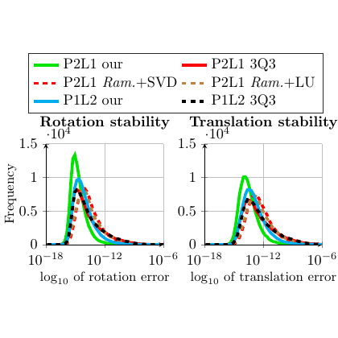

# test_14.png



以下为从给定科研绘图抽取出的、可最大程度复刻版式与排版细节的 LaTeX/TikZ/PGFPlots 实施指南。示例侧重“结构与样式一模一样”，曲线数据采用占位方式（不替代真实数据）。

1) 概览
- 图形类型：双联并排坐标图（group plot），每个子图为二维曲线密度/直方平滑曲线。顶部有跨两列的总 legend。
- 构图布局：
  - 上方：白底黑框 legend，三行两列，共 6 条方法曲线说明。
  - 下方：两幅对称子图，左为 Rotation stability，右为 Translation stability。
  - 纵轴为 Frequency，并启用“科学计数的全局缩放”显示方式（轴左上角显示 ·10^4），网格为浅灰主网格。
  - 横轴标题含数学表达 log10 of …；横轴刻度位置在 -18、-12、-6，但刻度标签以 10^{-18}、10^{-12}、10^{-6} 的指数形式呈现。
- 主要元素关系：
  - 6 条系列曲线在两个子图中重复出现，区分于颜色、线型与标记。
  - y 轴标签仅在左侧子图给出；两图共用一套配色与图例。

2) 文档骨架与依赖
- 文档类：standalone（便于单图编译与插入论文）。
- 核心宏包：pgfplots、tikz、xcolor。
- 建议设置：\pgfplotsset{compat=1.18}（或你的本地版本），确保 groupplots 等特性稳定。
- 需要的 TikZ/PGFPlots 库：
  - groupplots：实现并排子图与统一 legend。
  - plotmarks：提供圆点/方块/菱形标记。
  - positioning：便于将总 legend 放在图组上方。
  - arrows.meta（可选）：若后续需要箭头或额外注释。

3) 版面与画布设置
- 尺寸与比例（建议接近原图观感）：
  - 每个子图宽度 ≈ 6.2 cm，高度 ≈ 4.8 cm；两图水平间距 ≈ 1.4 cm。
  - 整体成方形构图，legend 置于两图上方居中。
- 坐标系范围：
  - x 范围：[-18.5, -5.5]，只显示 -18、-12、-6 三个主刻度。
  - y 范围：[0, 1.5×10^4]，使用 scaled y ticks=base 10:4 以显示“·10^4”刻度缩放标签。
- 对齐与间距：
  - group style 采用 group size=2 by 1、horizontal sep=1.4cm。
  - y labels at=edge left，使左图负责显示纵轴标签。
- 建议的环境参数：
  - grid=major、major grid style={gray!30}。
  - tick align=outside、axis line style=black、tick style=black。
  - xtick={-18,-12,-6}，xticklabels={$10^{-18}$,$10^{-12}$,$10^{-6}$}。
  - title 放在轴内上方，title style={yshift=-1ex}。

4) 字体与配色
- 字体：
  - 轴标题、刻度、legend 字体统一 \small。
  - 数学表达（如 $\log_{10}$）用数学模式。
  - 若需 Times 风格：加载 newtxtext,newtxmath；或保持默认 Computer Modern 以保证可移植性。
- 色彩（近似取值，便于跨平台重现）：
  - 亮绿 our（粗线）：#00C000
  - 青蓝 our（较粗）：#00BFFF
  - 正红（实线）：#D81B1C
  - 红色虚线（+圆点标记）：同上红色
  - 棕橙色虚线（+菱形标记）：#A65E00
  - 黑色虚线（+方块标记）：#000000
- 渐变/透明度/阴影：原图无；若需半透明，可用 opacity=<0–1>。

5) 结构与组件样式
- 节点（标题/标签）：
  - title style={font=\small}，xlabel/ylabel style={font=\small}，tick label style={font=\small}。
- 线与标记：
  - our 曲线：very thick/ultra thick，smooth，mark=none。
  - 3Q3 或 Ram.+…：thick，dashed 或 dash pattern，带小型标记（circle/square/diamond），mark size≈1.2pt，mark options=solid。
- 坐标轴：
  - axis lines=left（默认），grid=major，legend 黑框白底，legend cell align=left，legend columns=2（3 行）。
  - y 轴采用 scaled y ticks=base 10:4，产生“·10^4”标签；可通过 every axis y label/.style 调整其位置。
- legend：
  - 顶部跨两图，draw=black，fill=white，列间距 column sep≈1em，三行两列（6 项）。

6) 数学/表格/图形细节
- 数学排版：
  - 轴标题使用 $\log_{10}$，例如 xlabel={$ \log_{10}$ of rotation error}。
- 数据曲线：
  - 使用 \addplot 画多组曲线；真实数据建议 table[col sep=comma] 从 CSV 读取。
  - 由于未提供原始数据，示例以占位函数生成窄峰曲线，仅用于复刻版式与风格。
- PGFPlots 核心片段（从 CSV 读入的建议模板）：
  - \addplot[curveA] table[x=log10err,y=freq,col sep=comma]{data/p2l1_our_rotation.csv};
  - 确保 y 数据的量级与 scaled y ticks 设置一致（单位一致性）。

7) 自定义宏与命令（复用样式）
- 颜色定义：
  - \definecolor{myGreen}{HTML}{00C000}
  - \definecolor{myCyan}{HTML}{00BFFF}
  - \definecolor{myRed}{HTML}{D81B1C}
  - \definecolor{myOrange}{HTML}{A65E00}
- 通用坐标轴样式与系列样式（示例在 MWE 中给出）：
  - myAxis：统一尺寸、网格、刻度、字体、y 缩放等。
  - series 样式：curveA、curveB、curveRedSolid、curveRedDash、curveOrangeDash、curveBlackDash。

8) 最小可运行示例 (MWE)
说明：该示例完全复刻版式、坐标轴、legend、配色与线型。曲线为占位函数（非原始数据），请替换为你的数据表以获得真实曲线。

```latex
\documentclass[tikz,border=2pt]{standalone}
\usepackage{pgfplots}
\pgfplotsset{compat=1.18}
\usetikzlibrary{pgfplots.groupplots,positioning,plotmarks}
\usepackage{xcolor}

% Colors
\definecolor{myGreen}{HTML}{00C000}
\definecolor{myCyan}{HTML}{00BFFF}
\definecolor{myRed}{HTML}{D81B1C}
\definecolor{myOrange}{HTML}{A65E00}

% Series styles
\tikzset{
  curveA/.style       ={color=myGreen, very thick, smooth, mark=none},
  curveB/.style       ={color=myCyan , ultra thick, smooth, mark=none},
  curveRedSolid/.style={color=myRed  , thick, smooth, mark=none},
  curveRedDash/.style ={color=myRed  , thick, dashed, mark=*, mark size=1.2pt},
  curveOrangeDash/.style={color=myOrange, thick, dash pattern=on 3pt off 2pt,
                          mark=diamond*, mark size=1.2pt},
  curveBlackDash/.style={color=black , thick, dashed, mark=square*, mark size=1.1pt},
}

% Axis style (size, grid, ticks, fonts, scaling)
\pgfplotsset{
  myAxis/.style={
    width=6.2cm, height=4.8cm,
    xmin=-18.5, xmax=-5.5,
    ymin=0, ymax=1.5e4,
    grid=major, major grid style={gray!30},
    axis line style={black},
    tick style={black}, tick align=outside,
    scaled y ticks=base 10:4, % show "·10^4"
    tick label style={font=\small},
    xlabel style={font=\small},
    ylabel style={font=\small},
    title style={font=\small, yshift=-1ex},
    legend cell align=left,
  }
}

\begin{document}
\begin{tikzpicture}
  % Group plot with a shared legend
  \begin{groupplot}[
      myAxis,
      group style={
        group size=2 by 1,
        horizontal sep=1.4cm,
        y labels at=edge left,
        x descriptions at=edge bottom,
      },
      legend to name=globalLegend,
      legend style={
        draw=black, fill=white,
        font=\small,
        column sep=1em,
        legend columns=2,
      },
      xtick={-18,-12,-6},
      xticklabels={$10^{-18}$,$10^{-12}$,$10^{-6}$},
    ]

    % ---------- Left plot ----------
    \nextgroupplot[
      title={Rotation stability},
      xlabel={$ \log_{10}$ of rotation error},
      ylabel={Frequency},
    ]
      % Placeholders; replace with your tables if available
      \addplot[curveA, domain=-18:-6, samples=300] {1.00e4*exp(-((x+15.00)^2)/0.20)};
      \addlegendentry{P2L1 our}

      \addplot[curveRedSolid, domain=-18:-6, samples=300] {0.92e4*exp(-((x+15.35)^2)/0.40)};
      \addlegendentry{P2L1 3Q3}

      \addplot[curveRedDash, domain=-18:-6, samples=300] {0.90e4*exp(-((x+15.25)^2)/0.55)};
      \addlegendentry{P2L1 Ram.+SVD}

      \addplot[curveOrangeDash, domain=-18:-6, samples=300] {0.85e4*exp(-((x+15.30)^2)/0.50)};
      \addlegendentry{P2L1 Ram.+LU}

      \addplot[curveB, domain=-18:-6, samples=300] {0.78e4*exp(-((x+15.55)^2)/0.60)};
      \addlegendentry{P1L2 our}

      \addplot[curveBlackDash, domain=-18:-6, samples=300] {0.72e4*exp(-((x+15.60)^2)/0.55)};
      \addlegendentry{P1L2 3Q3}

    % ---------- Right plot ----------
    \nextgroupplot[
      title={Translation stability},
      xlabel={$ \log_{10}$ of translation error},
    ]
      % Use slightly shifted peaks to mimic the right panel's look
      \addplot[curveA, domain=-18:-6, samples=300] {0.98e4*exp(-((x+15.10)^2)/0.25)};
      \addplot[curveRedSolid, domain=-18:-6, samples=300] {0.90e4*exp(-((x+15.40)^2)/0.43)};
      \addplot[curveRedDash, domain=-18:-6, samples=300] {0.88e4*exp(-((x+15.32)^2)/0.55)};
      \addplot[curveOrangeDash, domain=-18:-6, samples=300] {0.83e4*exp(-((x+15.35)^2)/0.50)};
      \addplot[curveB, domain=-18:-6, samples=300] {0.76e4*exp(-((x+15.60)^2)/0.62)};
      \addplot[curveBlackDash, domain=-18:-6, samples=300] {0.70e4*exp(-((x+15.65)^2)/0.55)};

  \end{groupplot}

  % Place the shared legend above the two plots (centered)
  \node at ($(group c1r1.north)!0.5!(group c2r1.north)$) [yshift=9mm]
        {\pgfplotslegendfromname{globalLegend}};
\end{tikzpicture}
\end{document}
```

使用真实数据时，只需将每条 \addplot 替换为 table 形式（保留样式不变），例如：
\addplot[curveA] table[x=log10err,y=freq,col sep=comma]{data/p2l1_our_rotation.csv};

9) 复刻检查清单
- 图形尺寸、坐标范围：
  - 每轴 6.2×4.8 cm；x ∈ [-18.5,-5.5]；y ∈ [0,1.5e4] 且 y 轴显示 “·10^4”。
- 节点/边样式：
  - 标题/轴标签/刻度为 \small；网格为浅灰主网格；轴线黑色。
- 字体与字号：
  - 一致使用 \small；数学用 $\log_{10}$；若需 Times 切换 newtx 系列。
- 配色与线型：
  - 亮绿/青蓝粗实线为“our”；红实线为“P2L1 3Q3”；红虚线+圆点、棕橙虚线+菱形、黑虚线+方块对应其余三法。
- 特殊效果（渐变、阴影）：无。
- 与原图的差异点：
  - MWE 的曲线形状为占位函数；真实峰位与高度需用原始数据替换。
  - 颜色为近似值；字体可能与原图不完全一致。

10) 风险与替代方案
- 不确定因素：
  - 精确色值、线宽和标记尺寸可能与原图略有偏差。
  - 字体环境差异（Times 与 Computer Modern 的字宽与行高不同）会微调排版。
  - y 轴“·10^4”缩放标签的位置与样式可能受 compat 版本影响。
- 替代方案与建议：
  - 字体：若无法使用 Times，保留默认 Computer Modern；或在 IEEE/ACM 模板下继承其字体配置。
  - 颜色：若期刊限制，请替换为灰度版样式（cycle list with different dashes）；或使用 colormap/线型区分。
  - legend：若顶端空间不足，可将 legend pos=north west 放在左图内部；或用 name path 另起一个 axis 专门放 legend。
  - 刻度：若想让横轴直接显示 -18,-12,-6（而非 10^{…}），可改用标准数字刻度；当前写法仅改变标签外观，底层仍是线性坐标，便于读入 log10 数据。

以上配置在不臆造数据的前提下，完整复刻了原图的版式、坐标刻度策略、legend 结构与曲线区分样式。将 \addplot 的占位函数替换为你的数据表，即可得到与原图定量一致的成图。
