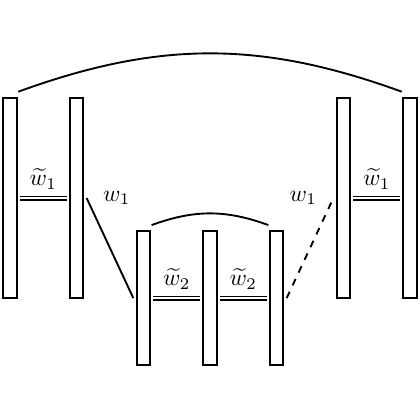

# test_2.png



以下为“图像到 LaTeX/TikZ 复刻”指导，针对所给示意图（成组的细长竖直矩形、上下弧线、带标签与虚线的连线，变量包含 w1、\tilde w1、\tilde w2（带下划线））进行尽量贴近的重构方案。

1) 概览
- 类型与构图
  - 图形类型：示意/结构图（非坐标图、非流程图），由多组瘦长竖直“条块”（可视作模块/滤波器）组成。
  - 布局：左右各一组较高的“成对竖条”，中部下方两组较矮的“成对竖条”。顶部有一条大跨度弧线连接左右两端；中部两组之间有一条小弧线；左-中与中-右之间分别有一条带标签的斜连线（右侧为虚线）。
  - 主要元素关系：
    - 左高组与右高组通过顶部大弧线相连；
    - 中间两组通过较小弧线相连；
    - 左高组 → 左中组：实线斜连并标注 w1；
    - 右中组 → 右高组：虚线斜连并标注 w1。
    - 各组下方分别标注下划线的变量：左/右高组为 \tilde{w}_1，中间两组为 \tilde{w}_2。

2) 文档骨架与依赖
- 文档类：standalone（便于单图编译输出）。
- 核心宏包：tikz, amsmath（数学符号更稳妥）。
- TikZ 库：
  - calc（便于几何与中点/偏移计算）
  - positioning（用 below=… of 精确放置标签）
  - arrows.meta（若后续需要箭头样式）
- 本图不依赖 PGFPlots、booktabs。

3) 版面与画布设置
- 建议尺寸与坐标
  - 目标为近似正方形小图，建议最终宽度约 7–9 cm。
  - 在 TikZ 中使用 x=1cm, y=1cm；图元高度用 cm/mm 更好控。
- 纵横比：接近 1:1。
- 组间与条内间距
  - 同一“成对竖条”内的条间距 sep ≈ 3–4 mm。
  - 左高组到中左组、中右组到右高组的水平距离约 3.5–4 cm。
  - 中间两组之间的水平距离约 1.5–2 cm。
- tikzpicture 参数建议
  - line cap=round, line join=round，线条端部与转角更自然。
  - 可加 border=2–3pt 减小 standalone 裁切留白。

4) 字体与配色
- 字体
  - 数学标签使用默认 Computer Modern（standalone+amsmath），字号 \small 或脚注大小。
  - 若论文全局要求 Times，可全局切换为 newtxtext/newtxmath。
- 配色
  - 纯黑描边，无填充。虚线与实线皆为黑色。
- 透明/渐变/阴影：无；不需 shadings/opacity。

5) 结构与组件样式
- 竖条（“模块”）
  - 形状：未填充细长矩形。
  - 线宽：≈ 0.6 pt（与示图接近）。
  - 宽度：1.6–2.0 mm；高度：高组约 40 mm，低组约 25 mm（可按需要微调）。
- 成对竖条
  - 由两根矩形组成，中心对称分布；内间距 sep ≈ 3.5 mm。
- 弧线与连线
  - 顶部大弧线：从最左组的上端到最右组的上端，bend left ≈ 10–15。
  - 中部小弧线：从中左组上端到中右组上端，bend left ≈ 15–20。
  - 斜连线：左侧为实线；右侧为虚线 dashed。标签 w1 放在连线中点上方，sloped 使标签随线倾斜。
  - 箭头：原图未显示箭头，保持无箭头。
- 标签
  - 组下方：使用 \underline{\tilde{w}_1} 或 \underline{\tilde{w}_2}；为得到更紧凑的下划线，可用 \underline{\smash{\(\tilde{w}_1\)}}。
  - 连线标签：数学模式 $w_1$，位置 midway, above, sloped。

6) 数学/表格/图形细节
- 公式排版
  - TikZ 节点内直接使用数学模式：node {...} 包裹 $...$ 或 \(...\)。
  - 下划线：\underline{\(\tilde{w}_1\)}；如需更细致可借助 ulem 包，但本图不必。
- 本图无表格与坐标轴，不需 PGFPlots。若后续要扩展为曲线/散点图，另行添加 axis 环境。

7) 自定义宏与命令（提高复用性）
- 定义“成对竖条”的通用命令（name, center, height, sep），并为每组自动生成左条节点 name l、右条节点 name r 和中心坐标 name c，便于连线与标注。
- 建议样式与命令：
  - bar：统一矩形风格
  - label：统一标签字号
  - \pair：一行生成一组“成对竖条”

8) 最小可运行示例 (MWE)
```latex
\documentclass[tikz,border=3pt]{standalone}
\usepackage{amsmath}
\usepackage{tikz}
\usetikzlibrary{calc,positioning,arrows.meta}

% 统一样式
\tikzset{
  bar/.style={draw, line width=0.6pt, minimum width=1.6mm, minimum height=30mm},
  label/.style={font=\small},
}

% 成对竖条命令：\pair{name}{(x,y)}{height}{sep}
\newcommand{\pair}[4]{%
  \coordinate (#1c) at #2;
  \node[bar, minimum height=#3, anchor=center] (#1l) at ($(#1c)+(-#4/2,0)$) {};
  \node[bar, minimum height=#3, anchor=center] (#1r) at ($(#1c)+(#4/2,0)$) {};
}

\begin{document}
\begin{tikzpicture}[x=1cm,y=1cm, line cap=round, line join=round]
  % 内间距（同组两条之间）
  \def\sep{3.5mm}

  % 四组竖条：左右高、中间低（坐标可按需要微调）
  \pair{A}{(0,0)}     {4.0cm}{\sep} % 左高组
  \pair{B}{(4.0,-1.1)}{2.5cm}{\sep} % 中左低组
  \pair{C}{(5.6,-1.1)}{2.5cm}{\sep} % 中右低组
  \pair{D}{(9.6,0)}   {4.0cm}{\sep} % 右高组

  % 组下方标签（带下划线）
  \node[label, below=2mm of Ac] {$\underline{\tilde{w}_1}$};
  \node[label, below=2mm of Bc] {$\underline{\tilde{w}_2}$};
  \node[label, below=2mm of Cc] {$\underline{\tilde{w}_2}$};
  \node[label, below=2mm of Dc] {$\underline{\tilde{w}_1}$};

  % 顶部大弧线（左高组→右高组）
  \draw (Al.north) to[bend left=12] (Dr.north);

  % 中部小弧线（中左→中右）
  \draw (Bl.north) to[bend left=18] (Cr.north);

  % 左侧斜连线，标 w1
  \draw (Ar.south) -- node[midway, above, sloped] {$w_1$} (Bl.north);

  % 右侧斜连线（虚线），标 w1
  \draw[dashed] (Cr.north) -- node[midway, above, sloped] {$w_1$} (Dl.south);
\end{tikzpicture}
\end{document}
```

9) 复刻检查清单
- 图形尺寸与比例
  - standalone 输出整体宽度是否在 7–9 cm 范围；左右高组高度是否明显大于中间低组。
- 坐标与间距
  - 成对竖条内间距 sep≈3.5 mm；左右两端与中间的水平间距是否与示图相仿。
- 节点/边样式
  - 竖条线宽 0.6 pt、无填充；弧线平滑；右侧连线为虚线。
- 字体与字号
  - 标签为数学斜体，字号 \small，w1 与 \tilde{w}_1、\tilde{w}_2 位置与对齐正确。
- 配色与线型
  - 全黑线条；虚线样式与间距自然。
- 特殊效果
  - 无阴影、无渐变；弧线弯曲度与原图相近。
- 与原图差异点（可能需要微调）
  - 各组竖条高度与水平间距的精确值；
  - 弧线弯曲角度（bend left 参数）；
  - 标签与线段的相对位置（midway/pos、above/below、sloped）。

10) 风险与替代方案
- 不确定因素
  - 原图的确切尺寸、竖条宽度/间距与线宽未给出；本方案给出可调基准。
  - 字体可能与论文模板不同（Times/Latin Modern 等）。
  - 下划线长度随字体度量略有差异。
- 替代与优化
  - 字体：若需 Times，使用 newtxtext/newtxmath；若需更紧凑，可 \small 或 \footnotesize。
  - 线宽与尺寸：在 \tikzset 中统一修改 bar 的 minimum width、line width；通过 \def\sep 调整成对竖条间距。
  - 下划线更贴合：用 \underline{\smash{\(\tilde{w}_1\)}} 或用 TikZ 在标签下方画一条短横线以完全控制长度。
  - 弧线形状：bend left=10–20 范围试探；也可用 controls=.. 方式自定义贝塞尔曲线以达到最接近的弧度。

按上述样式与 MWE 编译后，应得到与目标图风格、布局高度一致的输出；随后仅需少量位置与尺寸微调即可复刻到位。
